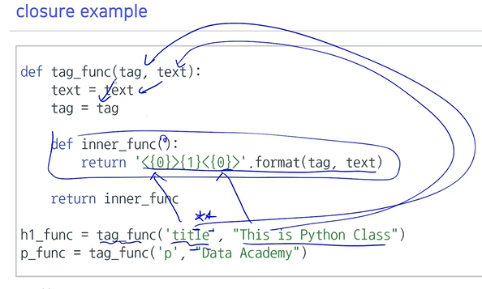
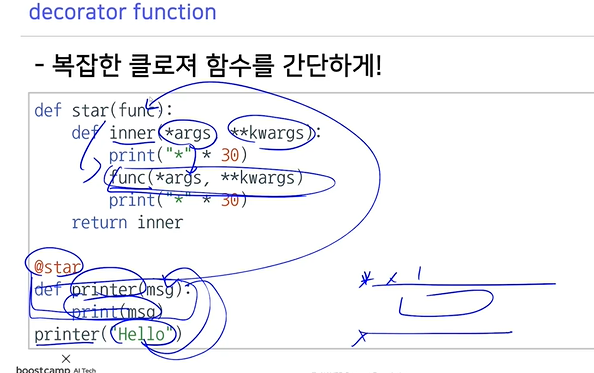
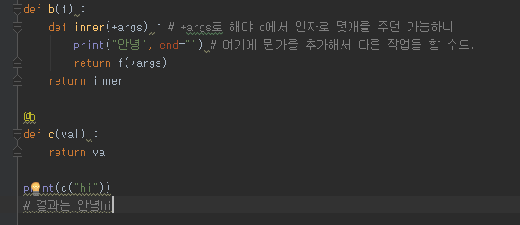
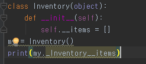
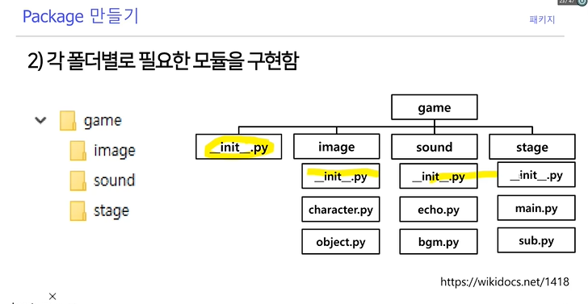

# Day4 - OOP


## OOP 개념

객체지향언어는 실제 세상을 모델링하는 방법


객체 : 실생활에서 일종의 물건. 속성과 행동을 가짐

OOP는 이러한 객체 개념을 프로그램으로 표현


설계도에 해당하는 클래스와 실제 구현체인 인스턴스

> class는 붕어빵틀, instance는 붕어빵


함수와 변수명에서는 snake_case

> caclulate_var

클래스명에는 CamelCase를 사용하낟.

> DecisionTree


**__는 특수한 예약 함수나 변수 그리고 함수명 변경(맨글링)으로 사용된다.**

> \_\_init\_\_, \_\_main\_\_


class 내에서 self는 instance 자기 자신을 의미한다.


 

## 상속

부모클래스로 부터 attribute와 method를 물려받은 자식 클래스를 생성

```python
class Person :
# 위와 같이 하더라도 Person(object)로 object를 자동으로 상속받는 것이다.
```


super() 는 상속받은 부모 클래스를 불러오는 것.

> self.~~ 는 자기 자신꺼,  super().~~ 는 부모꺼


## 캡슐화

```self.\_\_items
self.__items
```

이렇게 변수 앞에 \_\_를 붙여주면 private 변수로 선언하는 것.


### getter, setter

파이썬에선 @property, @<필드명>.setter 데코레이터를 이용해서 구현한다.

get_age, set_age 같이 만들면 코드가 지저분해지니까


```
@property
def items(self) :             # getter
	return self._items
	 
@items.setter                 # setter
def items(self, items) :
	self._items = items
	
@property
def full_items(self) :           # A.full_items 로 접근이 가능.
	return ",".join(self._items)   
```

다음과 같이 데코레이터를 지정해주면 밖에서 A.items 로 접근이 가능하다.

외부에 티를 내지 않고 setter, getter를 구현할 수 있다.


## Decorate


### First-class objects

* 변수나 데이터 구조에 할당이 가능한 객체

* 파라미터로 전달이 가능하고 리턴 값으로 사용가능하다.


파이썬의 함수는 모두 일급함수이다.

>  a= func() 이런거 되니까.
>
> map(func, arr) 이런거도 되고


```
def formula(method, arg_list) :
	return [method(val) for val in arg_list]
```

이런식으로 함수를 인자로 받아 편하게 만들 수 있다.


### Inner function 

함수 내에 또 다른 함수가 존재

```
def print_msg(msg) :
	def printer() :
		print(msg)
	printer()
```


#### closures : inner function을 리턴값으로 반환한다.




### decorator



printer라는 게 start의 파라미터로 들어간다.

그럼 printer를 부를때 "Hello"라는 인자를 넣고, 이 printer("Hello") 라는게 star의 인자로 가고.




c함수에 @b로 데코레이터가 붙는다면 c함수를 호출할 때 데코레이터의 특성에 따라 b를 먼저 거쳐간다.

> 그러니까 안녕이 먼저 나오고 hi가 나오는거겠지. 먼저 거치니까.

이때 b의 인자 'f'는 @b가 붙어있는 함수인 'c' 자체가 된다.

c함수 정의 자체에는 수정이 단 하나도 없기 다양한 기능을 c함수 호출의 앞에다 혹은 뒤에다 추가할 수 있다는 장점이 있다. 데코레이터가 flexible한 이유




다음과 같은 코드로 private 변수에 접근할 수 있다.

파이썬에서는 완전하게 private로 instance의 접근을 막지는 못하지만, 단지 유저레벨에서 private / public을 구별하고 건들지 말자는 약속 느낌.


데코레이터의 장점은 쓸데없는 반복을 줄일 수 있다.

데코레이터가 없으면 여러 함수 내에서 같은 동작을 하는 부분을 반복적으로 써줘야 하지만 데코레이터를 사용하는 경우 @를 통해 어느 함수에든지 간단히 붙여서 사용할 수 있다.


​	


sklearn이란 패키지 안에 RandomForest라는 모듈

파이썬의 Module == py 파일


```
import fah_converter

a = fah_converter.convert("AFD")
print(a)
```

라는 코드를 실행한다면 

\_\_pycache\_\_ 라는 폴더가 생긴다. 이곳엔 컴파일된 파일이 들어가있다. (pyc파일)

> 위 파일을 실행했다면 fah_converter.cpython-38.pyc 같은 파일이 생성

코드를 쉽게 로딩할 수 있도록 파이썬 인터프리터(?) 가 미리 컴파일해서 기계어로 번역해놓는다.


```
impoart fah_converter as fp
```

모듈을 호출할 때 위와 같은 형식으로 불러와서 해당 함수가 어디서 왔는지를 밝혀주는게 좋다.


### 패키지

* 하나의 대형 프로젝트를 만드는 코드의 묶음

* 다양한 모듈의 합, 폴더로 연결

* 다양한 오픈소스들이 모두 패키지로 관리됨




위와 같이 기능 단위로 폴더로 나눠서 관리한다.

폴더 안에는 \_\_init\_\_.py가 있어야 한다. (3.3 부터는 필수는 아니지만 다 쓰는..)

```
__all__ = ["image", "sound", "stage"]
from . import image
from . import sound
from . import stage
```

최상위 폴더의 \_\_init\_\_.py에는 위와 같이 만들어준다

내가 쓸 파일 명들을 선언해주는 것.

 

```
__all__ = ["main", "sub"]
from . import main
from . import sub
```

stage 폴더의 \_\_init\_\_.py에는 위와 같이 해주고


### 예외처리


if문을 로직적인 문제를 다룰 때 쓰고

예외처리는 잘못된 입력이나 데이터를 처리하기 위해 사용. 

> 파일이 비어있는 상황 같을 때는 if문 보다는 예외처리를 쓰라고 권유함. 
>
> 뭐 팀바팀이다..


### readline

readlines는 한번에 메모리에 올려서 처리하는 거고

readline은 매번 호출시마다 한줄씩 읽어온다. (너무 양이 많아 한번에 못올릴 때도 있으니까)


### os.path.join

os.path.join을 권장하는 이유는 linux, window, mac이 폴더 구분하는 기준값이 다르기에 !


### pickle

객체는 원래 메모리에 있어야 한다. 파이썬 인터프리터가 종료되면 메모리도 free 돼서 사라진다.

파이썬의 객체를 저장하고 싶을 때 pickle을 사용한다. (= 영속화)

데이터나 object 등 실행 중 정보를 저장하고, 나중에 불러와서 사용하고 싶을 때..


### argparser, configparser

configparser에서는 파일에 딕셔너리 형태로 설정값들 저장해놓고 불러와서 사용

argparse는 파이썬 실행시 인자형태로 넘겨줌.

