## 확률밀도함수

특정 구간에 속할 확률을 표현함

실수의 범위에서 특정 숫자가 나올 확률은 항상 0이다

> 1~6 사이의 실수 중에서 3이 나올 확률은 1/무한대
>
> 1~6 사이의 실수 중에서 4~5사이의 값이 나올 확률은 20%

즉 PDF는 특정 구간에 속할 확률을 계산하기 위한 함수이며, 그래프에서 특정 구간에 속한 넓이가 특정 구간에 속할 확률로 나오게끔 정한 함수이다.

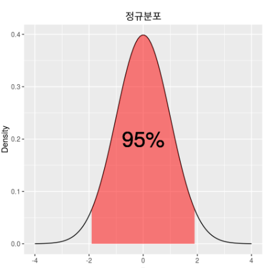

pdf에서는 정규분포에서 0, 1, 5가 나올 확률이 모두 0으로 같다.

그러나 직관적으로  0 근처가 가장 많이 나온 다는 것을 그래프를 통해서 알 수 있다.

특정 사건이 일어날 가능성을 비교할 수 없을까? : 가능도

연속사건에서는 특정 사건이 일어날 확률이 0으로 계산되기에 비교가 불가능하다. 그래서 가능도라는 개념을 적용해서 이를 비교한다.

엄밀히 말고, 쉽게 말하면 **위에 있는 그래프들에서 y값을 가능도로 생각하면 된다.** y값이 높으면 일어날 가능성도 높다는 의미로.

> 주사위 던지기 같은 이산적? 상황에서는 확률 = 가능도로 표현 가능.

가능도의 직관적 정의 : 확률분포함수의 y값

* 셀 수 있는 사건 : 가능도 = 확률
* 연속 사건 : 가능 != 확률, 가능도 = PDF값

사건이 여러번 발생할 때는 가능도를 곱해줌으로써 표현.

## 확률과 가능도의 차이

확률 : 주어진 확률분포가 있을 때, 관측값 혹은 관측 구간이 분포 안에서 얼마의 확률로 존재하는 가를 나타내는 값. **확률의 중요한 점은!! '고정된 분포'에서 이것이 관측될 확률이라는 것.**

> 확률 : P(관측값 X | 확률분포 D)

가능도 : 어떤 값이 관측됐을 때, 이것이 어떤 확률 분포에서 왔을 지에 대한 확률

'고정된 분포'가 아니라! 관측값을 고정한다!! 

> 가능도 : L(확률분포 D | 관측값 X)

**확률의 개념을 시각만 반대로 한게 가능도.**

확률은 주어진 확률분포에서 해당 관측값이 나올 확률이고, 가능도는 주어진 관측값에서 이것이 해당 확률분포에서 나왔을 확률이다.

### 가능도 계산.

쥐를 무게에 달았는데 34g이 나왔다.

이 관측 결과가 정규분포(m=32, sd=2.5)에서 나왔을 확률은 0.12 이다.

그러나 정규분포(m=34, sd=2.5)에서 나왔을 확률은 더 높다. << 이 분포에서 가능도가 더 높다.

## MLE

최대 가능도추정이란 각 관측값에 대한 총 가능도(모든 가능도의 곱)가 최대가 되게하는 분포를 찾는 것. 

보통 임의의 분포를 가정하고 하는것이 일반적이다.

일그러진 동전이 있어 앞면이 나올 확률을 실제로 던져봐야 알 것같다.

총 1000번을 던지니 앞이 400번 나왔다.

그렇다면 동전을 던져 앞이 나올 확률 p가 대략 0.4가 된다. 이는 p의 MLE값과 일치한다.

**즉, 동전을 1000번 던져서 앞이 400번 나올 가능성을 최대로 하는 p는 0.4**

MLE는 우리의 가능성과 확률에 대한 직관을 수리적으로 표현한 것에 불과

출처 : http://rstudio-pubs-static.s3.amazonaws.com/204928_c2d6c62565b74a4987e935f756badfba.html

최대가능도 추정법을 통해서 정답에 해당하는 확률분포와 모델이 추정하는 확률분포의 거리를 최소화함으로써 모델을 학습시킬 수 있다.

여러개의 관측값이 있는데 이렇게 관측될 가능성이 가장 큰 확률분포를 찾아내는 것.

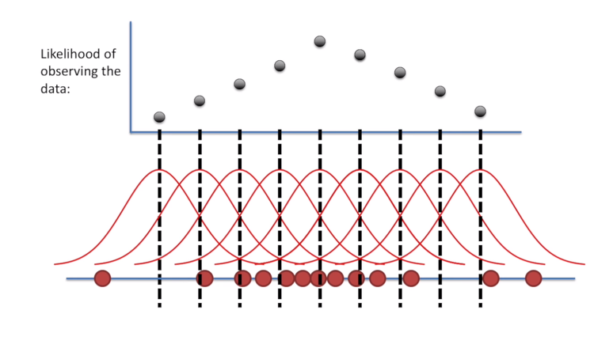

빨간 점들을 가장 장 표현하는 (= 가능도가 최대가 되는) 확률 분포를 추정해가는 과정.

여러개의 확률 분포 중에서 검은색 점이 가장 큰 값을 가지는(가능도가 제일 높은) 확률 분포식으로 추정한다.

출처 : https://jjangjjong.tistory.com/41 

​	

## 통계적 모델링

적절한 가정 위에서 확률분포를 추정하는 것

유한한 개수의 데이터만 관찰해서 모집단의 분포를 정확히 알아내긴 불가능. 근사적으로 확률분포를 추정하는 것

### 모수적 방법론

데이터가 특정 확률분포를 따른다고 선험적으로(a priori) 가정한 후 그 분포를 결정하는 모수를 추정하는 방법

> 정규 분포에서는 모수인 평균과 분산이 중요한데, 
>
> 정규분포라 가정하고, 이 평균과 분산을 추정하는 방법을 통해서 데이터를 학습하는게 모수적 방법론

### 비모수 방법론 

특정 확률분포를 가정하지 않고 데이터에 따라 모델의 구조와 모수의 개수가 유연하게 바뀌면 이를 비모수 방법론

**기계학습의 많은 방법론이 이걸 사용한다**

비모수 방법론이라고 해서 모수가 없다는게 아니라, 모수 개수가 무한히 많거나 데이터 개수에 따라 모수의 개수가 바뀌는 것을 의미한다.

모수와 비모수 방법론의 차이는 어떤 가정을 미리 부여하는지 아닌지로 구별된다.

확률 분포에는 모수라는게 적용되기 마련이고, 어떤 확률 분포를 가지고 모델링할 떄는 모수가 뒤따라 온다.

!("신경망은 비모수 vs 모수?")[https://brunch.co.kr/@seoungbumkim/7]

## 확률 분포 가정하기 

방법1) 히스토그램을 통해 모양을 관찰

* 데이터가 2개의 값만 가짐 -> 베르누이분포
* 데이터가 n개의 이산적인 값만 가짐 -> 카테고리분포
* 데이터가 [0,1] 사이에서 값을 가짐 -> 베타분포
* 데이터가 0 이상의 값을 가짐 -> 감마분포, 로그정규분포
* 데이터가 R 전체에서 값을 가짐 -> 정규분포, 라플라스분포

이렇게 기계적으로 확률분포를 가정하는건 금물.

**데이터가 어떤 원리로 생성됐는지를 먼저 관찰하고, 데이터 생성 방법에 따라 확률 분포를 가정해야한다.**

**항상 데이터를 먼저 관찰하면서 분석하고 어떤 확률분포를 할지를 결정한다.**

이 원칙은 통계적 분석, 기계학습 상관없이 중요한 원칙이다.

통계량의 확률분포 를 표집분포(sampling distribution)

## 데이터로 모수 추정

모수의 확률 분포를 구해야하는 것.

통계량(표본평균, 표본분산 같은)의 확률 분포는 표집분포라고 부르며, 표본평균의 표집분포는 N이 커질수록 정규분포를 따른다.

> 이를 중심극한 정리 : 모집단의 분포가 정규분포를 따르지 않아도 표본평균의 표집분포는 정규분포를 따른다.
>
> **통계량의 확률분포(표본평균의 확률분포)가 정규분포를 따른 다는 것이고**
>
>  **표본에 대한 분포는 정규분포를 따르지 않을 수 있다.**

데이터를 많이 모으면 모을수록 표본평균의 분포가 정규 분포가 되긴 하는데 

분산이 시그마^2/n 이라서 데이터가 늘어날 수록 분산이 작아진다. 

그러므로 데이터를 많이 모을수록 정규분포가 되긴하는데 분산이 0으로 가면서 하나의 값으로 몰리는 양상이 된다. 

이 값을 평균으로 사용해도 된다?

## 최대가능도 추정법

확률분포마다 사용하는 모수가 다르므로 적절한 통계량이 달라진다. 

그래서 이론적으로 가장 가능성이 높은 모수를 추정하는 방법이 최대가능도 추정법이다.

### 가능도함수 

$$
L(\theta;x)
$$

가능도 함수는 확률밀도함수, 확률질량함수와 같은 것. 단지 관점의 차이

밀도함수는 모수 세타가 주어져 있을 때 x에 대한 함수로 해석

가능도 함수는 주어진 데이터 x에 대해서 모수 세타를 변수로 둔 함수

> 즉 데이터가 주어져 있는 상황에서 세타를 변형시킴에 따라 값이 바뀌는 함수.

가능도 함수는 모수 세타를 따르는 분포가 데이터 X를 관찰할 가능성을 뜻하게 된다?

가능도 함수는 세타에 대한 확률로 이해하면 안된다. 대소비교가 가능한 함수로?

 

### 로그가능도를 사용하는 이유

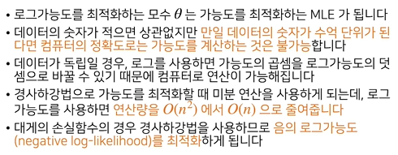

0~1 값을 수억단위로 곱해주면 컴퓨터 정확도로 인해 오차가 생겨 계산이 힘들다.

그러나 로그를 취해 곱셈을 덧셈으로 바꾸면 컴퓨터로 연산이 가능해진다.

로그 가능도에서는 미분 연산이 O(n^2)에서 O(n)으로..

### 최대가능도 추정법 예제 : 정규분포

정규분포를 따르는 확률변수X로부터 뽑아낸 독립적인 표본 {x1, ... xn}을 가지고 likelihood를 최적화하는 세타를 찾는것 

> 정규분포에서는 모수 세타가 평균과 분산이니까

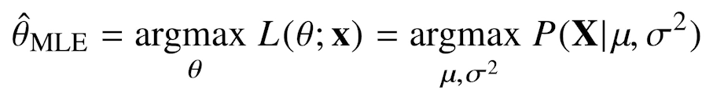

#### 1. Likelihood 구하기

모수가 세타 (평균:뮤, 표준편차:시그마)일 때, 이에 대한 가능도 함수를 구해보자

우선 한개의 데이터가 이 정규분포를 따를 확률은 다음과 같이 계산할 수 있다.

> 데이터 X가 어떤 분포를 따를 확률이 더 높다 => 가능도가 더 높다.

모든 데이터들이 독립적이라고 가정한다면, 다음과 같은 가능도 식을 구할 수 있다.

#### 2. Log Likelihood 구하기

위의 식으로 가능도 계산식을 얻었다. 	

여기서 세타를 조정해서 가능도가 최대가 되는 정규분포를 찾으면 된다.

현재 곱셈 식이기에 미분하기 쉽지 않다. 그래서 다음과 같은 log를 취함으로써 log likelihood를 구한다.

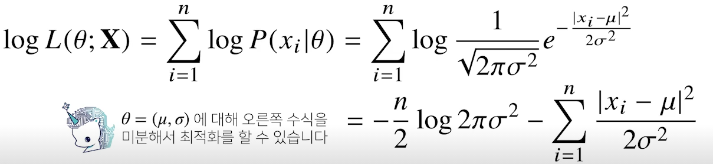

#### 3. Maximum Likelihood 구하기

이제 위 식을 통해 log likelihood를 최소화하는 (likelihood 최대화) 세타를 찾으면 된다.

이를 위해서 세타로 log likelihood를 미분하고, 이 식이 0이 되는 극솟값을 찾으면 된다.

#### 3.1 뮤로 미분하여 뮤 찾기

log likelihood를 평균으로 미분하면 위의 최종식에서 오른쪽에 있는 텀만 살아남음.

> 제곱을 미분하니 2가 나오고, 분모에 있던 2와 상쇄

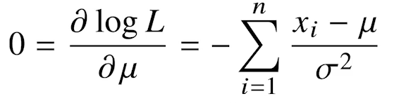

#### 3.2 시그마로 미분하여 시그마 찾기

log likelihood를 시그마로 미분해주게 되면, 

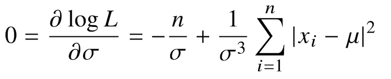

이렇게 미분해서 최대가능도를 구하고 싶다면, 미분 했을 때, 각각의 파라미터에 대해 0이 되는 평균과 표준편차를 구하면 된다. 이 값이 log likelihood를 최대화 해주는 모수를 찾는 것이다.

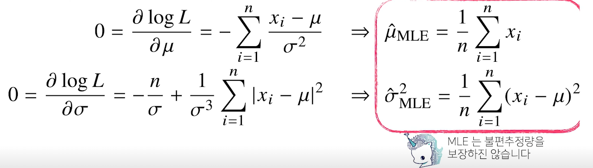

#### mu 공식 유도 과정

## 라그랑주 승수법

제약 조건이 있는 최적화 문제를 풀기 위한 방법.

어떠한 문제의 최적점을 찾는게 아니고, 최적점이 되기 위한 조건을 찾는다. 즉, 최적해의 필요조건을 찾음

라그랑주의 기본 가정은 "제약 조건 g를 만족하는 f의 최솟값 또는 최댓값은 f와 g가 접하는 지점에 **존재할 수 도** 있다."는 것이다!!

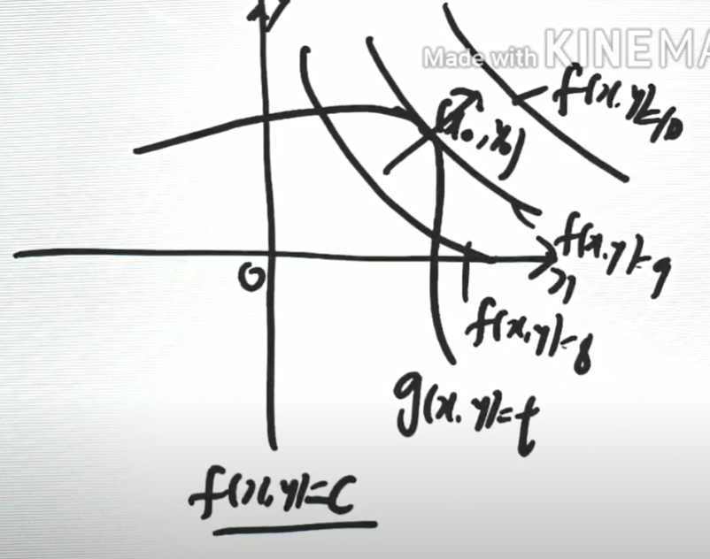

f(x,y) = c라고 놨을 때, c값을 최대화하는게 f(x,y)를 최대화 하는 것.

이것은 공통접선을 가질 때 일어나는데 a,b에서 접한다면 a,b에서의 법선 벡터가 동일할 때를 의미한다.

그래서 기울기 벡터들이 평행하게 된다.

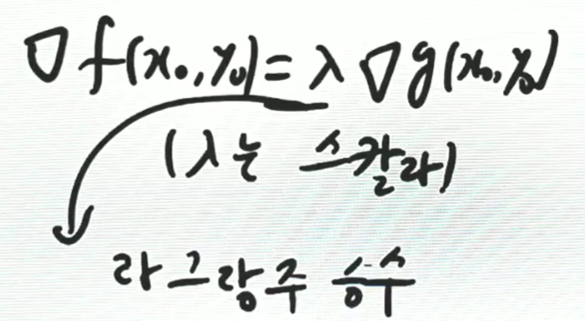

그레디언트 f의 x0,y0는 그레디언트 g의 x0,y0과 평행.

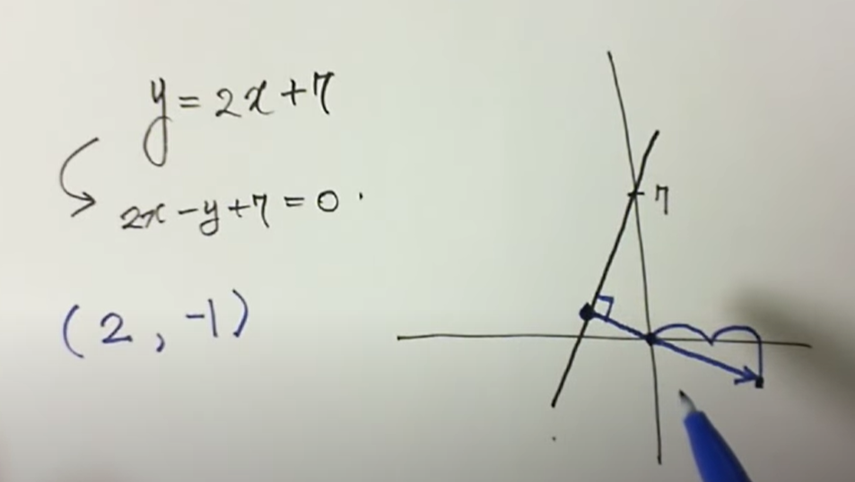

편미분을 하면 어떠한 그래프에서 한점에서의 수직이 되는 벡터를 구할 수 있다.

기준 함수 f와 조건함수 g를 모두 x와 y로 각각 편미분 하여 만들어진 벡터는 같은 방향을 가진다.

(2x, 2y) = a(1, 1/2루트y) 공식을 풀어 x와 y의 관계를 알아내고 이를 x^2 + y^2 = 1 식에 넣어 접점에서의 x,y값을 구한다.

## 최대가능도 추정법 예제 : 카테고리분포

카테고리컬 분포에서의 모수는 p_1 ~ p_d 

이 값들은 1~ d차원에서 각각의 차원에서 값이 1또는 0이 될 확률을 나타낸다. 

> p_1~p_d를 모두 더하면 1

카테고리는 스칼라 값이지만 카테고리 확률 변수는 0과 1로만 이루어진 K차원 벡터가 나온다 (원핫벡터)

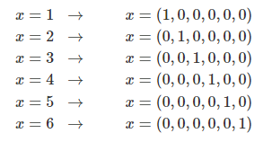

나올 수 있는 값이 6개라면 다음과 같이 확률 변수가 나오는 것. 

> 오른쪽 벡터가 확률 변수 값

$$
\sum_{k=1}^{K}x_k=1
$$
그래서 이 조건식이 만들어진 것.

여기서 x_i,k는 0또는 1의 값을 갖는다.

n_k는 주어진 x_i에 대해서 k값이 1인 데이터의 개수를 세는 개념

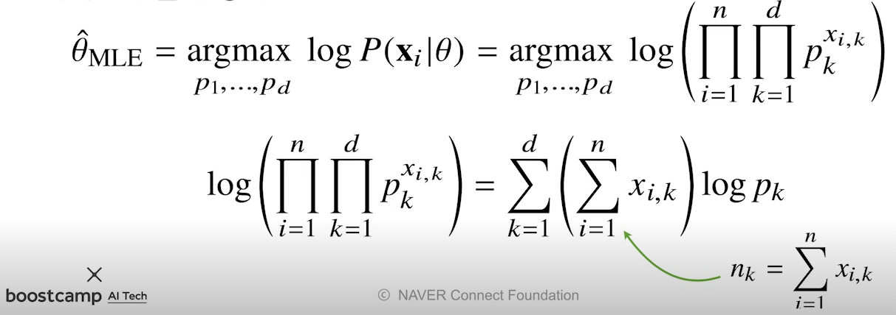

$$
\Pi_{i=1}^{n} \Pi_{k=1}^{d} p_{k}^{x_{i,k}}
$$
d는 카테고리 분포의 갯수, n은 표본의 갯수이다.

가령 x_{3,1}는 3번째 데이터의 첫번째 레이블일 확률값으로 이해하면 된다.

즉 특정 5번째 데이터가 들어온다면 그 데이터의 클래스에 대한 확률값은 레이블 갯수 만큼 나온다.

위 식에서 오른쪽에 있는 제약식 (모수를 모두 더하면 1이 된다)을 만족하면서 왼쪽 목적식을 최대화 해야함.

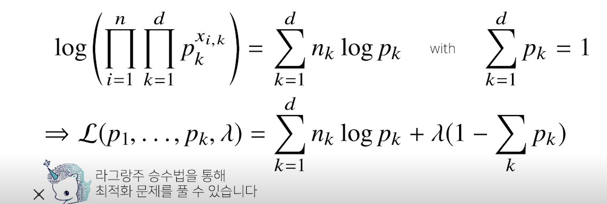

목적식에 제약식이 추가된다면, 앞의 정규분포처럼 미분했을 때 0이 되는 값을 구하는게 아니라

목적식에 라그랑즈 승수법을 통해 제약식을 더해줘야 한다.

f의 그레디언트 벡터 = a \* g의 그레디언트 벡터로 표현하여 

라그랑즈 목적식을 각각의 모수 pk로 미분하고, 라그랑즈 승수인 람다에 대해서도 미분을 해야한다.

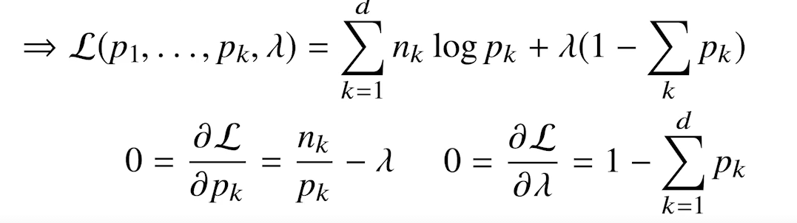

nk/pk가 람다를 만족해야 한다.

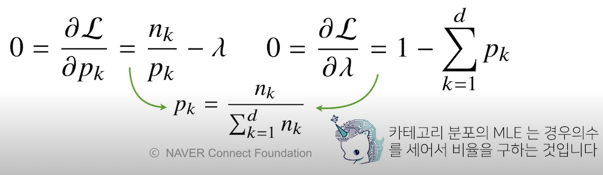

결과적으로 카테고리분포에서의 MLE는 각각의 차원에 해당하는 데이터를 카운트하고 비율을 구하는 것이다.

## 딥러닝에서 최대가능도 추정법

위에서는 확률분포의 주어져 있는 모수를 최대가능도 추정법을 이용해 추정해봤다.

이는 딥러닝 모델의 layer 별 가중치를 세타 = (W_1, W_2, ... ,W_L)로 표현할 수 있다. 

>  W는 각 층의 가중치

분류 문제에서는 **소프트맥스 벡터로 카테고리분포의 모수(p_1, ... , p_k)를 모델링한다.**

원핫벡터로 표현한 정답레이블 Y = (y_1, ... , y_k)을 관찰데이터로 이용해 확률분포인 소프트맥스 벡터의 로그가능도를 최적화할 수 있다. 이를 통해 딥러닝의 모수인 세타를 학습할 수 있다.

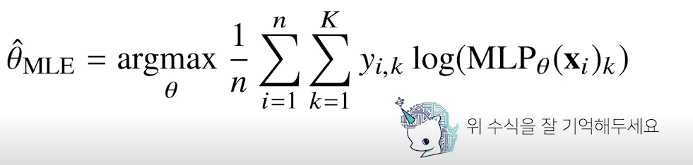

k=1~K 즉, 모든 클래스의 개수에 대해서, i=1~n까지 모든 데이터에 대해 

xi를 MLP에 넣었을 때 나오는 클래스 k에 대한 예측값과 정답 데이터y의 k번째 클래스에 대한 값

즉, y_i,k와 값이 1이고, MLP값도 1이라면 log로 인해 0으로 바뀌어 값이 0이 된다.

y_i,k가 1이고, MLP값이 0이라면 log로 인해 엄청 작은 값(-값)이 된다. 

그래서 1과 전체 mle 값이 작아지는 효과.

그래서 최대로 만들기 위해 y_ik와 MLP값이 같아야 한다.

근데 y_k가 0이면 항상 0??

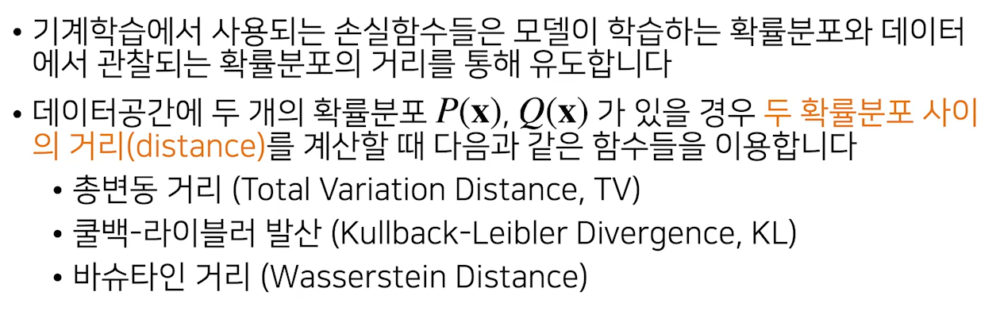

## KL Divergence

MLE를 구하는 과정이 p(x|theta*), p(x|theta)의 KL divergence를 구하는 공식과 동일하다.	

KL divergence가 작아진다는 것은 두 확률분포의 거리가 가까워진다는 의미이고, 이는 로그가능도 함수를 최대화시키는 것과 동일하다.

두 확률분포의 차이를 계산해주는 지표. 두 확률분포의 거리를 계산해주는 지표가 아니다.

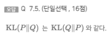

그래서 이 질문의 정답은 X이다.

데이터 정답 분포 P가 가지는 정보량은 E(logP(X)) 이고 예측 분포가 Q이면 E(logQ(X))이다.

이 값을 빼면 되는데 KL(P||G)의 의미는 Q에 대해 **상대적**으로 P가 가지는 정보량의 차이가 계산됨.

> 기준 값이 달라져서 값도 달라진다. +- 여부?

### plot들

* Violinplot - boxplot에 distribution을 함께 표현

* Stripplot - scatter와 cateogry 정보를 함께 표현

* Swarmplot - 분포와 함께 scatter를 함께 표현

* Pointplot - categor별로 numeri의 평균,  신뢰구간 표시

* Regplot - scatter + 선형함수를 함께 표시

