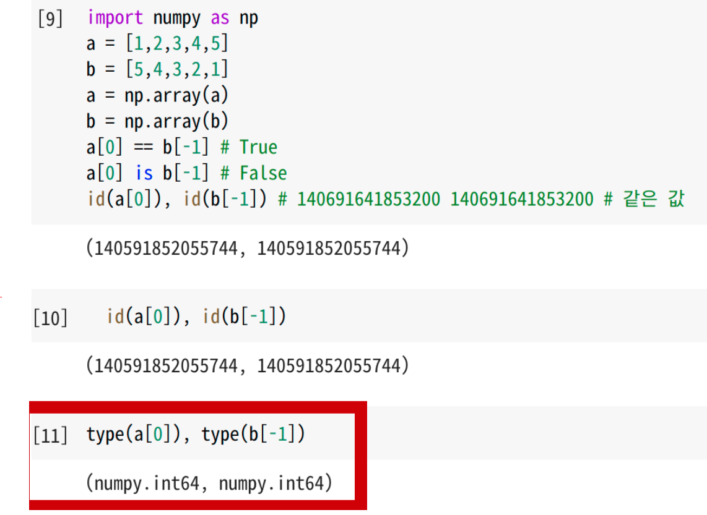
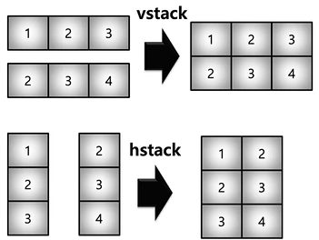
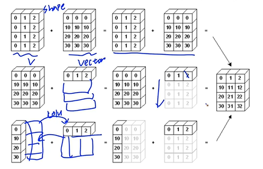
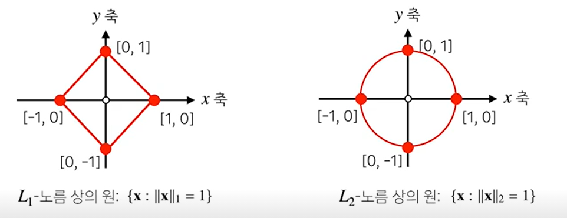
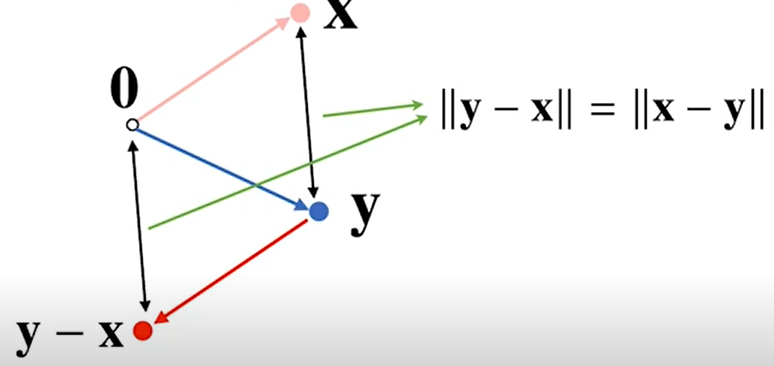
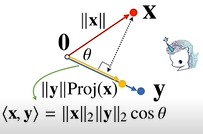
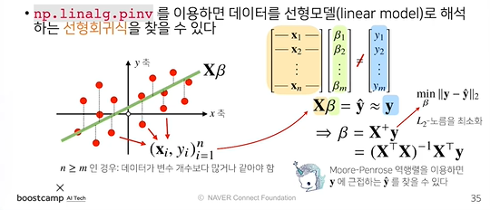
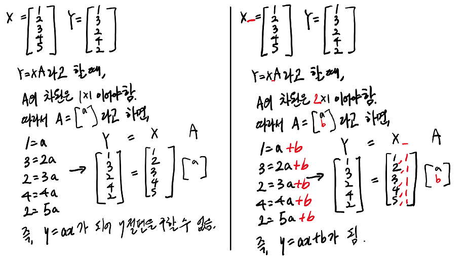

# Numpy

* numpy는 자체로도 많이 쓰이지만 이후에 사용되는 SciPy나 Pandas의 base 객체로도 활용.

* list에 비해 빠르고, 메모리 효율적

  > 메모리 효율적인 이유는 list는 python object를 가리키는 포인터들의 배열로 구성되기에

* 반복문 없이 데이터 배열에 대한 처리를 지원함 

  >  for while 같은거 안쓰기에 빠름. 
  >
  >  for loop < list comprehension < numpy
  >
  >  약 1억번 loop를 돌 때, 약 4배의 차이를 보임

* 선형대수와 관련된 다양한 기능을 제공

* numpy는 c로 구현되어 있어 성능을 확보하는 대신 파이썬의 큰 특징인 dynamic typing 포기.

* concatenate 처럼 계산이 아닌 할당에서는 속도의 이점은 없다..

* C언어의 data type과 거의 유사하다.


### numpy array 

* 하나의 데이터 타입만 넣을 수 있다.

  > dynamic typing not supported  <-- list와 가장 큰 차이점

* C의 Array를 사용하여 배열을 생성함.

* 데이터 타입이 정해져있고 개수를 정해놓기에? 메모리 공간을 잡기도 효율적?


### numpy shape

* (3,4) - 3행 4열의 매트릭스

* (2,3,4) - 3x4 매트릭스가 2개 있다.     

* (5,2,3,4) - (2,3,4) 가 5개 있다.

  > 3d-array 부터 앞으로 계속 쌓인다.


### numpy와 list의 메모리 차이

numpy array는 값이 붙어 있다.

list는 값을 직접 저장하는게 아니라 값의 주소값을 넣는다.




-5 ~ 256 값은 메모리에 static 하게 할당되어 있기에 list는 각 원소가 실제 값의 주소를 담고 있기에 "a[0] is b[-1]"는  True이다.

그러나 np.array일 때는 a[0] is b[-1]이 False가 되는데 

np.array가 슬라이싱 되면서 새로운 객체를 만들어낸다. a[0] is b[-1]은 한 텀?에서 일어나기에 두 값이 모두 존재하지만 

id(a[0]) , id(b[-1]) 은 id(a[0])이 일어나고, id(b[-1])이 일어나기에 id(a[0]) 후에 메모리가 해제되고 

id(b[-1]) 되는 시점에 메모리를 다시 할당받아 사용하기(재사용)에 같은 id값이 나오는 것.


### Handling shape


#### 1. reshape 

* array의 shape의 크기를 변경한다. element의 개수는 동일하다.

* reshape에서 -1의 의미는  element의 개수에 맞춰서 알아서 값을 넣으라는 뜻

  > (2,4) array가 있는데 reshape(-1,2) 를 한다면,  행의 크기는 4일 수 밖에 없으니
  >
  > (-1,2,2) 하면 -1 위치에는 2밖에 못들어오지


##### rank2 -> rank1 reshape


reshape는 현재 n-dim array를 1-dim array로 펼치고, m-dim array로 짜맞춘다고 생각하면 쉽다.

> D_ijk = (1,2,3) 가 있을 때, 1-dim array로 펼치면 [D_111, D_112, D_113, D_121, D_122, D_123] 이 되고,
>
> low dimension이 우선 순위로 flatten??  =>  뒤로 갈수록 low dimension 이라면, 1,1,1 | 1,1,2 | 1,1,3 으로 맨 오른쪽 꺼 부터 풀어지니까 이를 flatten이라 하는듯.
>
> (3,2)로 reshape 한다면
>
> [ [ D_111, D_112 ], 
>
> [D_113, D_121],
>
> [D_122, D_123] ] 가 만들어지는 것.


#### 2. flatten 

다차원 array를 1차원 array로 변환

> reshape의 기능 중 하나를 따로 빼서 가져온 것.


#### 3. slicing

* list와 달리 행과 열 부분을 나눠서 slicing이 가능함.

* matrix의 부분 집합을 추출할 때 유용함.

```python
a[:,2:] # 전체 행의 2열 이상의 값

a[1,1:3] # 1행의 1열 ~ 2열

a[1:3] # 1 행 ~ 2행 전체

a[:,::2] # 전체 행의 전체 열 중 2칸씩 뛰면서  
```


### creation function


#### 1. np.zeros(shape, dtype, order)

```
np.zeros(shape=(10,), dtype=np.int8)
```


#### 2. np.ones(shape, dtype, order)

```
np.ones(shape=(10,), dtype=np.int8)
```


#### 3. np.emtpy(shape, dtype)

shape만 주어지고 비어있는 ndarray가 생성 (메모리 초기화 하지 않는다)

메모리를 초기화하지 않기에 이전에 어떤 값으로 할당되었거나, 프로그램의 일부였던 값들이 그대로 가져와진다.


#### 4. something_like

```
np.ones_like(matrix) # matrix 와 같은 shape에 1값을 채워서 반환 
```

기존 ndarray의 shape 크기 만큼 1,0 또는 empty array를 반환


#### 5. np.identity 

단위 행렬을 생성함

```
np.identity(n=3, dtype=np.int8)
```


#### 6. np.eye

대각선이 1인 행렬, k값으로 시작 index를 변경할 수 있다.

```python
np.eye(3) # np.identity(3)과 같다.

np.eye(3,5,k=2) # 3 by 5 행렬이 만들어지는데 (0,2)이 단위행렬 시작 지점. 

[0,0,1,0,0]
[0,0,0,1,0]
[0,0,0,0,1]
```


#### 7. np.diag

생성되어 있는 행렬에서 대각 행렬의 값만 추출함 

```
np.diag(matrix) # matrix의 대각행렬 값을 추출 
nnp.diag(matrix, k=1) # 0,1부터 시작해서 대각행렬 값을 추출.
```


#### 8. random sampling

데이터 분포에 따른 sampling으로 array를 생성 (uniform, normal distribution 등등)

```
np.random.normal(0,1,10) # 모수값이 0과 1인 정규 분포에서 10개 추출
```


### operation function

sum, std, var, mean 등등


#### axis

operation fuction을 실행할 때 기준이 되는 dimension 축.

이 축방향으로 가면서 주어진 연산을 한다고 생각하면 될듯. sum하면 이 축방향으로 가면서 있는 값을 모두 더함.

> 연산을 어떻게 지원하는지 알려면 이 개념을 알아야 함


2차원에서는 행이 axis=0, 열이 axis=1, 3차원에서는 행렬 개수가 axis=0, 행이 axis=1, 열이 axis=2


sum(axis=1) 하면 axis=1인 열 방향으로 값을 모두 더함. 즉 같은 행에 있는 값을 모두 더한 array

> [[1,2], 
>
> [3,4],
>
> [5,6]]  이렇게 있다면 sum(axis=0) 을하면 행방형으로 내려가면서 합치니 [9,12]
>
> ​            sum(axis=1) 이면 열 방향으로 가니 [3,7,11]


(2,3,4) - (axis=0, axis=1, axis=2)

sum(axis=0) 하면 (3,4)의 결과가 나오는거지.

sum(axis=2) 하면 (3,3)의 결과가 나오고.


### concatenate





#### 1. vstack (vertical stack)

여러 row를 붙히는

```
a = np.array([[1,2,3]])
b = np.array([[4,5,6]])
np.vstack((a,b)) 
# 하면 [[1,2,3],
       [4,5,6]]
```

이 작업은 np.concatenate((a,b), axis=0)과 같다


#### 2. hstack (horizontal stack)

```
a = np.array([[1,2,3]])
b = np.array([[4,5,6]])
np.hstack((a,b)) 
# 하면 [1,2,3,4,5,6]
```

이 작업은 np.concatenate((a,b), axis=1)과 같다

> 대신 [[1,2,3]] 이런 형태로 들어가야함. 
>
> 1차원 array에는 axis 1이 없으니?


#### 축을 하나 늘리는 방법

b.reshape(-1,.2) == b[np.newaxis:2]


### broadcasting

shape이 다른 배열 간 연산을 지원하는 기능

서로의 shape이 같지 않을 경우 앞이나 뒤에 있는 row나 col에 크기를 늘려 맞춰줌.




기본적으로 numpy는 shape가 같으면 element-wise 연산을 한다.

같은 위치에 있는 element 끼리 계산


### comparison

```
a = np.arange(6)
a < 4 # [T,T,T,T,F,F], 여기서도 broadcasting

np.any(a < 4) # T
np.all(a < 4) # F
```


#### np.where

```
a = np.array([-1,0,1])
np.where(a>0, 3, 2) # a의 원소들 중 0보다 크면 3을, 작으면 2를 넣는다.
# => [2,2,3]

np.where(a>0) # 5보다 큰 원소들의 index 값을 반환
# => [2]
```

 

#### argmax & argmin

array 내에서 가장 큰 or 작은 값의 index를 반환

```
np.argmax(a, axis=1)
# 축방향으로 가면서 max 값의 index 반환
```


#### argsort

array 내에 있는 값이 작은 순서대로 index를 반환.

```
a = np.array([[1,2,4,5,8,78,23,3]])
a.argsort()
# => [0,1,7,2,3,4,6,5]
```


#### boolean inedx

boolean 값이 있는 ndarray를 인덱스에 넣으면 true에 해당하는 값만 뽑아냄

```
a = np.array([1,4,0,8])
a[a>3]
# => [4,8]
```


#### fancy index

numpy는 array를 index value로 사용해서 값 추출

```
a = np.array([5,6,7,8,9])
b = np.array([0,0,1,3])
a[b] # == a.take(b)
# => [5,5,6,8]
```


### numpy data i/o


#### 1. txt 파일

```
np.loadtxt("./test.txt")
np.save("./test.csv", a, delimiter=",")
```


#### 2. npy 파일

```
np.save("test.npy", arr=a)
np.load(file="test.npy")
```


# 1. 벡터

* 공간에서의 한 점

* 원점으로부터 상대적 위치. 

  > 원점에서부터 x라는 위치로 가는 화살표

* 벡터는 숫자를 원소로 가지는 list 또는 array.

  > 원소의 개수를 벡터의 차원이라고 한다.


## norm

점에서부터의 거리

벡터가 공간상의 한 점을 표현하다고 했을 때, norm은 원점에서 그 점 사이의 거리


### 1. L1 norm (llxll₁)

$$
\sum_{i=1}^n \left|x\right|
$$

* 각 성분의 변화량의 절대값을 모두 더한 값. 

* 좌표평면에서 각 좌표축을 따라 움직이는 거리.

* 각 원소의 절대값의 합 

> ex) 2차원 좌표 평면이라면  |x축을 따라 이동하는 거리|+ |y축을 따라 이동하는 거리|


### 2. L2 norm (llxll₂)

$$
\sqrt{\sum_{i=1}^n x^{2}}
$$

* 각 원소의 제곱을 모두 더한 뒤 루트를 취함.

* 피타고라스 정리를 통해 계산되는 유클리드 거리.





**이 norm의 종류에 따라 기하학적 성질이 달라진다. **

L1 norm의 원이 저런 이유는 사용하는 norm에 따라 거리라는 개념이 달라지기 때문이다.

원이란 원점에서 부터의 거리가 같은 점들의 모임인데, L1 norm을 통해 거리를 쟀을 때 같은 거리에 있는 점들의 집합은 마름모가 된다.


**머신러닝에서는 서로 다른 norm들을 사용해서 학습할 때, 최적화할 때 이용한다.**

각 기계학습 방법론에서 어떤 norm을 사용할 지 정할 때 이런 기하학적 성질에 많이 의존한다.


### 벡터 사이의 거리

* 두 점이 주어졌을 때, 이 두점 사이의 거리 

* 두 벡터 사이의 거리를 계산할 떄는 두 벡터의 뺄셈을 이용한다. 

* 거리 계산을 L1 norm, L2 norm으로 하냐에 따라 값이 달라지지.





### 두 벡터사이의 각도

* 두 벡터사이의 각도는 **L2 norm에서만 가**능하다.

* 두 점사이의 거리를 벡터의 뺄셈으로 구하고 코사인 제 2법칙을 통해 각도를 구할 수 있다.


거리를 L2 norm으로 정의했기에 코사인 제 2법칙에 따라 다음과 같은 수식이 만들어진다.

> 세 변의 길이를 알기에 각도 계산 가능

$$
cos{\theta} = \frac{||x||₂^2 + ||y||₂^2 - ||x-y||₂^2}{2||x||₂||y||₂}
$$


위 식을 x = (a,b), y = (c,d)로 가정해보면
$$
cos{\theta} = \frac{a^2+b^2 +c^2+d^2 -(a-c)^2-(b-d)^2}{2||x||₂||y||₂} = \frac{ac+bd}{||x||₂||y||₂}
$$
분자에 해당하는 부분이 **내적 연산**이 된다.


L2 norm을 정의하는 이유가 각도라는 개념을 d차원에서 계산할 수 있도록 하기 위함이다.

L2 norm과 벡터의 내적 연산을 통해 각도를 구할 수 있다.

```
v = np.inner(x,y) / (l2_norm(x) * l2_norm(y))
angle = np.arccos(v)
```


두 벡터 사이의 각도를 계산하는건 2차원에 있을 필요 없이 임의의 d차원에서도 가능

**각도 계산은 l2 norm 에서만 가능**


Q. 왜 L2 norm에서만 가능??

-> 아직 완전히 이해하기는 힘든 부분.


### 내적

* 내적은 정사영된 벡터의 길이를 벡터 y의 길이 ||y|| 만큼 조정한(곱한) 값.

* 내적은 정사영된 벡터의 길이와 관련이 있다.
* 내적은 보통 두 벡터 사이의 유사도를 측정하기 위해 사용.





$$
정사영된 벡터  = ||x||cos{\theta}
$$


# 2.행렬

* 벡터가 숫자를 원소로 가지는 1차원 배열이었다면, 행렬은 벡터를 원소로 가지는 2차원 배열

* **행렬은 행벡터를 원소로 갖는 2차원 배열이다.**

  > numpy에서 행렬은 행벡터를 원소로 가진다고 생각해야함.


### 전치 행렬 (transpose matrix)

* 행과 열의 인덱스를 바뀐 행렬.
* 벡터에도 transpose 할 수 있다. (행벡터.T = 열벡터)


### 행렬의 이해[1] : (행렬은 데이터들의 모임)

* 벡터가 공간에서 한 점이라면 행렬은 **여러 개의 점**이다.

* 행벡터 x_i는 i번째 데이터를 의미 

* 행렬의 x_ij는 i번째 데이터의 j번째 변수의 값.


### 행렬 곱셈

* 두 행렬을 곱한 결과는 i번째 행벡터와 j번째 열벡터의 내적을 성분으로 한다..
* 곱해진 행렬의 a번째 행, b번째 열의 원소의 값은 앞에 있는 행렬의 a번째 행벡터와 뒤에 있는 행렬의 b번째 열벡터의 내적
* np.array의 곱은 @로 할 수 있다.


### 행렬 내적

행렬의 곱셈이 **i번째 행벡터와 j번째 열벡터**의 내적을 계산하는 것이었다면, numpy의 내적(np.inner)은 **i번째 행벡터와 j번째 행벡터**를 계산하는 것이다.


**numpy에서의 내적과 수학의 내적은 다르다.**

수학에서의 내적은 tr(X \* Y.T) 이다. X의 행벡터와 Y의 행벡터를 곱한 뒤 값을 모두 더해주는 것.

그러나 np.inner은 (X \* Y.T) 이다. 즉 마지막에 더해주는 연산이 없고 결과가 행렬이 나온다.

즉, 두 행렬이 np.inner를 하려면 열의 크기가 같아야 한다.


### 행렬의 이해[2] : 벡터공간에서 사용되는 연산자

* 행렬곱을 통해 벡터를 다른 차원의 공간으로 보낼 수 있다.

  > m차원 공간에 있는 X벡터를 n차원 공간에 있는 Z벡터로 옮겨(매핑)준다.

* 행렬곱을 이용해서 주어진 데이터에서 **패턴을 추출**하거나, 주어진 데이터를 **압축**할 수도 있다.

* 행렬을 사용한 연산자를 linear transform, 선형변환이라고 부른다. 

  > 모든 선형변환은 행렬곱으로 계산할 수 있다.


**딥러닝 모델은 선형 변환과 비선형 함수들의 합성으로 이뤄져있다.**


### 역행렬

* 행렬은 어떤 공간에 있는 X라는 벡터를 다른 공간의 Z라는 벡터로 보내는 연산자로써의 기능을 하고, 역행렬은 이를 거꾸로 돌리는 연산을 한다.
* 역행렬이 존재하려면 행과 열의 숫자가 같아야 하고, 행렬식(determinant)이 0이 아니어야 한다.

$$
AA^{-1} = A^{-1}A = I
$$


그러나! 역행렬이 존재하지 않아도, 연산을 되돌리는 개념은 **유사 역행렬**(= 무어-펜로즈 역행렬)로 사용 가능하다.

> 행과 열의 숫자가 다른 행렬도 **유사 역행렬(= 무어-펜로즈 역행렬)**

$$
A^{+}=(A^TA)^{-1}A^T\;(n >= m인경우)
$$

$$
n>=m 이면\;A^{+}A=I\;가\,성립한다.
$$


$$
A^{+}=A^T(AA^T)^{-1}\;(n <= m인경우)
$$

$$
n<=m 이면\;AA^{+}=I\;가\,성립한다.
$$

유사역행렬의 곱셈 순서가 달라지면 항등행렬이 안나올 수 있다. 주의해라.

항등행렬은 무조건 행,열의 크기 중 작은 크기를 갖게 되네

> n과 m이 다를 때, A\*A.T 와 A.T\*A 중 하나는 역행렬이 존재하지 않는다.
>
> m < n 이면 A.T\*A 는 n\*n 행렬이 되어 역행렬 존재하지 않는다.
>
> n < m 이면 A\*A.T 가 m\*m 행렬이 되어 역행렬이 존재하지 않고.


n차원의 벡터A를 m차원의 벡터Z를 연결하는 연산자 A가 있을 때,

이 연산을 되돌리는 유사역행렬이 존재한다.

이를 이용해 많은 기계학습, 통계학에서 사용된다.

>  np.linalg.pinv를 사용하면 된다.


### 응용 1 : 연립방정식 풀기

변수의 개수가 식의 개수보다 많을 때 사용할 수 있다. 즉, n <= m인 경우

만약 변수의 개수가 식의 개수보다 많은 경우에는 해가 무한히 많다.

**유사 역행렬을 사용하면 그 중 하나의 해를 구할 수 있다.**


### 응용2 : 선형회귀분석

변수의 개수보다 식의 개수가 더 많은 경우는 선형 회귀식을 찾을 수 있다.

> 즉, 변수 개수보다 데이터 개수가 더 많은 경우


행렬을 여러개의 점(데이터)를 하나의 행렬로 표현할 수 있다고 했다.

Xb 는 데이터에 어떤 계수 벡터 b를 곱했을 때 나오는 값은 예측값. 이 예측값은 초록색 선으로 표현된다.





이때 어떤 베타를 써야 빨간 점을 잘 표현하는 선형모델식을 찾을 수 있느냐가 선형 회귀 분석.

행이 열보다 더 많기에 방정식을 푸는 것은 불가능하다.

Xb = y를 만족하는 X를 찾는 것은 거의 불가능하다. (b를 찾는거긴 하지만) 그렇기에 할 수 있는 것은 b라는 계수를 곱해줬을 때 Xb로 표현되는 선이 주어진 데이터를 잘 표현할 수 있는 선을 찾는게 최선.

> 즉 예측과 실제의 차이가 최소가 되는 순간을!


y hat과 y의 차이가 최소화됐냐를 표현하기 위해 L2 norm을 이용.

L2 norm을 최소화 하는 계수 b를 찾게 되면, 선형 모델을 이용해서 주어진 데이터를 잘 표현했다고 할 수 있다.

유사역행렬을 사용하면 y에 가장 근접하는 y hat (L2 norm 이용했을 때)을 찾을 수 있다.


### bias term 추가하기



보통 x값에 [1]을 더해줘서 bias term으로 사용한다.

이는  y = w1x1 + w2x2 + b를 만들기 위한 식이지만 실제로는 y= w1x1 +  w2x2 + 1wb 이다.

학습시킬 때도 단순히 특성 하나가 더 있다고 학습시키면 되기에 bias term을 추가하는데 간편하여 이렇게 사용한다.