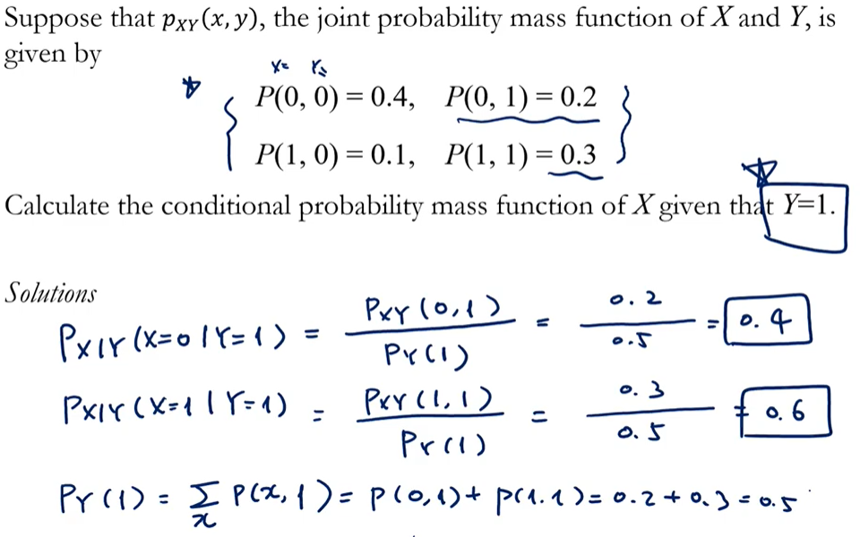

## 결합확률분포

표본 공간 (실험으로 부터 나온 모든 결과를 담고 있는 집합)

확률변수를 통해 표본공간의 값을 실수로 바꿔주지

확률분포는 함수다.

그런데 이때 확률변수가 여러개이다.

여기서 결합은 약간 **동시에** 느낌이다.

X가 a를 갖고 동시에 Y가 b를 갖는 상황

> 각 확률변수가 각 실수로 동시에 대응되는 확률을 구하고 싶다.

이 a와 b값을 0~1 사이의 확률 값으로 바꾸기 위해서 확률함수를 통해.

> P = f(X=a, Y=b)

확률변수가 두개니까 적분도 두개하고 시그마도 두번하고.

## 결합확률함수

$$
f_{xy}(x,y) = P[X=x, Y=y]
$$

## 결합누적분포함수

$$
F_{xy}(a,b) = P\{X<=a,Y<=b\}
$$

a보다도 작고, b보다도 작은 확률.

이게 결합확률함수 인것이지.

확률변수(에서 나온 실수) X와 Y가 들어가면 확률이 나오니까

## 주변확률함수(marginal)

주변확률함수를 구하기 위해선 결합확률함수가 필요하다.

X에 대한 주변확률함수는 x와y의 결합확률을 다 더하는데 Y의 모든 값에 대해 더하면 X의 주변확률함수 값이 구해진다.

Y에 대한 주변확률함수는 X에 대한 X와Y의 결합확률을 다 더한다.

연속형에서는 X의 주변확률함수를 구하기 위해선 X와Y의 결합확률함수를 Y에 대해서 적분한다. 모든 Y의 범위에서

초록색 박스 : 결합확률함수로 부터 나온 확률값

파란색 박스 : 주변확률함수로 부터 나온 확률값

> margin이 사진의 가장자리라는 뜻이 있다고 함. 
>
> 가장자리에 있기에 marginal probability

i가 0일 때의 주변확률값은 

i=0이고 j가 0,1,2,3일 때의 확률값을 모두 더한다.

> 주변확률은 각 행의 합 or 각 열의 합

연속형확률변수에서는 x에 대한 주변확률함수를 구하고 싶을 때는 x와y에 대한 결합확률함수를  y로 적분하면 된다.

다음과 같은 식으로 X와 Y의 결합확률 분포로 부터 X의 분포를 구할 수 있다. 

무슨 의미가 있는지는 잘 모르겠다.

## 독립확률변수

$$
P\{X\in A, Y\in B\} = P\{X\in A\}P\{Y\in B\}
$$

이 식을 성립하면 X와 Y는 독립이라는 것.

동시에 일어날 확률이 각각 일어날 확률의 곱으로 표현된다.

$$
f_{xy}(x,y) = f_{x}(x)f_{y}(y)
$$
여기서 f_x(x)는 주변확률함수.

X와 Y가 독립이라는 것은 X의 정보를 알고 있다는 것이 Y의 값을 변화시키지 못한다.

> X의 정보가 Y를 못바꾸고, Y의 정보가 X를 못바꾸고

 

여기서 X와 Y는 독립이 아니다.

x에 대한 주변확률값과 y에 대한 주변확률값의 곱이 결합확률값이 되지 않기 때문에

확률변수 X와 Y가 독립일 떄, X+Y의 누적확률함수 유도

 

이 F_{x+y}, 누적확률 함수를 convolution이라 부른다.

x의 누적확률함수와 y의 누적확률함수의 convolution이라 한다.

이 convolution 즉, cdf를 미분하면 pdf가 나온다.	 

확률변수 x와 y가 독립이라면, 그 확률변수의 합의 pdf는 초록박스 처럼 표현한다. 

## 조건부확률분포

joint probability function이 주어졌을 때 

conditional probability function 구하기

결합확률분포가 있다면 주변확률분포도 구할 수 있으니

X의 conditional PDF를 구하는 과정. 

#### 1. 0 < y < 1일 때 X의 C PDF를 구해라.

#### 2. Y=y로 주어졌을 때, X가 1보다 클 확률을 구해라.

범위값을 구하고 싶다면, 우선 conditional pdf를 구한 뒤 적분을 취해주면 된다.

