# Day11 베이즈 통계학


이전은 빈도주의 통계학이다.


표본 집합의 부분 집합인 사건에 대해 확률값이라는 숫자를 할당했다.

이 확률값이라는 숫자에 대해 여러가지 해석이 있다.

>  빈도주의 관점과 베이지안 관점


### 빈도주의 

반복적으로 선택된 표본이 사건(부분 집합) a의 원소가 될 경향을 그 사건의 확률

> 동전 던지기에서 앞면이 나올 확률은 0.5
>
> 빈도주의 관점에서는 던진 횟수 * 확률만큼 해당 사건이 발생한다고 본다
>
> 10000번 던지면 10000*0.5 = 5000번.


### 베이지안

확률을 선택된 표본이 특정한 사건(부분 집합)에 속한다는 가설, 명제, 혹은 주장의 신뢰도라고 본다.

**여기서 반복이라는 개념은 사용되지 않는다**


> "새는 날 수 있다" 라는 명제가 있다면 이 명제는 참인가?
>
> 대부분의 새는 날 수 있지만 닭, 타조, 어린 새, 다친 새 등은 날 수 없다. 따라서 항상 참인 명제는 아니다.
>
> 그렇다고 명제 전체가 거짓인건 아니다.
>
> 이런 경우 '이 명제의 신뢰도는 95%이다' 라고 명시하는 방법을 사용.
>
> 베이지안 관점에서의 확률은 이러한 명제의 신뢰도를 뜻한다.
>
> 베이지안 관점에서는 "새가 날 수 있는 가능성은 95%이다"


'앞면이 나오는 사건'의 확률은 0.5다 

'앞면이 나왔다'는 주장의 신뢰도가 0.5다


### 베이즈 정리

베이즈 정리는 조건부확률을 이용하여 정보를 갱신하는 방법을 알려준다.


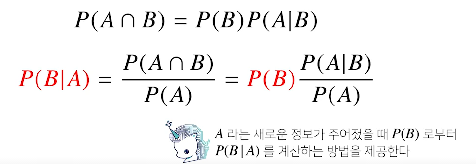

B가 일어날 확률이 주어져있을 때, B가 조건부로 주어졌을 때 A가 일어날 확률과 A가 일어날 확률을 연산하다면

A라는 정보가 주어졌을 때, P(B)가 일어날 확률을 제공해주는 것이 베이즈 공식에서 의미하는 것


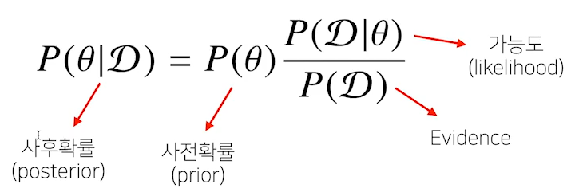

D는 새롭게 관찰하는 데이터, 세타는 모델링 하는 이벤트 혹은 모델의 파라미터 (모수) 

**사후 확률** : 데이터를 관찰을 했을 때, 이 파라미터 혹은 가설이 성립할 확률

> 데이터를 관찰한 이후에 확인하는 확률이기에


**사전 확률** : 데이터가 주어지지 않는 상황에서 사전에 가정한 파라미터 혹은 가정

**사전 확률은 데이터 분석을 하기 전에 주어진 정보라고 할 수 있다. 사전 확률 없이는 베이즈 통계학에서 분석을 하기가 어렵다. 모르는 경우에는 임의로 정할 순 있지만, 베이즈 통계학에서의 신뢰도는 떨어진다.**

 

가능도 : 현재 주어진 모수(세타)에서 이 데이터가 관찰될 확률

Evidence : 데이터 자체의 분포


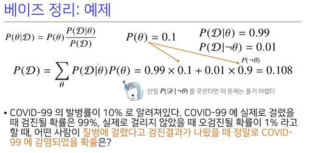

실제로 걸렸을 때를 θ로 표시

검진될 확률을 D로 표시한다.

P(θ) : 사전확률

P(D|θ), P(D|ㄱθ) : 가능도
$$
P(D|\theta) : 실제로\,걸렸을\,때\,검진될\,확률
$$

**P(D)가 저런 식이 나오는 이유는 θ가 (걸리다, 안걸리다) 두 경우만 있으니까 P(D ∩ θ) + P(D ∩ ㄱθ)**


P(θ|D) 공식에 넣고 풀어주면 

0.1 * 0.99 / 0.108로 0.916이 나오는데 이 값이 질병에 걸렸을 때 검진결과 양성이 나올 확률


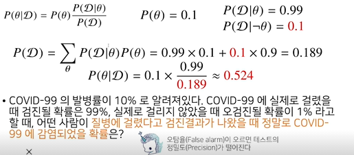

오탐율이 0.01에서 0.1로 다음과 같이 오르면 값에 변화가 생긴다.


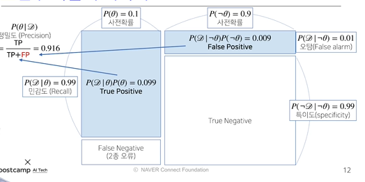

문제에 따라 1종 오류에 초점을 둘지 2종 오류에 초점을 두어 오류를 낮추는데 힘쓸지 결정된다.

> False Negative : 의료 진단에서 중요


위와 같이 베이즈 정리를 통해 precision을 계산할 수 있고,

새로운 데이터가 들어왔을 때, 앞서 계산한 사후 확률을 사전확률로 사용해서 **갱신된 사후확률**을 계산하는 것이 가능하다. 즉, 데이터가 새로 들어왔을 때, 베이즈 정리를 통해 정보를 갱신하는 것이 가능하다.


앞서 문제에서 COVID-99 양성 판정을 받은 사람이 두번째 검사에서도 양성이 나왔다. 이때 진짜 걸렸을 확률은?

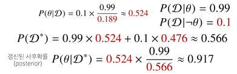

사전 확률을 0.1이 아닌 앞에서 구한 사후 확률이었던 0.524로 설정한다.

가능도는 그대로지만, evidence는 갱신된다. 

결과적으로 0.917이라는 높은 검진율이 나옴,

>한번 더 하면 검진율이 99%까지 오른다.


**베이트통계학의 장점은 데이터가 새로 들어올 떄마다 이런 식으로 사후확률 업데이트 가능**


P(Θ) 를 "질병이 걸렸다" 라는 말의 신뢰도.

D를 새로운 정보. (여기선 검사 결과)

그러니 D라는 새로운 정보가 주어졌을 때, "질병이 걸렸다" 라는 말의 신뢰도가 사후확률


#### 1. 첫번째 epoch.

P(Θ) = 0.1

이 사전확률의 의미는 아무나 길거리에 가는 사람 잡아서 너 질병에 걸렸어 라고 말한다면 이 말에 대한 신뢰도가 0.1이 된다.

그러나 수식을 통해 P(Θ|D)를 구할 수 있는데, 이 사후확률의 의미는 검사에서 양성이 나왔다는 정보를 보고, 너 질병에 걸렸어 라고 말하면 신뢰도가 0.524가 된다.


#### 2. 두번째 epoch.

P(Θ) = 0.524

이 사전확률의 의미는 이전 epoch의 사후확률의 의미와 같다.

이런 상황에서 P(Θ|D)를 구하면, 사후확률은 "양성이라는 검사 결과가 있는 사람"에게 또다시 검사했더니 양성이 나왔다는 정보를 보고, 너 질병에 걸렸어 라고 말하면 신뢰도가 0.917 


여기서는 같은 검사를 수행했지만, 다른 확률을 가고 있는 B검사나 C검사가 있을 수 있다.

이러한 B검사나 C검사를 수행하는, 즉, 새로운 정보를 추가함으로써 "질병에 걸렸다" 라는 말의 신뢰도를 높여가는 과정을 베이즈?


*여기서는 A검사를 두번했는데 확률이 적어지는 것은 독립이라 그런거겟찌?*


조건부 확률은 인과관계를 추론할 때는 함부로 사용해선 안된다. 데이터가 아무리 많아도 불가능

> 인과관계 : A가 B의 원인인가.


인과관계는 데이터 분포의 변화에 강건한 예측모형을 만들 때 필요.


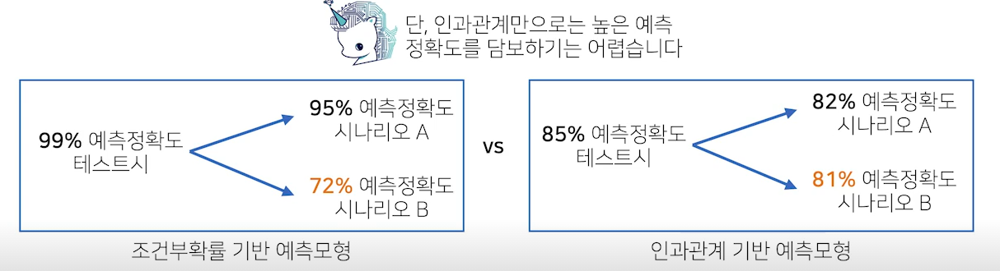

왼쪽은 인과관계를 고려하지 않은 조건부확률 예측모형. 이때는 새로 들어오는 데이터 분포가 달라지면 정확도가 떨어진다.

오른쪽은 인과관계로만 만들면 예측 정확도는 높지는 않지만 여러 상황에서 비슷한 성능을 낸다.


인과관계를 알아내기 위해선 중첩요인의 효과를 제거해야함.

이 중첩요인효과를 제거하지 않으면 모델의 예측 성능을 많이 떨어트릴 수 있따.


R을 지능지수, T를 키라고 했을 때

키가 크냐에 따라 지능지수가 높다라는 예측모형을 만들 때


데이터분석하면 키가 클 수록 지능지수가 높다는 분석이 나온다.

그것은 연령이라는 중첩요인 제거하지 않았기 때문에 생기는 것.

어릴 수록 키가 작으니 지능지수도 더 작은거지.

이러한 것이 가짜 연관성이다.

실제로는 연관이 없는데 다른 변수의 영향에 의해 연관성이 있어 보이는..?


치료법 a와 b가 있다. 어떤 치료법이 완치율이 더 높은가.?

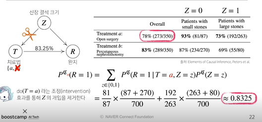


신장결석 크기라는 Z요인을 제거한다. 

조건부확률로 계산했을 때 a의 확률은 0.78이었지만

Z라는 개입을 제거했을 때 a의 확률은 0.8325


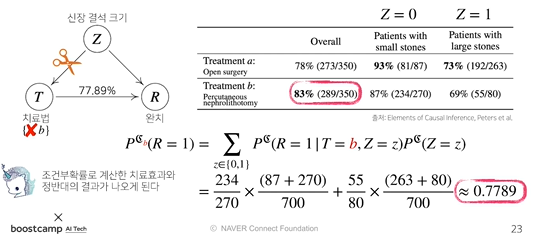

b에서는 0.83 에서 0.7789로 된다.


즉, 치료법에 따른 완치라는 인과관계에 따른 분석을 했을 때, (중첩효과를 제거하면) 믿을만한 해석이 나온다. 더욱 안정적인 예측모형을 설계하는 것이 가능하다.


이렇게 인과관계를 고려해서 중첩효과를 제거한 데이터분석을 통해 안정적인 모델을 설계하는 것이 가능하다. 단순 조건부확률로만 데이터분석을 하는 것은 위험하다.

**데이터분석에서 인과관계 고려가 중요하다 !!**


인과관계를 추론할 떄 조건부확률로만 의존하면 안된다.


# DeepLearning Basic


Key components of DL

* The **Data** that the model can learn

* The **Model** how to transform the data

* The **loss function** that quantifies the badness of the model

* The **algorithm** to adjust the parameters to minimize the loss 

  > SGD, Adam Optimizer


이 네가지 항목에 비추어서 새로운 논문이나 기술을 보게 되면 

기존 연구에 비해서 어떤 장점이 있고 변형이 있는지를 알기 쉽다!!


## Loss fuction

모델이 정해지고 데이터가 정해져있을 때, 이 모델을 어떻게 학습할지

> 각 layer의 weight와 bias를 어떻게 업데이트 할지


regression task 에서는  모델의 예측값과 실제값의 차이의 제곱을 최소화 시키는 방향으로. MSE

classification task 에서는 모델의 예측값과 실제값의 cross entropy를 최소화하는 방향으로.

probabilistic task 에서는 출력값을 단순 값이 아닌 값에 대한 평균과 분산 과 같은 것으로 모델링할 때 MLE를 통해서도 가능.


항상 이 값을 사용하는게 아니고 데이터와 상황에 따라 달라진다. 왜 사용하는지를 아는 것이 중요하다.


MSE는 제곱 쓰지만 절대값 쓰는 loss function도 있다. MAE (L1 norm)

어떤 아웃라이어가 있을 때 이 데이터에 맞추려다가 뉴럴넷이 망가지는 경우가 있다.

그렇기에 l2 norm이 항상 맞는 방법은 아닐 수 있다.


분류문제의 아웃풋은 대부분 원핫벡터로 표현된다.

yi^(d)는 하나만 1이고 나머지는 0 인 벡터

그래서 크로스엔트로피를 쓰는건데... 이게 최적일까?? 하는 생각도 해바야한다.


probabilistic task

모델이 아웃풋이 숫자가 아닌 확률적인 문제를 풀고 싶을 떄

사람의 사진을 보고 나이를 맞추는데, 15, 46살 이렇게 나오는게 아니라

20살이긴 한데 약간 애매해, 이사람은 확실히 30살이야 같이 신뢰도? 같은것을 같이 낼때..


## Optimizer

사람들은 그냥 Adam을 쓴다. 결과가 잘나오니까..

왜 Adam을 쓸까..


다양한 hyperparameter 서치를 하낟.

어떤 옵티마이저 쓰고, base lr, lr 스케쥴링은 어케할지 등등... 이에 따라 성능이 차이가 많이 남


구글은 컴퓨팅 파워가 짱짱하기에 여러가지를 하지만

우리들은 몇번 실험 못해. 이떄 좋은 성능을 내는게 Adam


AI를 만들기 위해 뇌를 모방할 필요는 없다.

시작은 neuron에 동작방법을 모방하며 시작했겠지만, 작금의 뉴럴넷이 잘 작동하는게 뇌를 모방해서 잘 되는게 아니라 여러 변형과 시도로 잘되는 것

> 날기위해 새를 모방하다 새와는 다른 방법으로 날고있다.


편미분을 해서 얻어내는 gradient 정보는 local한 정보이다. 그 위치에서 조금만 유효하기에

step size가 크면 학습이 안된다.

> adaptive learning rate 방법론은 step size를 자동으로 바꿔준다.


n차원 -> m 차원으로 가고 싶다면 행렬을 사용하면 되지.

100차원 입력에서 20차원 출력으로 

이러한 행렬을 곱하는 것을 affine transform이라 한다.


이러한 행렬의 곱 혹은 행렬은 두개의 벡터 공간 사이의 변환으로 해석하는게 좋다.

행렬을 찾는 다는 것은 두 차원 사이의 선형변환을 찾겠다는 것이다.


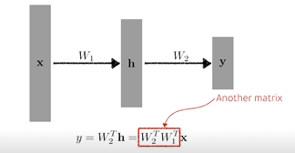

다음과 같이 linear transform으로만 layer를 쌓게 된다면 

W_2*W_1은 사실상 한개의 layer에 있는 어떠한 선형변환 W_x와 같은 것이다. 쌓는 의미가 없어


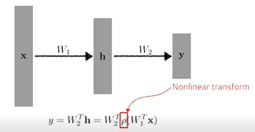

그래서 중간에 nonlinear transform을 넣어준다

x에서 y로 가는 매핑이 표현할 수 있는 **표현력을 최대한 극대화 하기 위해서**는

단순 선형결합을 반복하는 것이 아니라 중간에 activation function을 넣어 non linear transform을 거치고 선형결합하고, 비선형결합 거치고 .....

> 많은 파라미터를 쓰면 더 표현력이 좋겟지. 그래서 쌓는거고. 그런데 선형결합만 하면 파라미터 많아도 의미가 없으니!


한 층에 node를 여러개 만들어(W 크기가 커지는) 여러개의 선을 만들고,

activation function으로 선을 구부리는 과정을 반복한다.


reshape = view

axis = dim

squeeze : 매트릭스를 하나 줄여줌. 랭크를 하나 줄여줌


torch autograd


```
w = torch.tensor(2.0, requires_grad=True)
y = w**2
z = 2*y+5
# z = 2*w^2 + 5라는 식, 그래프를 만든것

z.backward() # 미분 연산을 한다.
w.grad # 미분 값이 출력. # == tensor(8.)
```


nn.Linear 같은 함수들이 어떻게 구현되어 잇는지 찾아보는 것이 좋다... (github)

torch는 numpy와 비슷하다. 하지만 자동미분을 해준다는 것이.. 굿.
