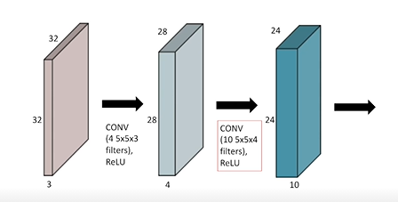

# Day 13 CNN

32x32x3 이미지   -> 28x28x4로 변환하기 위해서는 4개의 5x5x3 커널이 필요하다. 

파라미터 수는 커널 크기 5x5 \* input 채널 수 3 \* 아웃풋 채널수 4 

convolution layer와 pooling layer로 feature extraction을 하고,

FC layer로 decision making을 한다 (분류 하거나 회귀해서 출력값을 얻어주는)

그러나 최근에는 FC layer를 없애거나 최소화 시키는 추세이다. 

> FC Layer가 Convolution Layer보다 파라미터 숫자가 훨씬 많음

내가 학습하고자 하는 모델(SVM,RF,NN 등등)의 파라미터의 숫자가 늘어나면 늘어날 수록

학습이 어렵고 Generalization Performance가 떨어진다고 알려져있다.

다루는 네트워크에 대해서 파라미터 개수가 몇개인지 손으로 계산해봐라 

>  근데 GPT-3는 그렇게 많은데..? 이부분은 더 연구해봐야할..

## 커널

대부분의 상황에서 홀수 커널을 사용한다.

대개 필터를 통과한 후 이미지의 크기가 이전 이미지의 크기와 동일하도록 맞추려고 한다.

그래서 n = n + 2p - f + 1 식이 되어야 하는데 f를 짝수로 주면 p가 정수가 되지 않아 패딩을 주기 힘들다.

## 패딩

가장자리에 있는 값에도 convolution operation을 하기 위해서 사용한다.

68x128x3x3

네트워크를 봤을 때 파라미터 수가 만, 십만, 백만 단위인지를 알아 볼 수 있는 감이 필요하다.

(각 레이어가 2개인 이유는 이당시에는 gpu 성능이 안좋아 하나에 다 올릴 수 없어서 2개의 네트워크 만듬)

> 첫번째 layer에서 48채널 2개가 생기는데 그냥 96채널 하나가 생긴다고 생각해도 됨

layer 1 : 11x11x3x48(x2) =35k

layer 2 : 5x5x48x128(x2) = 307k

layer 3 : 3x3x128(x2)x192(x2) = 884k

...

FC layer에서는 인풋 파라미터(뉴런) 개수와 아웃풋 뉴런 개수를 곱한게 파라미터 개수

FC layer 1 : 13x13x128(x2)  x  2048(x2) = 177M

(Convolution layer보다 파라미터 개수가 약 1000배가 늘어난다.)

convolution layer는 하나의 커널이 모든 위치에 대해서 convolution 하기 때문에

Convolution layer를 점점 더 깊게 쌓고 FC layer는 줄이니까 깊이는 점점 깊어지지만 파라미터 개수는 줄어드는

## 1x1 Convolution

256x256개에 채널이 128에서 32로 줄이는 효과를 낸다. (Dimension reduction)

convolution layer를 더 깊게 쌓으면서 파라미터 개수를 줄일 수 있다.

>  뉴럴넷을 깊게 쌓는데 파라미터를 줄이는 테크닉..

## Modern CNN (but ~2018)

### 1. AlexNet 

AlexNet가 성공한 이유

* ReLU
* GPU implementation
* overlapping pooling
* data augmentation
* dropout

11x11 filter같이 큰 크기는 안좋다.

receptive field 하나의 convolutional kernel이 볼 수 있는 이미지 영역은 커지지만 상대적으로 더 많은 파라미터가 필요로 한다.

> 작은 filter 여러개로 쌓는게 같은 receptive field을 보는데 적은 파라미터 사용

**receptive filed :  특정 feature 픽셀이 원본 영상의 "몇 픽셀"이나 값을 대변할 수 있는지를 의미**

#### ReLU 

* preserve properties of linear models (양수에서 기울기가 1로 값을 유지하니까)

* easy to optimize with gradient descent 

* good generalization

* overcome the vanishing gradient problem 

  > sigmoid에서 값이 커질수록 기울기가 줄어든다. 그런데 결국 그레디언트 값이 이 기울기니까 뉴런의 값이 많이 크면 sigmoid에 의해 기울기가 0에 가깝게 된다. 그래서 사라짐

### 2. VGG Net

* **3x3 colnvolution filter만 사용했다**
* dropout

하나의 convolution filter가 찍었을 때, 고려되는 인풋의 크기가 커진다. receptive field

하나의 값을 얻기 위해 고려할 수 있는 입력의 spatial dimension

3x3을 두번하면 receptive field는 5x5가 된다.

receptive field 차원에서는 3x3 두번과 5x5가 같다. 하지만 파라미터 수는 다름

> 그려보면 첫번째 인풋에 3x3 찍고, 아웃풋에 3x3 찍는게 
>
> (첫번째 인풋 5x5영역이 두번째 인풋의 3x3영역이 됨) 
>
> 첫번째 인풋이 5x5찍는 영역과 같다.

**이러한 이유 때문에 alexnet에서 썻던 11x11 같은 큰 크기의 필터를 사용안함**

즉! receptive field를 늘리는 관점에서는 크기가 큰 필터보다 크기가 작은 필터 여러겹 쌓는게 좋다.

### 3. GoogLeNet

* 중간중간에 1x1 convolution을 잘 사용해서 파라미터 숫자를 줄임
* inception blocks
* network in network 구조를 사용

#### Inception Block

하나의 입력에 대해 여러가지 receptive field를 갖는 필터를 거치고 이를 통해 여러개의 response를 concat하는 효과도 있고 **1x1 convolution이 끼어 들어감으로 인해 전체적인 파라미터 개수를 줄임**

여기서 spatial dimension을 중요하지 않다. (음.. 사진의 행과 열?) 왜냐하면 파라미터의 개수에 영향을 미치지 않아. 개수에 미치는건 인풋의 채널과 커널사이즈

channel 128에 연산을 하여 아웃풋도 128채널이도록 하자.

3x3x128 필터를 한번 사용하는 것과 1x1x32 필터와 3x3x128 필터를 사용하는 것의 파라미터 차이가 크다.

**receptive field 차원에서도 둘은 똑같지만** 파라미터 숫자의 차이가 많이 난다.

즉! 1x1 convolution을 잘 활용하면 전체적인 파라미터 숫자를 줄일 수 있다.

AlexNet은 8layer인데 파라미터 수가 60M인데 GoogLeNet은 22layer인데 4M이다.

뒷단에 있는 FC layer를 줄이고, 11x11 convolution 같은 큰 크기의 컨볼루션 줄이고, 1x1 convolution을 통해 feature dimension을 줄였기 때문에 이와 같은 효과, 성능이 나옴

### 4. ResNet

Resnet은 오버피팅은 아니었지만 layer가 깊을수록 학습이 더 잘 안됐다.

#### Residual Connection (identity map)을 추가.

입력이 올라오게 되면 출력이 나오는데

이 입력값 x를 출력값에 더해준다. 그래서 궁극적으로 원하는 것은 이 convolution layer가 학습하고자 하는것은 residual. 즉 f(x)가 학습하는 것은 이 레이어를 통과했을 때의 출력과 입력의 차이만을 학습하자는 것이다.

x가 입력이고, 출력이 x+f(x)니까... 차이.

이러한 shortcut connection(하나 이상의 레이어를 skipping)으로 x를 더해주어 F(x)가 아닌 F(x)+x를 다음 레이어로 전달한다. 

이를 통해 얻는 이점은 **vanishing gradient 문제가 해결**되어 모델을 더욱 깊게 쌓을 수 있다.

> x + F(x)를 미분하면 1+F'(x) 이므로 최소 1이상의 gradient를 갖는다.	

> training과 test의 loss와 accuracy를 보게 되는데, 이 두 개가 서로 상반되는 경우에 우리는 overfitting을 의심하고 (training accuracy는 상승, test accuracy는 하락), 이 두 개가 서로 같은 경향을 띄지만, 전체적인 loss가 크고, accuracy가 낮은 경우에 우리는 vanishing gradient를 의심하게 됩니다.

skip connection에 대한 질문. (좀더 공부해야 할 듯)

* https://www.edwith.org/bcaitech1/forum/49033
* https://www.edwith.org/bcaitech1/forum/48979

? 원래는 x와 f(x)? 그럼 이전에 학습하던건 뭐지?

residual을 사용하면 더 깊게 쌓아도 학습이 가능해졌다.

더해주려면 차원이 같아야하지

입력이 128x128x64였는데 3x3 conv, BN, Relu, 3x3 Conv, BN 을 거쳐서 나오는 값이 차원이 다를 수도 있다. (128x128x32 같이 나올 수도..)

이때 x와 결과의 채널을 맞춰주기 위해 1x1 conv 해주는게 project shortcut

> 그러나 일반적으로 project shortcut보다 simple shortcut 많이 사용

Batch Norm을 convolution 다음에 넣어야 한다. actiovation function  다음에 넣어야 한다로 논쟁이 많다.

### BottleNeck architecture

구글의 inception block과 똑같다.

입력값을 convolution하기 전에 채널의 수를 줄이면 파라미터 수를 줄일 수 있다.

3x3 convolution하기 전에 인풋채널 줄이고, 컨볼루션하고 채널을 늘리고.

### 5. DenseNet

Resnet에서는 conv를 통해 나온 값을 더해주잔아

더하면 두 값이 섞이니가 concat해보자. (spatial dimension이 같으니 concat 가능)

concat하면 채널이 커진다. 채널이 2배, 4배, 8배로 커진다.

채널이 커지면 convolution feature의 채널도 커지니 파라미터 수가 늘어난다.

그래서 1x1 conv를 이용해 채널 수를 줄여준다.

Dense block으로 채널 늘리고, Transition Block으로 채널 줄이고

ResNet에서는 x+F(x)를 하는데 이때 기존 결과값과 input 값이 섞여버려서 정보 손실이 발생한다.

이를 커버하기 위해 concat을 통해 input과 output을 그대로 가져가고, 1x1 convolution을 통해 정말 필요한 값들을 linear transformation을 통하여 적절히 가져가게 되므로 단순 덧셈보다 정보를 가져가는 측면에서 더 이득이다.

> input이 1인데 output이 9, input이 2인데 output이 8이면 둘다 최종 결과가 10으로, 둘다 같은 값으로 인지하게 된다. 그러면 정보 이해 및 표현력에서 한계를 가진다.

**대부분의 상황에서 이 dense net 구조가 SOTA를 얻을 떄가 많다.**

## Semantic Segementation (Dense classification)

이미지의 모든 픽셀이 어떤 클래스에 속하는지를 알고 싶은 것

자율주행에 많이 활용된다.

앞에 화면에 자동차인지, 도로인지, 사람인지 등등을 다 파악해야함.

기존 CNN 네트워크

Fully Convolutional Network

dense layer를 없애고 convolution만으로 네트워크를 구성

**이 두 네트워크는 파라미터 개수가 완전히 동일하다**\

앞의 convolution layer에서 20x20x1000의 아웃풋이 나왔다면

FC layer에서는 400000 짜리 벡터로 바꾼 뒤 FC layer에 넣어 1000차원의 벡터로 바꾼다. 

> 이때 파라미터 개수는 400000x1000

Convolution layer에서는 20x20x1000 짜리 커널을 만들어서 이 커널로 컨볼루션 해서 1x1x1000짜리 아웃풋을 만들어낸다. 

> 이때 파라마터 개수는 20x20x1000x100 이다.

4x4x16짜리 인풋에 4x4x16 커널로 컨볼루션 하면 한개의 값이 떨어지니까 이를 10번

이렇게 fully convolutional network의 이점은 인풋 이미지에 상관없이 네트워크가 돌아간다.

convolution layer은 정해진 커널로 동일하게 찍기 때문에 인풋 사이즈가 커지면 아웃풋 사이즈만 커질 뿐이다.

또한, FC Layer가 없기에 2차원 정보를 잃어버리지 않기 때문에 물체가 어디에 존재하는지 예측해낼 수 있다.

원래 FC가 있으면 flatten이 있기때문에 인풋크기가 달라지면 안되지만?

이렇게 full convolutional network로 하게 되면 단순히 분류가 아닌 semantic segementation할 수 있고, 히트맵을 그릴 수 있다

그러나 convolution layer들을 거치고 나서 얻게되는 마지막 heat map의 개수는 훈련된 class의 개수와 동일하다.

> 만약 강아지 사진이라면 강아지가 있는 위치에 있는 픽셀값들의 크기가 높다.

그래서 원래 크기만큼 나오도록 upsampling을 해줘야한다.

### Deconvolution

convolution의 역연산이다.

convolution을 하면서 stride를 2로 주면 대략 크기가 반으로 줄어든다.

deconvolution에서는 stride를 2로 주면 대략 2배가 된다.

spatial dimension을 키워준다.

엄밀히 따르면 convolution이 몇개의 숫자를 합쳐 하나의 숫자로 만드는 건데, 하나의 숫자에서 여러개 숫자를 완벽히 복원하는 것은 불가능함.

그러나 파라미터의 숫자나 네트워크 입력과 출력의 느낌으로 봤을 때는 convolution의 역이라고 생각하면 편해

## Detection

R-CNN

입력 이미지에서 대략 2000개의 bounding box를 뽑아냄.

이 데이터를 CNN을 다 통과시켜서 각각의 box를 분류함

> 즉, cnn 2000번 돌려야 하나의 결과

Faster R-CNN

이러한 bounding box를 뽑아내는 것도 학습을 시키자

region proposal network라고 만들고 학습시킨다. 얘는 사진 속에 어떤 물체가 있는 곳을 crop 해준다. 

그리고 그 box를 CNN을 통해 분류시킨다.

YOLO (you only look once)

동시에 여러개의 바운딩 박스를 분류한다.

바운딩 박스를 뽑아내는 과정이 없기 떄문에 속도가 아주 빠르다.

얘는 바운딩박스를 예측하면서 픽셀에 class를 예측하는 일을 동시에 수행한다

마지막이 이를 취합하여 어떤 박스에 어떤 클래스인지 판단.

