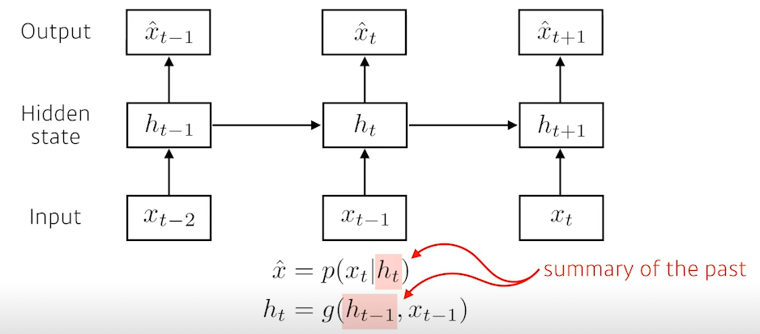

# Day 14 - RNN

시퀀스 데이터 표현

P(x_1, ... , x_t) = P(x_t | x_1, ... , x_t-1)

P(x_1, ..., x_t-1) = P(x_t-1 | x_1, ... , x_t-2)

이걸 계속 푸니까 밑에와 같은 식이 나온다.

X_1 ~ X_t-1 까지 데이터가 주어진 상황에서 X_t를 모델링 한다.

이전 시퀀스의 정보를 가지고 앞으로 발생할 데이터의 확률분포를 다루기 위해 조건부확률을 이용한다.

시퀀스 데이터에서는 매 시점에서 다뤄야 하는 데이터의 길이가 매번 달라진다.

그래서 길이가 가변적인 데이터를 다룰 수 있는 모델이 필요하다

그러나 너무 옛날 데이터는 사용할 필요 없을 때, 고정된 길이 만큼(타우)의 시퀀스를 가지는 모델로도 만들 수도 있음.

타우의 길이는 도메인 지식을 기반으로 해야한다.

잠재 AR모델.

잠재변수를 인코딩해서 활용하는 잠재 AR모델.

가변적인 모델을 고정적인 모델로 바꿀 수 있다.

과거 정보를 Ht로 인코딩한 뒤, 이전 정보와 인코딩된 정보를 인풋값으로 넣어준다.

이 잠재변수 Ht를 신경망을 통해 반복해서 사용하여 시퀀스 데이터의 패턴을 학습하는 모델이 RNN

가장 기본적인 RNN 모델은 MLP와 유사하다.

W1과 W2는 시퀀스와 상관없이 불변인 행렬이다?

가중치 행렬이 3개가 나온다

Wx(1) : 입력 데이터로 부터 선형모델을 통해 잠재변수로 인코딩하는 역할

WH(1) : 이전 시점의 잠재변수로부터 정보를 받아 현재 시점의 잠재변수로 인코딩해주는 역할

W2 : 이렇게 만든 잠재변수를 통해 출력으로 만들어주는 역할

**W2, WX1, WH1은 t에 따라 변하지 않는다.**

t에 따라 변하는 것은 오로지 잠재변수와 입력데이터이다!!!

RNN에서 사용되는 가중치 행렬은 t에 따라 변하지 않는다!.!

BPTT

빨간색이 BP 경로

잠재변수에 gradient가 두개가 들어온다. 다음 시점에서 들어오는 GV와 출력에서 들어오는 GV

이 GV를 입력과 이전 시점의 잠재변수로 보낸다.

BPTT를 모든 t시점에서 적용하면 계산이 불안정해진다.(값이 없어지거나 너무 커지거나)

>  과거 시점으로 갈 수록 gradient가 0이 되면, 학습에 반영이 잘 안된다.

그래서 truncated BPTT를 사용해서 좀 줄일 수 있지만, 완전한 해결책은 아님.  (기울기 소실 여전.)

길이가 긴 sequence data를 처리하는데 알맞지 않아 LSTM이나 GRU가 나오게 됨.

## RNN Basics

Sequential Model

sequential 데이터의 어려움은 길이가 언제 끝날지를 몰라.

받아들여야하는 입력의 차원을 알 수가 없다.

그래서 convolution이나 mlp를 사용하지 못해. 왜냐? 내가 몇개의 입력을 넣을지를 아직 모르니까.

Markov Model (first-order autogregressive model)

과거 데이터 하나만 보고 미래를 예측한다.

joint distribution을 표현하는것은 매우 쉽지만

많은 정보를 손실한다.

> 내일 수능 점수는 오늘 공부한 양에만 depentdent한다? 말이 안됨.

latent autorgressive model

과거의 많은 정보를 고려해야 하는데 markov model은 이를 이용하지 못한다.

latent autoregressive model은 잠재변수 h(latent state)가 이전 데이터를 요약하고 있다.

## Vanila rnn

RNN은 MLP와 다 똑같은데 자신으로 돌아오는 구조가 있다.

time step t에서 보는 것은 t-1까지 정보를 인코딩한 잠재변수와 t시점의 입력값.

x가 어떤 네트워크를 통과해서 이전에서 나온 cell state와 합쳐 네트워크를 통과한 뒤 non linear 함수를 거쳐 아웃풋으로 나오고 이 값이 다시 다음 time step에 cell state로 들어간다.

rnn의 가장 큰 단점은 short-term dependecies

몇 스텝 전에 있는 정보는 잘 고려되지만 멀리 있는 정보를 고려하긴 힘들다.

BP을 할 때 다음과 같이 과거의 h로 가기에는 똑같은 weight를 곱하고 non linear function을 통과시킨다.

h0의 값이 h4까지 갔을 때, 값이 거의 없어진다.

> sigmoid로 0~1 값을 계속 곱하면 엄청 작아지거나
>
> relu로 양수값이 나와서 계속 곱하다보니 값이 너무 커지다거나.

## LSTM

lstm은 하나의 영역을 보면 입력값으로 previous cell state, previous hidden state, input으로 3개가 들어오고

next cell state, next hidden state, output으로 3개의 아웃풋이 나온다

lstm은 3개의 gate로 이뤄져있다. 이 gate를 기준으로 이해하면 좋다

### 중간을 흘러가는 cell state

이 cell state는 time step t까지 들어온 정보를 모두 요약하는 역할을 한다.

컨베이어 벨트라 생각하면 된다.

매 타임스텝마다 컨베이어 벨트에 물건이 올라온다. 이 정보를 잘 조작해서 어떤 정보가 유용하고 안유용한지를 가지고 다음 번으로 넘겨준다. 이 컨베이어 벨트에 뭐를 올리고 뭐를 뺄지를 잘 정하는게 gate이다.

### Forget Gate

decide which information to throw away

어떤 정보를 버릴지를 판단한다.

시그모이드를 거치기에 0또는 1값.

현재의 입력과 이전의 셀 state 값을 통해 이전 셀 state에서 넘어온 정보 중 어떤걸 버릴지 판단한다.

### input gate

decide which information to store in the cell state

새로운 정보를 이 cell state에 올릴지 말지를 결정한다.

i_t가 이전의 state와 입력을 가지고 어떤 정보를 올릴지 말지를 정한다.

C_t가 올릴 정보를 표현하게 된다.

C_t는 현재 입력값과 이전 cell state를 합쳐서 만든 cell state 예비군. 

i_t가 1이면 이 C_t를 올리는 거니까 현재 정보를 올리는거고 0이면 안올리는거고

### Update cell

forget gate에서 나온 f값을 통해 버릴건 버리고,

input gate에서 나온 C_t를 이전 C에 업데이트 한다.

### Output gate

output gate로 현재 시점의 아웃풋 값을 만들어내고, 이 값을 h_t로 다음 step으로 보낸다.

## GRU

LSTM은 gate가 3개였지만 여기는 2개이다.

reset gate와 update gate

많은 상황에서 lstm보다 gru가 더 좋다.

lstm은 gate unit이 3개고 gru는 gate unit이 2개니까  네트워크 파라미터가 적으니까 (gate 개수가 적으니까)

더 적은 파라미터로 동일한 아웃풋을 내면 generalization performance가 올라가기 때문에 그런 관점에서!!

what makes sequential modeling a hard problem to handle?

말 같은 sequential data는 중간에 빠지거나, 끝까지 안하거나, 좀 섞일 수 있다.

그럼 모델링하기 매우 힘들어진다.

이런 단점을 보완하기 위해 만들어진게 트랜스포머

## 트랜스포머

Transformer is the first sequence transduction model based entirely on attention

새로운 데이터가 들어오고 이전 cell state가 사용되고 이를 다음 step으로 보내는 재귀적인 구조였다.

입력과 아웃풋의 domain이 다를 수 있고, 입력 개수와 출력 개수도 다를 수 있다.

rnn 같은 경우에는 3개의 단어가 들어가면 뉴럴넷이 3번 도는데, 트랜스포머에서는 재귀적으로 돌지않고 한번에 찍어낸다. 물론!! decoder에서 단어를 만들 때는 auto regressive하게 한 단어씩 만들지만 encoder 부분에서는 한번에 n개의 단어를 처리하는 구조이다.

동일한 구조를 갖지만 서로 다른 파라미터를 갖는 인코더와 디코더가 6개가 stack되어 있다.

이해할 점

1. n개의 단어가 어떻게 인코더에서 한번에 처리가 되는지
2. 인코더와 디코더 사이에 어떤 정보를 주고받는지
3. 디코더가 어떻게 단어를 제너레이션 할 수 있는지

### 인코더

Feed forwrad NN은 MLP와 비슷하다

self-attention이 트랜스포머에서 주요한 부분.

벡터 x1에서 z1으로 넘어갈 때, x2와 x3의 정보를 활용한다.

> n개의 단어가 주어진다면 각각의 단어 벡터를 zi로 바꿀 때 나머지 n-1개의 단어를 같이 고려한다.

그래서 self attention에서 나온 결과는 dependencies 하지만 feed forward 에서는 independencies

각 단어가 주어졌을 때, 하나 마다 3개의 벡터가 나옴

이 3개의 벡터를 통해 x_i이라는 임베딩 벡터를 z_i로 바꿔준다.

각각의 단어마다 eky, query, value 벡터를 만들고 score 벡터를 만든다.

i번째 단어에 대한 쿼리 벡터와 나머지 단어들과의 키 벡터와 내적을 통해 값을 구한다.

> 특정 타임스텝에 어떤 입력들에 더 많은 인터렉션이 일어나야 하는지를 구하는 과정

입력 embedding 벡터 마다 각각의 뉴럴네트워크를 통해 key, query, value 벡터를 만들고,

> 여기서 3개의 뉴럴넷은 모든 단어에 shared

1. 현재 단어의 쿼리벡터와 나머지 단어의 키벡터를 모두 내적한다. -> score
2. 쿼리벡터의 디멘션의 루트값으로 내적값을 나눈다
3. 이 값을 softmax를 취해 준다 -> attention weight(얼마나 단어와 interaction 해야하는가)
4. attention weight와 value vector를 weighted sum을 해서 최종적인 결과물을 낸다

query 벡터와 key 벡터는 항상 차원이 같아야 하지만 value 벡터는 달라도 된다.

value 벡터의 차원이 최종 결과물의 차원이다 

> 단!! multi head attention에서는 또 달라지지만!! 위 상황에서는 그렇다고

왜 이게 잘될까??

어떤 이미지 하나가 주어졌다면 이 이미지 하나를 cnn이나 mlp로 dimension으로 바꾸면 인풋이 fix되어있으면 출력이 고정된다. 

하나의 인풋이 고정되어 있더라도 인코딩하려는 단어와 옆에있는 단어에 따라 인코딩되는 값이 달라진다.

같은 입력이라도 옆에잇는 입력에 따라 결과가 달라지기에 더 많은 걸 표현할 수 있다

n개의 단어가 주어지면 n by n짜리 입력을 처리해야 함.

rnn은 100000개의 sequence data가 주어지면 그냥 돌리면 된다. 오래 걸리겠지만 처리는 된다

그러나 트랜스포머는 n개의 단어를 한번에 처리해야하고 computational cost가 n^2에 비례하기 때문에

length가 길어짐에 따라 메모리를 많이먹기에 한계가 있을 수 있다. 

그러나 훨씬더 flexible 한 네트워크 만들지

### Multi head attention

앞에서 한 attention을 여러번 하는 것

하나의 입력 임베딩 벡터에 대해서 Q,K,V를 하나만 만드는게 아니라 n개 만드는 것

n개의 attention을 반복하게 되면 n개의 인코딩된 벡터가 나오게 된다.

> 논문에서는 8개를 쓴다 그래서 1개의 임베딩 벡터가 들어가면 8개의 각기 다른 임베딩 벡터가 나옴

하지만 다음 인코더를 스택해야 하니까 인코더의 입력과 출력의 차원을 맞춰줘야한다.

그래서 간단한 learnable linear map을 추가시켜 차원을 바꿔준다. (단순 matrix)

> 10 dimension이 8개를 어텐션해서 80 dimension의 출력이 나오면 이를 80x10 matrix로 10차원으로 줄임

그러나 실제 100 dim짜리 임베딩 벡터가 들어온다면 이를 바로 쓰지 않고 10개의 10 dim짜리 벡터라 나눈 뒤 어텐션을 수행한다.

그럼 8개가 다 같지 안을까?

### Positional Encoding

데이터를 sequential 하게 넣어주지만 positional encoding을 안하게 되면 abc, bca, cba 모두 똑같은 결과가 나온다.

> 단순 임베딩 벡터의 내적값을 통해 결과를 내니까 순서가 고려되지 않는다.

주어진 입력에 어떤 값을 더해주어 순서에 대한 정보를 넣어준다.

그냥 각 임베딩 벡터에다가 순서에 따라 다음과 같은 값을 단순히 더해주는 과정

encoder에서 decoder로 보내지는 정보

인코더에서는 key와 value 벡터를 보내게 된다

인코더에서도 i번째 단어의 쿼리벡터와 나머지 단어의 키벡터를 곱해 attention 만들고 value를 weight sum하잔아.

인풋에 있는 단어들을 디코더에 있는 출력하고자하는 attention map을 만들려면 

디코더에서 현재 예측하는 단어보다 앞에있는 단어를 보지 않기 위해서 masking을 한다

