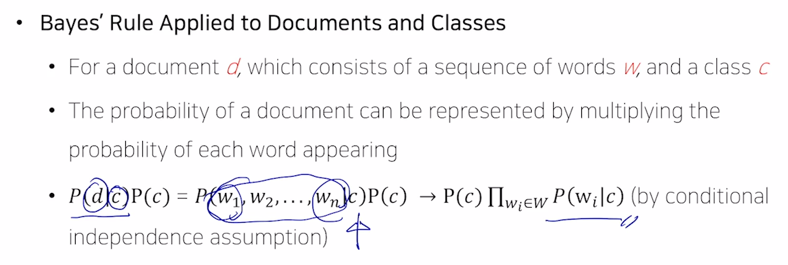
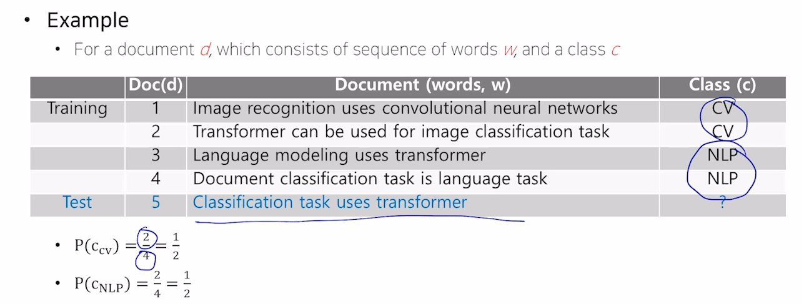
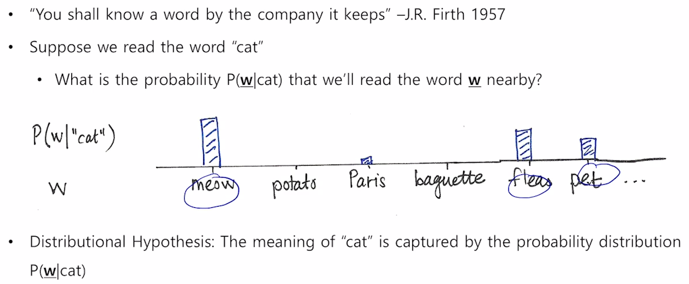

## 단계별 NLP Task

### low level parsing

#### 1. 토크나이저

문장을 이해하기 위해서 문장을 이루는 각 단어들을 정보 단위로 쪼개나가는 것. 

> 형태소 분석기

#### 2. stemming

단어의 어근을 추출하는 과정

> stduying, studied
>
> 하늘이 맑다. 맑은데 맑지만 등등 어미가 다양하게 변화할 수 있다.

> 이런 수많은 어미의 변화 속에서도 같은 의미라는 것을 컴퓨터가 이해할 수 있어야 한다.

### word phrase level

#### 1. NER 

고유 명사, 명사를 인식하는 기법. 문자열 내에 있는 단어들을 기관명, 인물, 장소 와 같이 단어를 정해진 클래스로 분류하는

#### 2. POS tagging 

word들이 문장 내에서 품사나 성분이 어떤 것인지 알아내는 테스크

### sentence level

#### 1. sentiement analysis 

#### 2. machine translation

### multi-sentence and paragraph level

#### 1. entailment prediction 

두 문장간의 논리적인 모순 관계를 예측.

> "어제 존이 결혼이 했다". "어제 최소 한명이 결혼을 했다." 라는 두 문장이 들어오면
>
> 첫 문장이 참인 경우 두번째 문장은 자동으로 참이 된다.

#### 2. Question Answering 

구글에 "where did napoleon die?" 라고 치면 이 문장을 해석하여 정답에 해당하는 답을 결과 상단에 위치시킨다.

이렇게 할 수 있는 이유는 먼저 검색창에 있는 키워드들이 포함된 문서들을 모두 검색하고, 문서들로 부터 QA를 통해 질문에 대한 정답을 찾아낸다.

#### 3. dailog system

#### 4. summarization

# Bag of word

딥러닝이 적용되기 이전에 많이 활용되던 방법으로 단어 및 문서를 숫자 형태로 나타내는 가장 간단한 기법

#### 1. 문장에서 나오는 단어들을 vocab으로 만들고, 각 단어들을 원핫 벡터로 만든다

모든 문장에서 나온 유니크한 단어의 개수가 벡터의 차원.

#### 원핫벡터의 단점

어떤 단어쌍이든지 간에 유클리디안 거리가 루트2이고 코사인 유사도가 0이 된다. 단어 의미에 상관없이 모두 동일한 관계를 갖는다.

#### 2. 들어있는 단어들의 벡터를 모두 더함으로써 문장을 표현할 수 있따.

이를 bag of word라고 한다. 

### 기본적인 문서 분류 기법인 Navie Bayes classifier

나이브 즉, 단순하게 모든 feature들의 등장을 각각 독립으로 가정한다. 그래서 계산이 단순한 것.

그러나 실제 케이스에서는 모든 단어들이 독립이라고 볼 수는 없고, 딥러닝을 비롯한 다양한 방법들이 제시가 된다.

>  그러나! naive bayes도 괜찮은 성능을 성능을 보이는 것으로 보아 단순한 가정이라기에는...

문류가 분류될 수 있는 카테고리가 C개 있다.

> 경제 , 문화, 스포츠, 해외  => C = 4

베이지안 분류기는 모든 c에 대한 P(c|d) (d가 들어왔을때 클래스가 c일 확률)들 중 가장 높은 확률을 택함으로써 문서 분류를 한다.

P(d) 는 문서가 뽑힐 확률이니 그냥 상수로 무시할 수 있다.

그래서 맨 마지막 식이 도출된다.

* P(d|c) : 클래스 c가 고정됐을 때 문서 d가 나타날 확률.

* P(w|c) : 클래스가 고정됐을 때 단어가 나타날 확률

c가 고정됐을 때, w_1~ w_n 각 단어가 나올 확률이 독립이라고 가정한다면 각 단어가 나올 확률을 모두 곱한 형태로 나타낼 수 있다.

해당 클래스의 개수 / 모든 클래스의 개수로 P(c) 를 구할 수 있다.

다음으로는 클래스가 둘중 하나의 클래스로 고정됐을 때, 각 단어가 나오는 확률을 추정한다.

CV에서 나오는 단어가 총 14개인데 그중에서 task라는 단어가 1번 나왔다. 

즉, P(w_task | C_cv) = 1/14이다.

각 클래스가 나올 확률 \* (각각의 단어가 가지는 조건부 확률 값의 곱)으로 확률값을 구할 수 있다.

두 확률 값을 구한 뒤 확률 값이 큰 곳을 최종 결정한다.

입력 문장 중 특정 단어가 클래스 내에서 전혀 발견되지 않았을 경우 그 클래스에 속할 확률은 0이 되고, 그 단어가 포함된 문장에 대한 클래스 예측 확률은 0이 된다.

## Word Embedding

비슷한 의미를 갖는 단어가 좌표상에 비슷한 위치에 매핑되게 함으로써

단어들의 의미상 유사도를 잘 반영하게 하고 싶다.

## Word2Vec

단어를 저차원의 벡터 공간으로 매핑하는 방법.

같은 문장에서 나타난 인접한 단어들 간에 의미가 비슷할 것이라는 가정을 사용한다.

즉, 비슷한 분포를 가진 단어들은 비슷한 의미를 가진다 == 같이 등장하는 횟수가 많을수록 두 단어는 비슷한 의미를 가진다.

예를 들면 "the cat purgs", "this cat hounts mice" 두 문장이 있을 때,

cat이라는 단어를 중심으로 앞뒤에 나타난 the 와 this

purgs hounts mice 라는 단어들이 cat이라는 단어와 의미적으로 관련성이 높다고 생각할 수 있다.

> purgs나 hounts는 cat이 할만한 행동
>
> 즉, the와 this가 the와 hounts 보다는 벡터 공간으로 보냈을 때 가까울 것이다?

한 단어의 의미를 주변에 등장하는 단어들을 통해 알 수 있다는 사실에 착안한다.

cat 주변에 나타나는 단어들의 확률분포를 예측하게 된다.

cat단어를 주고, 주변 단어를 숨긴 채 주변 단어들을 예측하는 방식으로 학습이 진행된다.

window slicing 기법을 통해 입력과 출력 단어 쌍을 구성할 수 있다.

현재 예제에서는 vocab size가 3이기 때문에 입력과 출력 레이어의 노드 수는 3개

가운데 있는 히든 레이어의 노드 수는 사용자가 정하는 하이퍼파라미터이며 워드임베딩을 수행하는 좌표공간의 차원수로 동일한 값.

* W1은 3차원 벡터를 받아 2차원 벡터로내어주기에 2 by 3 matrix

* W2는 2차원 벡터를 3차원 벡터로 변환하기에 3 by 2 matrix

* 변환된 3차원 벡터에 softmax를 통과시켜줌으로써 3차원 벡터가 확률분포값을 나타내도록 한다.

즉, (study, math) 쌍에서 입력이 study로 주어져서 나온 확률분포 벡터와 ground truth로 주어지는 math에 백프로의 확률을 부여한 확률분포 벡터(원핫벡터)와의 거리가 가까워지도록 학습한다.

원핫벡터의 특성상

W1\*x 연산시에 원핫벡터 자리에 해당하는 컬럼 벡터를 W1에서 뽑아오는 과정으로 생각할 수 있다.

>  단순히 원핫벡터에서 1을 갖는 idx에 해당하는 column 만을 뽑아오는 거지

그렇기에 embedding layer라고 한다.

torch에서도 embedding layer와 linear layer로 구분하는데 

내 생각엔(?) embedding layer는 단순 access만 하고,  linear layer는 모두 곱하는 연산을 수행한다.

W2 연산 후에 나오는 logit 값이 ground truth에서 1에 해당하는 곳은 +무한대이고 나머지는 -무한대가 되도록..

???????

내적 연산을 벡터들간의 유사도를 나타내는 과정으로 나타낸다면

입력 단어의 W1 상에서의 벡터와 

출력 단어의 W2 상의 벡터 간의 내적에 기반한 유사도가 최대한 커지도록 하고

출력단어가 아닌 다른 단어들의 W2 상에서의 벡터들의 내적에 기반한 유사도는 최대한 작게 만들도록 

W1와 W2를 조정해가며 학습해가는게 Word2Vec

> w2에서 파란색 부분이 출력단어의 내적에 기반한 유사도를 뽑아낼 떄 쓰는!!!!

?????

워드임베딩 학습 후

juice라는 입력벡터와 drink라는 아웃풋 벡터가 유사하다. (같이 만이 나와서?)

juice는 milk와 입력, 출력 벡터가 유사하고

 

이 두개의 벡터가 나오는데 둘 중 어느것을 워드임베딩의 결과물로 사용해도 상관 없다.

> vector로 말하지만 위의 예시에서 W1과 W2에 해당한다.

여러 단어들 중 나머지 단어와 가장 의미가 상의한 단어를 찾아내는게 word intrusion dectection task

word2vec에서 나온 벡터를 이용해 나머지들간의 유클리디언 거리를 구하고 평균내는 작업을 해서

나머지 단어들과의 평균 거리를 구하고 이 점수가 가장 큰 단어로..

이 word2vec은 단어 자체의 의미를 파악하는 task 이외에도 다양한 task에서 사용됨

자연어를 워드 단위의 벡터로 나타내어 태스크에 입력으로 제공하여 많이 활용됨

## Glove

word2vec과의 가장 큰 차이점은 각 입력및 출력 쌍들에 대해서

학습데이터에서 두 단어가 한 윈도우 내에서 총 몇번 동시에 등장했는지를 사전에 계산을 미리하고

입력어의 임베딩벡터 u_i, 출력어의 임베딩벡터 v_j 간의 내적값에다가 

두 단어가 한 윈도우에서 몇번 동시에 나타나는지에 대한 P_ij에 로그값을 취한 값을 빼준다.

즉 log(P_ij)에 내적값이 가까워질 수 있도록 **loss function**을 설계함.

word2vec에서는 특정 입출력 단어 쌍이 자주 등장한 경우에는

그 데이터 아이템이 여러번에 걸쳐 학습됨으로써 두 워드 임베딩 벡터간의 내적값이 학습에 비례하여 커지게 된다

그러나 glove 에서는 단어쌍이 동시에 등장한 갯수를 빼줌으로써 중복되는 계산을 줄여주는 효과.??

따라서 학습이 더 빠르고 더 적은 데이터에 대해서도 잘 동작한다.

glove 모델은 co-ocurrence matrix의 row rank matrix factorization으로도 이해할 수 있다.

word2vec이나 glove 모델 모두 주어진 학습 데이터에 기반하여 word embedding을 학습하는 알고리즘

다양한 task에 적용했을 때 성능도 비등하게 나온다

