## RNN

sequence data가 입력으로 출력으로 주어진 상황에서

각 **time step에서 들어오는 입력벡터 x_t**와 **전 time step에 rnn 모듈에서 계산한 hidden step t-1**을 입력으로 받아 **현재 time step에서 h_t**를 출력으로 내는 구조이다

서로 다른 time step에서 들어오는 입력 데이터를 처리할 때

동일한 parameter를 가지는 (그래서 반복적으로 등장하는 모듈이라는 의미를 가진) RNN 모듈을 매 타임스텝에서 동일하게 사용한다.

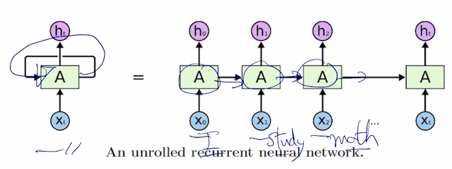

rnn module A가 재귀적으로 호출되면서 A모듈의 출력이 다음 time step에 입력으로

**가장 중요한 것은 매 time step에서 rnn 모듈은 같은 파라미터를 공유한다는 것!!**

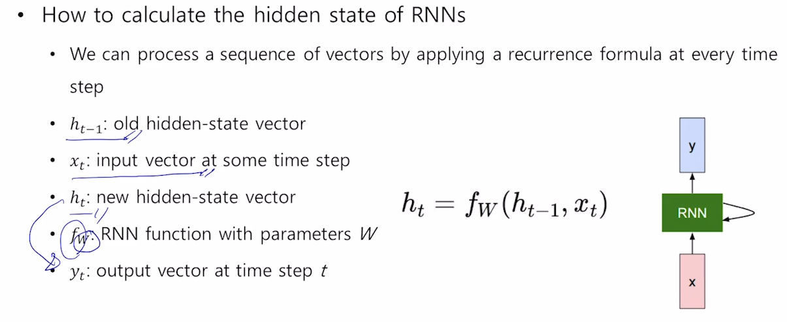

fw는 rnn 모듈에 필요한 linear transform matrix

> MLP의 linear layer이다. 그냥 행렬연산.

y_t 는 매 step마다 나올 수도 있고, 아닐 수도 있다.

> task에 따라 다르지. machine transform, classification.

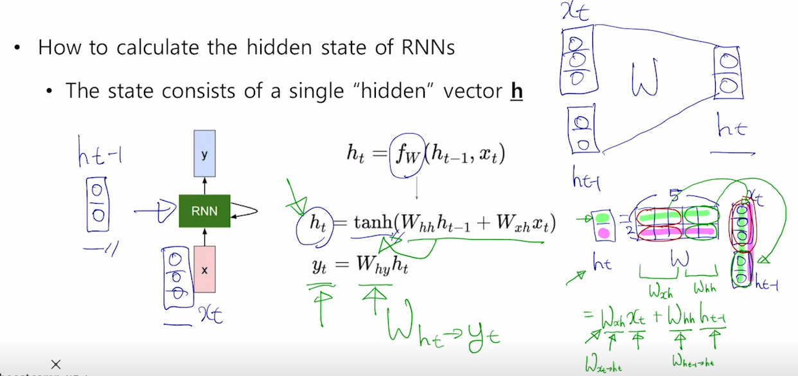

x_t와 h_t-1을 입력으로 받아 결합시키고,(?)

W라는 linear transform matrix에 곱해준 뒤, tanh를 취해줌으로써 output을 낸다.

직관적으로 W_xh 는 x_t를 h_t로 변환하는 역할을 하고 W_hh는 h_t-1를 h_t로 변환하는 역할

> 하나의 W로 볼 수 있다.

task서 현재 time step t에서 예측값이 필요한 경우라면 h_t를 입력으로해서 추가적인 output layer를 만들고 (linear transform matrix W_hy)를 곱해줌으로써 최종 아웃풋인 y_t를 구한다.

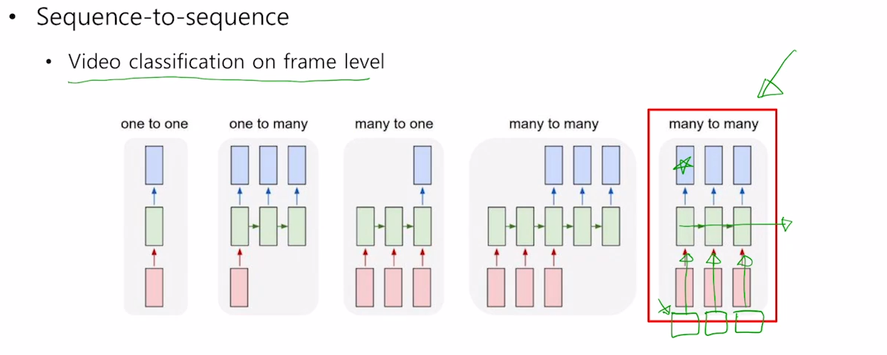

#### 1. one-to-one

RNN에 입력값과 출력값의 time step이 단 하나라면 그저 MLP ?

> (키 몸무게 나이) 를 뉴럴넷을 통해 하나의 값을 내는 경우

  

#### 2. one-to-many

image captioning

하나의 이미지가 들어가 여러 단어가 나오게 된다.

앞서 RNN 구조에서는 매 time step마다 input이 들어온다고 설명했다

이를 맞춰주기 위해 첫번쨰 이후로는 input 값으로 size가 같은 0벡터 혹은 매트릭스를 넣어준다.

#### 3. many-to-one

sentiment classification

입력 데이터의 길이만큼 rnn cell이 확장되어진다.

> 5개의 단어벡터가 들어오면 5번 돌고 마지막 step에서 output 출력

#### 4. many-to-many[1]

machine translation

time step이 총 5개인 이유는

3개의 입력을 모두 읽은 후에 비로소 문장에 번역에 해당하는 출력 단어를 생성하기에!!!

#### 5. many-to-many[2]

video classification to frame level

입력 문장이 모두 주어진 후에 예측을 하는 [1]번 경우와는 달리 입력이 주어질 때 마다 예측을 수행하는 형태. 

delay가 존재하지 않는 형태

비디오 처리 같은 실시간성이 필요한 경우!!

## Character level language model

### Language model 

주어진 문자열을 바탕으로 다음 단어가 무엇인지를 맞추는 task

word level, character level에서 모두 사용될 수 있다.

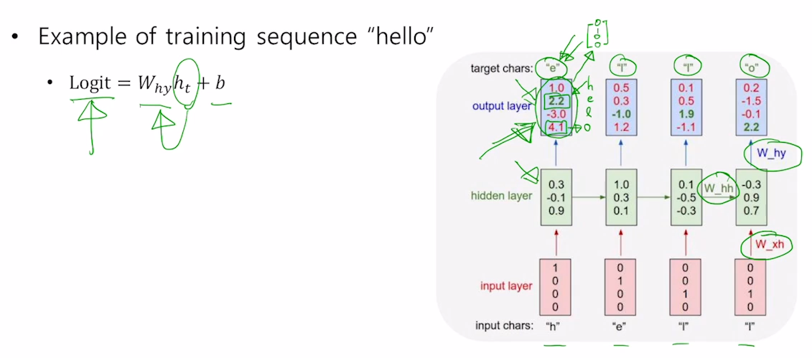

학습을 통해 **W_hh, W_xh, W_hy**를 학습하게 된다!

여기선 [1.0, 2.2, -3.0, 4.1] 이라는 결과가 나와서 "o" 라는 아웃풋이 나오지만

정답은 [0,1,0,0]에 해당하는 "e"이다. 예측결과에 softmax한 값이 ground truth와 가까워지도록 학습이 진행된다.

3번째 time step과 4번째 time step을 보면 둘다 같은 입력 "l" 이 들어가지만 다른 character를 예측할 수 있어야 한다.

이는 h_t를 잘 활용해서!

LM을 학습시킬 때 여러가지 방법이 있는데

1. teacher forcing으로 예측값과 상관없이 다음 스텝에서는 실제 값을 넣어준다.

2. 이전 스텝에서 예측한 아웃풋을 현재 스템의 입력으로 넣어준다.

3. 이전 스텝에서 만든 softmax를 확률 분포로 생각하고 하나의 값을 sampling 하여 현재 스텝의 input으로 넣어준다

   > h: 3%, e: 13% l: 0%, o: 84%의 확률 분포에서 sampling

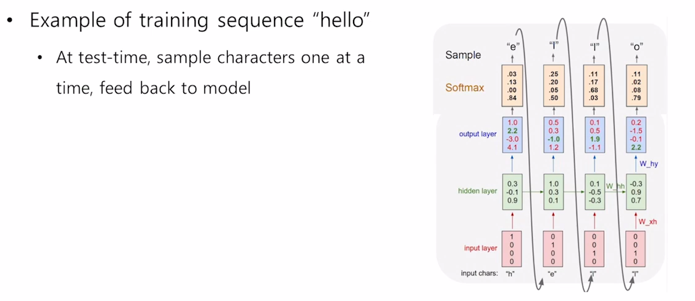

test(inference)할 때는

첫번째 데이터만 주고, 다음 time step의 입력으로는 이전 time step의 예측값으로 사용한다.

이렇게 무한한 길이의 character sequence로 생성할 수 있다.

> 주식 첫날 정보 넣으면 알아서 계속~ 예측..

### BPTT

output을 계산한 뒤 loss를 계산하여 BP를 수행해야 하는데

sequence data의 길이가 길어지면 한번에 처리할 수 있는 데이터의 양이 한정된 gpu 에서 담기지 못할 수 있다.

그래서 보통 truncation, 군데군데 짤라서 제한된 길이의 sequence 만으로 학습을 진행한다.

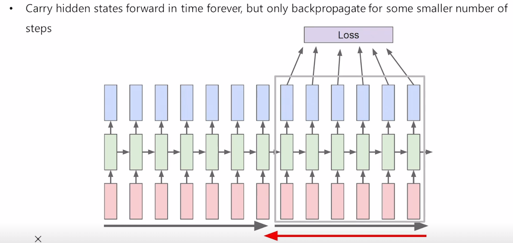

7개로 나눴다면 다음과 같이 나누고, 이 나눈 것들에 대해 forward propagation, backward propagation을 수행하게 된다.

> 그냥 backpropagation 연산을 7개 셀씩 한다는 의미인가?

rnn이 앞서 말한대로 다양한 사례에서 필요한 지식을 어떻게 배우고, rnn 내의 어느 부분에 저장이 되는지 다양한 방식으로 분석할 수 있다.

rnn에서 과거의 필요한 정보를 저장하는공간은 매 타임스텝마다 업데이트를 진행하는 h_t 라는 hidden state 벡터

> 몇번 뭐를 생성해야한다. 이떄까지 스페이스를 몇번 생성했다 등등..?

hidden state vector를 역추적하면서 분석하면

각각에 차원 하나를 고정하고 그 값이 타임스텝이 진행됨에 따라 어떻게 변하는지 분석함에 따라서 rnn의 특성을 분석할 수 있다.

 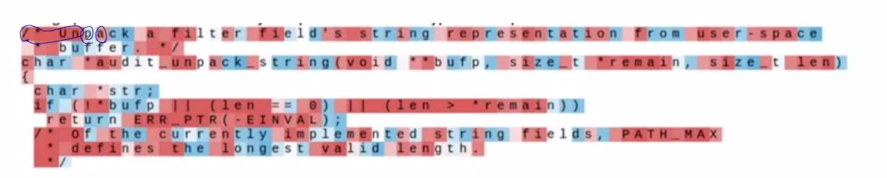

hidden state vector의 특정 dimension값이 어떻게 변화하는지를 시각화한 자료

> ex) hidden state vector의 idx 53번째 값.

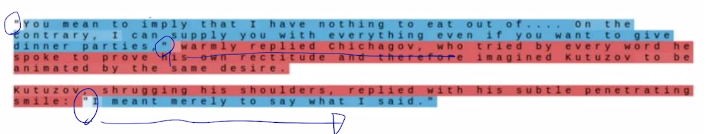

여러 dimension 중 하나의 dimension에서는 흥미로운 패턴이 생긴다.

quote detection cell로 "가 열린 순간에는 항상 -로 작은 값이 생기다가 "가 닫히면 +로 큰값이 생성되는...

**그러나**  위에서 나온 rnn model 배우는 흥미로운 사실을 배웠는데 이러한 특징들은 vanila rnn에서는 나타난게 아니라 더 진보된 LSTM이나 GRU를 사용했을 때의 결과이다.

simple한 형태의 fully connected layer로 구성되는 vanila rnn은  많이 사용하지 않는다.

왜냐하면 동일한 W_hh를 계속해서 곱하기 때문이다.

hidden state vector에 계속해서 동일한 W_hh가 곱해진다...

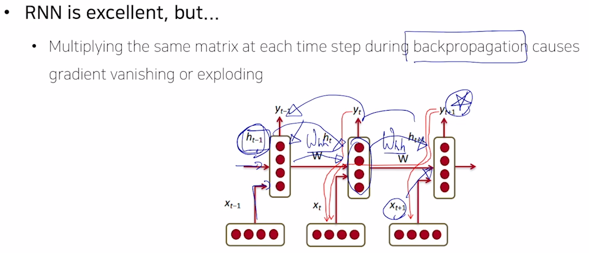

이전 step에 있었던 hidden state vector에 원하는 정보를 담기 위해선 BP가 정상적으로 동작해야한다. (gradient가 정상적으로 도착하여 파라미터 잘 조정??)

그러나 W_hh가 계속 곱해진다는 사실 떄문에. (같은 수를 계속 곱하는 등비수열) 

gradient가 기하급수적으로 커지거나, 작아진다.

그래서 생기는 문제가 gradient vanishing or explpoding

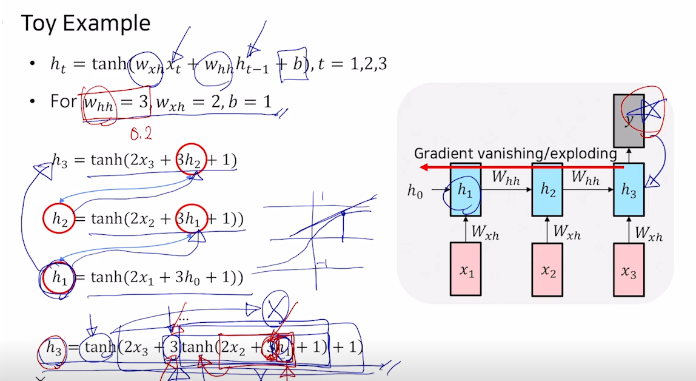

위의 예제는 toy exampel로 x_t와 h_t-1이 scalar값인 경우로 한정.

W_hh와 W_xh, b가 위와 같은 값으로 세팅되어진 상태라고 가정하자.

이때 time step 3번을 돌았을 때, backpropagation을 해보는것.

>  h1에서부터 h3까지

h3로 만들어지는 output에서 gradient를 계산하여 BP한다고 했을 때,  h1까지 gradient가 전달되려면 

h3에대한 h1의 편미분 값을 계산한다.

> tanh', W_hh(3), tanh', W_hh(3) 미분값을 계속해서 곱해주게 된다

gradient 값이 time step을 거쳐갈 수록 W_hh값이 거듭제곱이 되어 gradient 값이 증폭이 된다. 

> 0.2를 곱하면 엄청 작아지고, 3을 곱하면 엄청 커지고

W_hh는 행과 열의 개수가 동일한 matrix가 된다.

> 같은 차원의 벡터가 들어와서 같은 차원의 벡터가 나가니까 당연하지

LSTM에서는 그래도 더 많이 time step까지 gradient가 살아남는다.

## LSTM

gradient vanishiing, explosion을 해결

time step이 먼 경우에도 필요로 하는 정보를 효과적으로 처리하고 학습할 수 있도록 함.

LSTM에서는 hidden state vector를 단기 기억을 담당하는 기억소자로 볼 수 있다.

장기 기억을 담당하는 cell state vector를 이용해 기억을 더 길게 저장할 수 있도록 개선한 모델이라는 뜻에서 long short-term memory

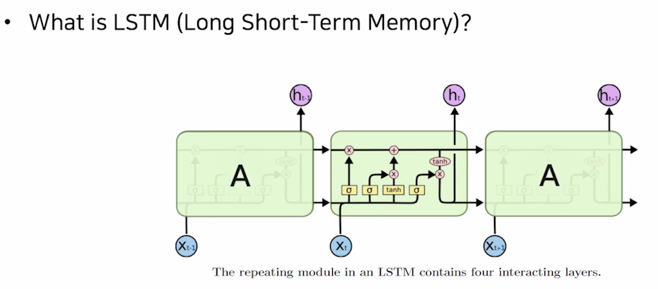

RNN
$$
RNN):quad h_{t} = f_{w}(x_{t}, h_{t-1})
$$
lstm
$$
LSTM:\quad \{c_{t},h_{t}\} = lstm(x_{t},c_{t-1},h_{t-1})
$$
lstm에서는 이전 step에서 두개의 서로 다른 벡터가 들어온다.

rnn에서 쓴 **hidden state vector**와 새로 추가된 **cell state vector**

cell state vector가 여러가지 정보(완전한 정보)를 담고 있는 벡터 

hidden state vector는 cell state vector를 한번더 가공해서 그 time step에서 노출할 정보만을 남긴 vector

Cv를 한번더 가공한 Hv는 현재 time step에서 예측값을 계산하는 output layer에 입력벡터로 사용됨.

> Cv는 output 할때는 안쓰이나?

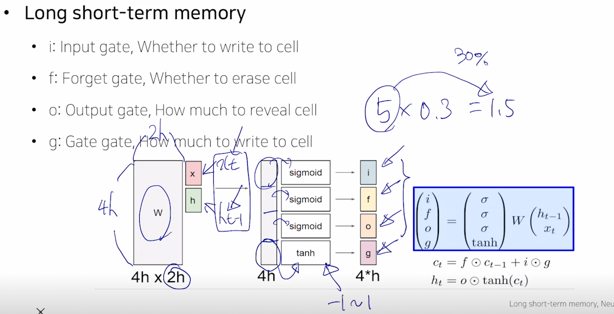

x_t, h_t-1, c_t-1 입력 중에서 x_t와 h_t-1를 linear layer를 거쳐 선형변환한다.

아웃풋으로 나오는 벡터를 4분할 한뒤 3곳에는 sigmoid, 1곳에는 tanh를 거친다

sigmoid의 결과는 0~1 사이의 값을 갖고

이 값들은 다른 벡터와 element wise mutliplication을 통해 곱해지는 벡터의 일부 퍼센테이지만 가지도록 하는 역할을 한다.

> sigmoid 값이 0.3이면 이전 벡터의 30%만 가져가겠다. 정도의 의미

tanh에서 나온 값은 -1 ~ 1사이의 값인데 C tilde에 해당한다.

vanila rnn에서 선형결합 후 tanh를 통해 최종 Hidden state vector를 -1~1 값으로써 유의미한 정보를 담는 역할을 했듯이 같은 역할로 쓰인다.

이 4가지의 ifog 벡터의 역할은

전 time step에서 넘어온 cell state vector를 적절히 변환하는데 사용이 된다.

ifog 벡터들은 모두 차원마다 다른 값을 가질 수 있다.

### 1. Forget gate

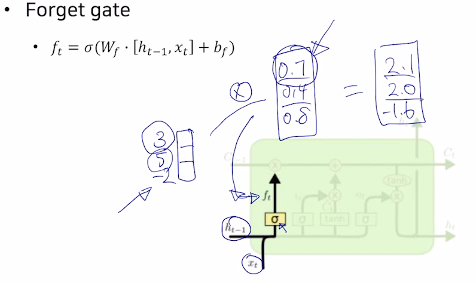

forget gate는 h_t-1과 x_t를 concat 한 값에 W_f를 곱해주고, sigmoid를 취해 만들 수 있다.

c_t-1이 3차원 벡터가 들어오면

forget gate vector (f_t)와 곱해지게 된다. 

0~1 사이의 값을 곱하니까 몇퍼센트를 잊는다 라는 의미로 해석하면 된다.

### 2. Gate gate (G) 와 input gate(i)

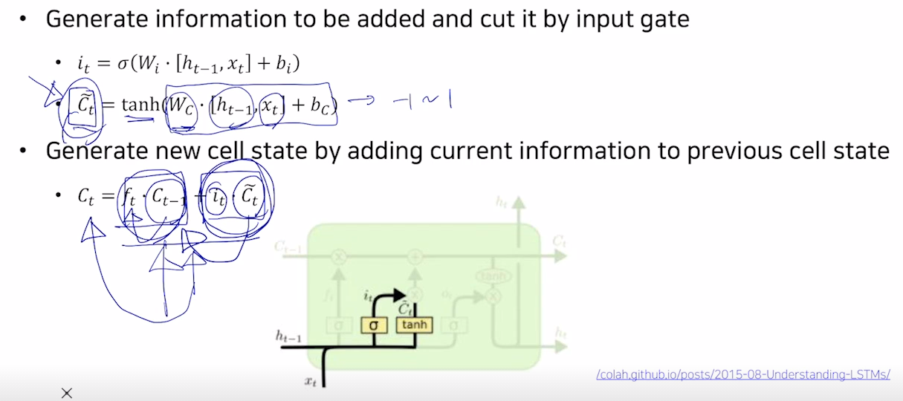

W_f, W_i 라고 표현하는 이유는 계산상으로는 W \* (h_t-1, x_t)인데 어차피 계산한 뒤에 4영역으로 나누니까 이름을 따로 붙힌듯

C_t-1에 forget gate를 곱해줘서 기존에서 얼마나 뺄지를 정하고,

현재 스텝에서 만들어진 정보인 gate gate(C tilde)를 input gate와 곱한 후 더해주어 원하는 만큼 새로운 C_t를 만드는데 추가해준다.

> C tilde는 -1 ~ 1의 값을 갖게되고, 여기다 input gate 0 ~ 1 값을 곱해줘서 C tilde에서 몇프로를 더 추가하겠다.

바로 C tilde를 더해주지 않고, i_t라는 인풋게이트와 곱해주는 이유는

가령 한번에 선형변환 만으로 C_t-1 에 더해줄 정보를 만들기 어려운 경우에

더해주고자 하는 값보다 좀 더 큰 값들로 구성된 정보를 C tilde로 만들고,

그 값에서 각 디멘젼 별로 비율만큼 덜어내서 

> 선형 변환 한 후 각 디멘젼 별로 0~1값을 곱해준 뒤 연산한다.

### 3. output gate (o)

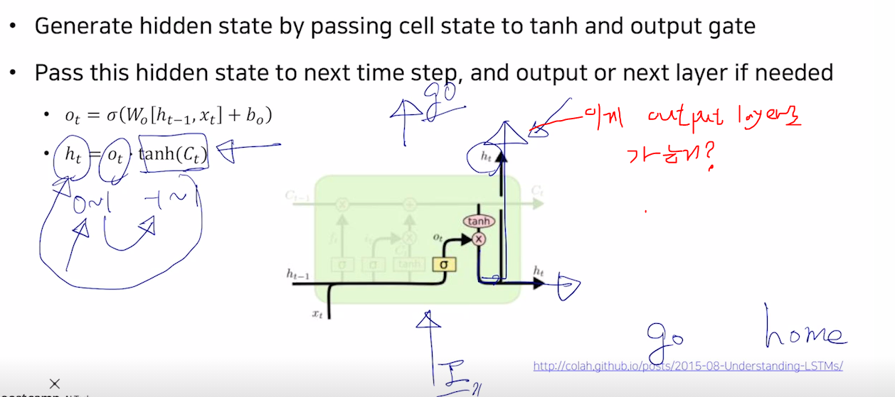

위의 과정을 통해 현재 time step에 cell state vector인 C_t를 계산 완료하고 나서

hidden state vector (h_t)를 만들 차례이다

앞에서 구해진 C_t에 tanh를 붙여 -1 ~ 1 사이 값으로 구해주고 ouput gate (o_t) 를 곱해주어 최종적으로 h_t를 만든다

c_t와 h_t의 차이와 역할은

c_t는 기억해야할 필요가 있는 모든 정보를 담고 있는 벡터라고 볼 수 있고

h_t는 현재 time step에서 예측값을 내기 위해 output layer의 입력으로 사용된다는 점에서

해당 time step의 예측값에 직접적으로 필요한 정보만 담은 것.

> c_t가 담은 많은 정보 중 지금 필요한 정보만 필터링한게 h_t

> "Hello"라는 문장을 넣을때 e에서는 l을 예측해야 하지만, "가 열려있다는 것은 계속 기억해둬야한다.
>
> " 에 대한 정보가 cell state vector에 있고, l을 예측하기 위한 정보가 hidden state vector에 있다.

 

## GRU

GRU는 LSTM을 경량화해서 적은 메모리 요구량과 빠른 계산 시간이 가능하도록 만든 모델이다.

LSTM과의 차이점

1. lstm에서 두개로 존재하던 cell state vector와 hidden state vector를 하나로 만들어 hidden state vector만 사용한다.

   > GRU의 hidden state vector는 LSTM의 cell state vector의 역할을 한다.

2. forget gate를 없애고 1- input gate로 사용했다.

경량화 되었지만 GRU는 LSTM과 비슷한 성능을 보여준다. LSTM과 함께 많이 사용되는 RNN 계열의 모델

 ### Backpropagation in LSTM, GRU

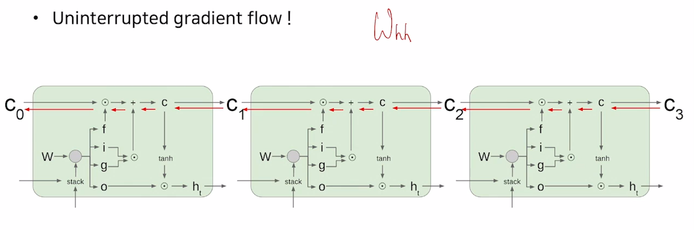

정보를 담는 cell state vector가 update 되는 과정이

vanila rnn에서 **W_hh를 계속적으로 곱해주는 형태의 연산**이 아니라

**전 time step의 cell state vector에서 서로 다른 값으로 이루어진 forget gate를 곱하고**

**c tilde와 input gate의 곱셈을 더해주는 과정**을 통해서

gradient vanishing 과 explosion이 사라진다

기본적으로 덧셈 연산은 backprop을 수행할 때 gradient를 복사해주는 연산이 되기에 멀리 있는 time step에 까지 gradient 변형 없이 전달해줄 수 있고, long term dependency 문제를 해결

왜지? 왜 덧셈이라?

## 요약

rnn은 다양한 길이를 가질 수 있는 sequence data에 유용한 구조

vanila rnn 구조가 간단하지만 학습이 잘 안되기에 사용이 잘 안됨

**cell state vector를 각 time step에서 업데이트 하는 과정이 덧셈에 기반한 연산이기에** 

gradient vanishing을 피할 수 있다.

### Language model에서의 입력

Language model에서는 이전 step에서의 아웃풋이 현재 step의 인풋으로 사용되기에 이전 스텝의 output 만들어지지 않으면 모델이 돌아가지 않는다.

즉, 재귀적으로 돌아야 하는거지

> 엄밀 LM은 직접 for 루프를 호출하면서 인풋을 넣어주는 형태로 만들어져야함 ??

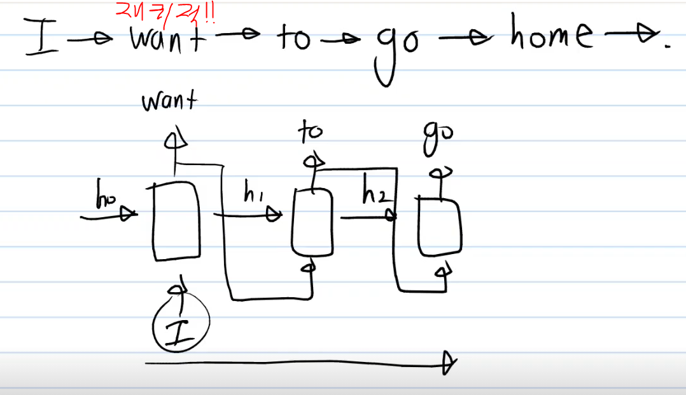

하지만 ner 같은 태스크에서는 

전체 입력 문장이 무엇인지를 알고 있어.

LM처럼 생성한 것을 넣어줄 필요가 없는거지..

**즉 둘은 다른 task이다.**

----------------------------

residual connection

$$
x_{l+2} = x_{l+1} + F(x_{l+1},W_{l+1}) = x_{l} + F(x_l, W_l) + F(x_{l+1}, W_{l+1})
$$
기본적일 때
$$
x_{l+2} = F(x_{l+1}, W_{l+1}) = F(F(x_l,W_l), W_{l+1})
$$

rnn
$$
h_t = tanh(W_{h}*h_{t-1}+ W_{x}*x_t)
$$

$$
h_{t+1} = tanh(W_h*tanh(W_{h}*h_{t-1}+ W_{x}*x_t) + W_{x}*x_{t+1})
$$

$$
h_3 = tanh(2x_{3}+3tanh(2x_2 + 3h_1 + 1)+1)
$$
lstm
$$
C_t = f_t*C_{t-1} + i_t * \tilde{C}_t
$$

$$
C_{t+1} = f_{t+1}*C_{t} + i_{t+1} * \tilde{C}_{t+1}
$$

$$
C_{t+1} = f_{t+1}*(f_t*C_{t-1} + i_t * \tilde{C}_t) + i_{t+1} * \tilde{C}_{t+1}
$$

rnn은 tanh' \* W_h * tanh' ...

lstm은 f_t+1 \* f_t ....

