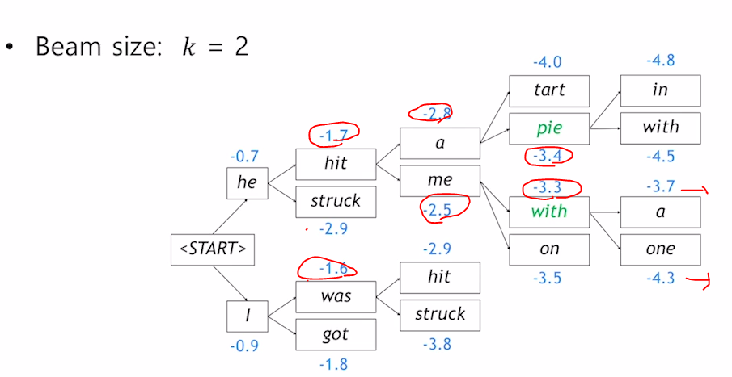

## seq2seq

many-to-many의 1버전에 해당

입력을 모두 읽고 이해한 뒤 출력을 내보내는 유형

encoder와 decoder은 서로 다른 lstm 모델을 써서 구성된다. 

> 파라미터를 공유하지 않는다는 것

enoder의 마지막 step에 hidden state vector를 decoder의 rnn에 hidden state vector로 들어간다.

decoder에 첫번째 단어로 <SOS> 라는 토큰을 넣어준다. 디코더에서 단어 생성이 끝나는 시점은 output으로 <EOS>가 나오는 순간이다.

### seq2seq의 문제점

rnn 기반의 seq2seq은 매 time step마다 hidden state vector에 정보를 축적하는 과정을 따르는데

rnn 구조 특성상 hidden state vector의 dimension이 항상 고정되어 있다.

결국 고정된 크기에 sequence 전체 정보를 압축하여 저장하기는 힘들다.

lstm이 long term dependency를 해결했다고 하더라도 너무 과거에 있던 정보는 소실되거나 변질된다.

#### 기존 문제점

1. 입력 시퀀스의 길이가 어떻게 되더라도 항상 hidden state vector가 고정된 크기를 갖는다.
2. rnn 구조의 특성상 길어지면 과거에 정보를 잃게 된다.

> 트릭으로 입력 데이터를 거꾸로 넣기도 햇다.
>
> I go home을 나는 집에 간다로 번역하는 문제에서 입력 데이터의 앞부분이 소실되어 디코더에서 "나는"을 예측하는데도 문제가 생기는 경우가 많았다
>
> 그래서 home go I 순으로 넣어 decoder에서 받았을 때 적어도 앞의 정보는 소실 안되게.

### Seq2Seq with attention

그래서 각 time step에서 만들어지는 encoder의 hidden state vector를 모두 활용하려는게 attention

> 필요한 hidden state vector만 가중치를 주며 쓰자!!

1. decoder에서는 인풋으로 만들어지는 decoder hidden state vector를 encoder에서 만든 hidden state vector들과 내적을 한다. 그럼 이 내적값은 hidden state vector들 간의 유사도라고 생각할 수 있다.

2. 이 내적값들을 softmax를 통과시켜 확률값( 이 값을 attention vector라고 부름)으로 변환시킨다.

3. 이 확률값은 encoder state vector에 부여되는 가중치로 사용되고, 이를 통해 가중평균을 해서 하나의 hidden state vector를 만들 수 있다.

   > 뭐 확률 % 만큼 그 step의 hidden state vector를 필요로 한다 정도로 생각하면 됨

4. 이렇게 만들어진 하나의 hidden state vector를 context vector라고 부른다

5. 그럼 decoder hidden state vector(attention에 쓰인)와 context vector아 concat 되어 output layer의 입력으로 들어간다.

6. decoder에서의 두번째 연산도 두번째 decoder hidden state vector를 만들고 위와 같은 연산을 반복

attention module은 위의 초록색 영역이다.

입력을 decoder hidden state vector 하나와 모든 encoder hidden state vector가 들어간다.

그럼 출력으로 encoder hidden state vector를 가중평균한 하나의 context vector가 나온다

#### decoder hidden state vector의 역할

1. 아웃풋 레이어에 입력으로도 사용되고

2. encoder에서 계산된 타임 스텝별 hidden state vector 중 어떤 단어를 중점적으로 가져와야 할지. 가중치를 결정해주는 역할을 한다

초록색 선은 forward prop

보라색 선은 backprop

backprop에서 예측 단어가 맞지 않았다면 attention vector가 제대로 만들어져 encoder hidden state vector를 제대로 활용할 수 있는 방향으로 디코더의 hidden state vector를 조정해나간다.

**train**하는 상황이라면 이전 step의 output이 현재 step의 input으로 쓰이진 않는다.

>  the가 나와야 하는데 A가 나온 경우 즉, 전 단계에서 예측을 잘못했다 하더라도 ground truth를 입력으로 넣어주게 된다. - teacher forcing

**inference**하는 상황이라고 하면 무조건 이전 step에서 나온 output을 현재 step의 input으로 넣어줘야 한다.

teacher forcing을 하면 학습이 빠르고, 용이하게 진행되기는 하지만 inference 환경과는 괴리가 생긴다.

그래서 적절히 결합한 방식도 있다. 

처음에는 teacher forcing 만으로 학습을 진행하다가 모델이 어느정도 학습 되면 후반부에는 teacher forcing을 안쓰고 예측값을 입력으로 사용.

위에서 attention을 위한  단순 내적연산은 다음 식과 같다. 학습할 파라미터가 없지.
$$
score(h_{t},h_{s}) = h_{t}^{T}h_{s}
$$

### 행렬곱으로

$$
score(h_{t}, h_{s}) = h_{t}^TW_{a}h_{s}
$$

위에선 내적을 통해 유사도를 구했는데 유사도를 구하는 방법을 바꾼 attention machnism이 있다.

I 행렬에 1의 위치에 다른 값을 쓰는 것의 의미는 두 행렬의 곱셈에 특정 디멘젼에 가중치를 주겠다.

0 위치에 다른 값을 쓰는것은 서로 다른 디멘션의 값을 곱한 값에 들어가는 가중치 값.

이 행렬을 학습 가능한 파라미터로 두게 되면 같은 디멘션을 갖는 벡터들 간에 

모든 디멘션간에 곱해진 값들에 각각 부여되는 가중치가 a,b,c,d 이다

[1 0]

[0 1]  같이 항등 행렬을 넣는건 그냥 내적하는건데 이 값들을 학습 가능하도록 해서 굳!

### concat 기반

$$
score(h_{t}, h_{s}) = v_{a}^{T}tanh(W_{a}[h_{t};h_{s}])
$$

decoder의 hidden state vector와 encdoer의 hidden state vector를 concat한 뒤 선형변환을 거친다. 

이 값에 tanh 함수를 붙여준 다음 선형변환을 한번 더해준다.

> 왜 선형변환을 v_a로 벡터 형태로 썻냐 하면 이 연산의 결과는 scalar가 나와야 하기에 
>
> 이 v_a의 shape는 row vector의 크기가 되어야 한다!!

이런 방식들은 단순 내적 연산을 학습이 가능한 parameter가 필요한 모듈로 바뀐 것이다.

### 어텐션의 장점

1. NMT 분야에서 성능을 많이 올려줬다.

2. solve the bottleneck problem

   encoder의 마지막 hidden state vector만을 사용했어야 해서 긴문장의 번역은 잘안됐지만 해결

3. gradient vanishing 문제를 해결해준다.

   단어를 잘못 생성해서 gradient가 발생을 했고, backprop을 통해 멀리 있는 encoder hidden state vector에 전달되어야 한다면 

   만약, attention이 없었다면 decoder를 역방향으로 통과하고 encoder도 모든 time step을 역방향으로 통과해야 한다. 그러면 gradient가 사라질 수 있는데

   attention으로 정보의 지름길이 만들어졌다

> 보라색이 attention 없을때, 초록색이 있을 때의 gradient 이동 경로

4. 흥미로운 해석 가능성을 제공한다.
   * attention의 패턴이 어떤식으로 나왔는지를 조사해서 decoder가 각 단어를 예측할 때 인코더 상에 어떤 단어에 집중했는지를 알 수 있다.

## Beam Search

### Greedy decoding

탐욕적 알고리즘에 기반한 방법론으로 현재 상황에서 가장 높은 확률을 갖는 단어를 선택해나간다.

중간에 현재 온 길이 최선이 아니라는 것을 알더라도 뒤로 되돌아갈 수가 없다

P(y_1 | x) 는 x가 주어졌을 때 첫번째 y단어가 나올 확률?

P(y_2 | y_1, x) 는 x와 y_1이 주어졌을 때 y_2가 나올 확률?

P(y|x)는 joint probability에 해당하는 수식을 쓸 수 있다.

가장 높은 확률값을 갖는 출력문장 y를 찾아내는 것이다.  P(y | x)

P(y_1 | x)가 확률값이 가장 컸다고 하더라도, 뒤의 모든 영역에 대한 계산을 했더니 전체 P(y|x)가 그리 크지 않은 값을 갖을 수 있다.

P(y_1 | x)에서 제일 큰 확률값은 아니더라도 뒤쪽에서 더 큰 확률값들을 만들어낼 수 있는 선택을 하는것이 전체적으로 봤을 때 더 좋을 수 있다.

가장 좋은 방법은 모든 경우의수를 고려한 뒤 최적의 값을 찾는거지만 사실상 불가능

### beam search

약간 위의 두 상황에서 중간에 있는 방법이라고 할 수 있다.

핵심 아이디어 : 디코더의 매 타임스텝 마다 단 하나의 candidate만을 고려하는 것도 아니고, 모든 case V^t 만큼을 고려하는 것도 아니라 정의해놓은 k개의 가능한 가짓수를 고려하고 최종적으로 k의 candidate 중에서 가장 높은것을 택하겠다.

> k는 보통 5 ~ 10

빔서치가 global optimal을 뽑는건 아니지만 효율적으로 좋은 성능을 낸다

k^2개의 총 후보 중에서 k개를 선택하는 과정을 반복한다.

그리디 디코딩에서는 <END> 토큰을 만들어냈을 때 문장 생성을 끝내게 된다.

그러나 빔서치 디코딩에서는 여러 hypothesis가 존재하고 각각 다른 시점에서 <END>를 만들어낸다. 

어떤 hypothesis가 <END> 토큰을 만들었다면 그 경로에 대해선 중지하고, 남은 hypothesis에 대해서도 수행한다.

빔서치는 우리가 정해둔 time step T까지만 decoding 함으로써 중단하거나

<end> 토큰이 발생하여 저장된 hypothesis가 n개가 되면 중단한다

중단되면 여러개의 hypothesis가 구해지는데 이중에서 joit probability 값이 가장 큰 값을 택하면 된다

근데 이때 hypothesis의 길이가 다르게 되면 상대적으로 짧은 길이가 joint probability 값이 높을 것이다.

> 단어가 생성됨에 따라 기존의 joint probability 값에 -값을 더해주기에 (0~1값에 log 취한거니)

그래서 길이가 다른 joint probability간에 비교를 위해 각 단어의 개수로 나눠준다. (스케일링? 정규화?)

## BLEU Score

### 1. F-MEASURE (F1-SCORE)

precision : 내가 예측한 혹은 보여준 데이터 중에서 맞는게 얼마나 되는가 

> 내가 예측한거 중에 몇프로나 맞앗냐

reacll : 아비터의 리콜로도 이해가 가능. 전체 유닛 중에서 얼마만큼 잘 소환 했는가

> 전체 정답 중 몇프로나 맞앗냐

값의 크기가 산술이 젤 크고, 기하, 조화 순이다

산술 평균이 중심에 해당하니까 내분점에 관점에서보면 기하와 조화 평균은 작은값에 더 가까운 쪽으로 내분점을 구해주는 방식이다.

> (4,5) 와 (1,8)의 산술평균은 같다. 그러나 조화평균은 4.xx , 1.xx로 확연한 차이를 보임

이 F-measure는 조화 평균을 택한 것이다.

precision과 recall의 값을 합치는데 좀 더 작은 값에 치중을 하겠다는 의미.

하지만 이 measure는 순서가 뒤바뀐 예측값을 정답으로 인식해버린다.

> precision과 recall을 계산할 때 워드 단위로 측정했기 때문에

예측률이 100%로지만 만든 언어가 문법적으로 아예 말이 안되는 문장

그래서 이 문제를 해결하기 위해 BLEU Score

### 2. BLEU SCORE

개별 단어 level에서 봤을 때 얼마나 공통적으로 ground truth와 겹치는 지와에 대한 계산 뿐만 아니라 

> 위의 F-measure

N-gram이라는 연속된 N개의 단어를 봤을 때, 그 phrase가 ground truth와 얼마나 겹치는가를 계산해서 평가 measure에 반영한다.

즉, 한단어씩만 보는게 아니라 n단어씩도 보겠다.

또한 recall은 무시하고 **precision만 고려한다.**

> I love this movie very much. 이 단어를 
>
> 난 이 영화를 많이 사랑한다.  다음과 같이 예측할 수 있는데  "정말" 이라는 단어가 하나 빠졋다.
>
> 하지만 어느정도 생략됐다 하더라도 이 문장이 충분히 좋은 정확도를 가진 결과라고 볼 수 있다
>
> 또한 난 이 노래를 많이 사랑한다 라고 예측한다면 명백한 오역으로 판단해야하기에 recall 안써

1-gram ~ 4-gram 까지의 precision을 계산해 모두 곱한 후 1/4 승을 한다. 

> 기하 평균을 사용한다. 조화평균이 작은 값에 너무 큰 가중치를 주기에

$$
min(1, \frac{length\_of\_prediction}{length\_of\_reference})
$$

이 수식의 의미는 실제 길이보다 짧은 문장을 생성할 경우 precision 값을 낮춰주겟다는 의미 

> 10단어 정답에 대해 7단어만 생성한 경우

