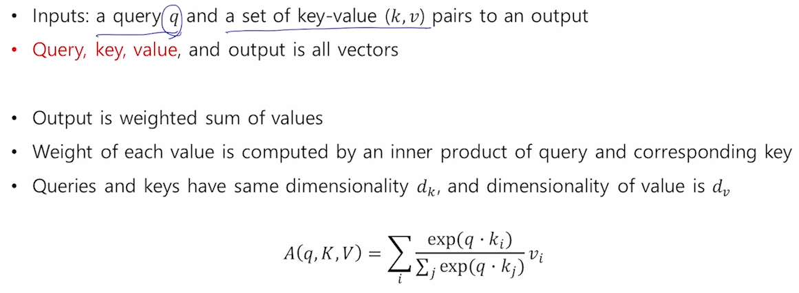
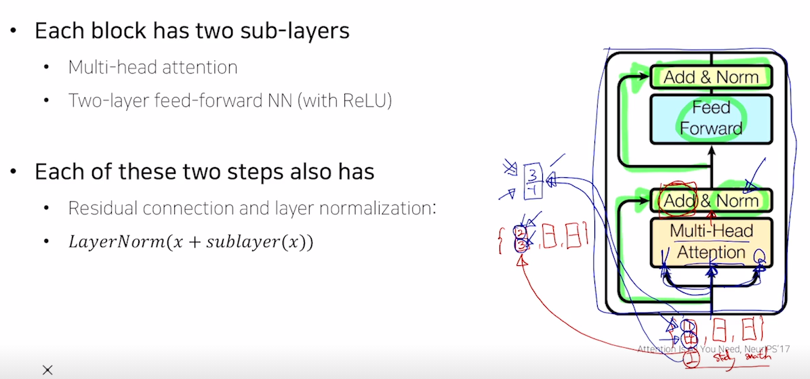
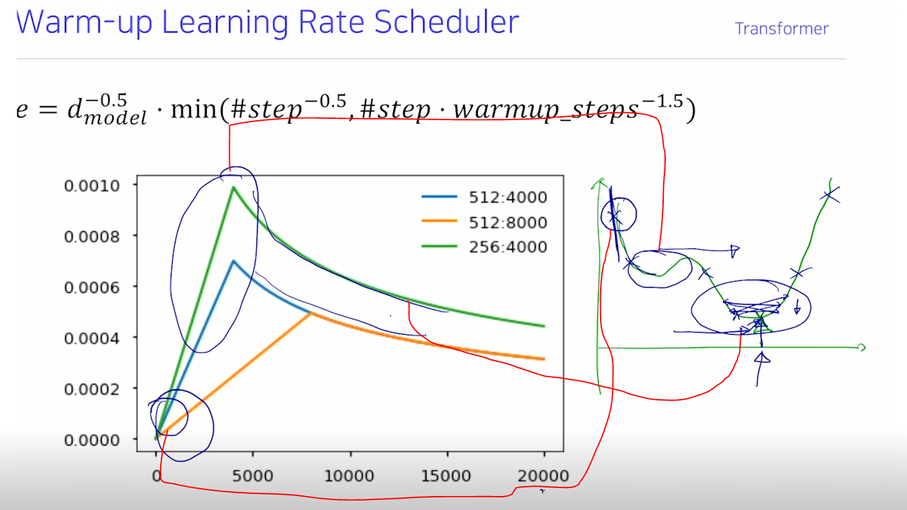

# 트랜스포머

## 기존 RNN 모델의 단점

3번째 time step 즉, home이라는 단어가 들어왔을 때 만들어지는 hidden state vector에 "I"와 "go"에 대한 정보도 들어있다.

home이라는 단어가 I 라는 단어에 정보를 적절히 포함하고 있으려면 

I로 부터의 정보는 RNN을 타임 스텝 개수만큼 통과해서 전달되게 되고

이러면 gradient vaninshing 이슈에서 처럼 멀리 있는 타임스텝에서의 정보를 전달하는 과정에서 정보의 손실, 유실, 변질 등의 이슈가 있다.

## Forward, Backward RNN

forward RNN과 backward RNN는 파라미터를 공유하지 않는다. 서로 다른 RNN

backward로도 만듦으로써 "I" 에서 만들어지는 hidden state vector에는 go, home에 대한 정보도 담기게 된다.

매 time step 마다 hidden state vector는 두개씩 만들어진다. 

## 트랜스포머

주어진 sequence에 대해서 각 단어별로 전체 시퀀스 내의 문맥을 잘 반영한 인코딩 벡터를 단어별로 만들어내는 RNN모델을 대체하는 transformer의 방법

### self attention

"I" "go" "home" 이라는 embed vector가 주어졌을 때

h에 해당하는 각 단어 별로 인코딩 된 벡터가 아웃풋으로 나옴

**"I" 에 대한 인코딩 벡터를 만든다고 하면 이 "I"의 임베디드 벡터가 seq2seq with attention에서 디코더의 hidden state vector의 역할을 한다.**

내적의 특성으로 "I" 가 자기 자신과 내적을 할 경우 다른 값들과의 내적보다 큰값이 된다.

자기 자신에 큰 가중치가 걸리는 방향으로 인코딩이 될텐데 그럼 자기 자신의 원래 정보만을 주로 포함하는 벡터로만 나올 것이다. 

그래서 이러한 문제를 해결할 수 있도록 개선을 하게 된다.

### Query, Key, Value 

디코더에서의 어텐션은 현재 아웃풋을 만들어내는데 인풋의 어떤 것들에 더 많은 가중치를 줄까? 더 많이 사용할가를 수식화한 것이다.

즉, 디코더 히든 벡터는 주어진 벡터들 중에 어느 것들을 선별적으로 가져올지에 대한 기준이 되는 벡터로써 역할을 했다. self attention에서는 이 경우를 **Query**라고 표현한다,

이 기준이 되는 히든벡터와 내적이되는 재료 벡터들을(인코더의 히든 벡터) **Key**라고 표현한다.

query와 key의 유사도를 구한 후 softmax 취해 나온 가중치(attention score)로 가중평균을 했을 때 사용되는 재료 벡터들을 **Value** 라고 표현한다.

이 query, key, value vector들을 다 같은 vector로 쓰면 위에서 말한 자기 자신에 대한 내적값이 크게 나오는 단점이 생긴다. 그래서 사실상 하나의 임베딩 벡터에 각기 다른 linear layer를 취해줘서 모두 다른 값을 갖도록 한다. 

> 그러나 같은 "I"의 임베딩 벡터라도 Query, Key, Value로 쓰일 때가 모두 다르다.
> 모두 다른 값을 갖지만 원형은 각 단어의 임베딩 벡터.

이런 matrix를 통해서 자기 자신과의 내적만 엄청 큰값이 나오는 것을 막는것.

Q_1와 K_1~n을 내적하고 softmax 취해서 첫번쨰 단어와 나머지 단어들 간의 attention score를 구하고, 이 AttentionScore_1~n과 V_1~n을 곱한뒤 더하여(가중평균 or 내적) 첫번째 단어에 대한 최종 encoding vector를 만들어낸다.

embed vector에서 Q,K,V를 만들어내는 것을 다음과 같이 표현할 수 있다.

### 장점

내적 연산을 통해 계산하기에 time step이 멀었음에도 불과하고, 내적의 유사도만 높다면 멀리 있는 단어도 중요하다고 판단할 수 있다.

rnn에서는 time step의 차이만큼 반복적으로 rnn을 통과하면서 발생하는 정보 손실 문제를 없앨 수 있다.

**Long term dependency 문제를 깔끔히 해결했다!!**

Q와 K는 내적은 수행해 attention score를 구해야 한다. 

==> 차원 크기가 같아야 한다.

이렇게 나온 attention score의 갯수는 value vector의 갯수와 같아야 한다.  

==> Key vector의 갯수와 Value vector의 갯수는 같아야 한다. (|K| == |V|)

실제 transformer 구현할 때는 Q,K,V의 차원 수를 모두 같게 한다.

[https://www.edwith.org/bcaitech1/forum/50640]

dot product할 때 루트 d_k로 나눠줌으로써 scale작업을 하기도 한다.

multi head attention을 수행하다보면 d_k 크기를 가진 벡터들을 계속 내적하게 된다.

그럼 내적이 값을 곱하고 더하는 과정이다보니 큰값은 계속 커지고, 작은 값은 계속 작아진다.

즉, 극단적인 값으로 계속 수렴하는 현상이 발생한다.

이러한 벡터에 softmax를 취하면 작은 값은 0이 되고, 큰값은 1이 된다. 그래서 "peaked" 라는 표현을 사용한 것이다.

**이렇게 softmax로 극단적인 1과 0으로 나뉘어지면 gradient 계산시에 softmax 함수의 미분값 역시 0으로 수렴한다..**

$$
y_i = \frac{e^{z_i}}{\sum_ke^{z_i}} (z_i는\;벡터의\;각\;원소\;값)
$$

$$
\frac{dy_i}{dz_i} = y_i(1-y_i)\;\;if\;\;i=j,\;\;-y_iy_j\;if\;i\;!=j
$$

위처럼 어느 값이 0 또는 1이 되어 버리면 두 경우 모두 0이 된다.

## Multi head attention

self attention module을 유연하게 확장한 모델

W_Q, W_K, W_V를 하나의 세트만 만드는게 아니라 여러개 만들어 확장시킨다. 즉, 여러 버전의 Q,K,V로 서로 다른 encoding vector를 만든 후 concat한다.

> W_Q_i, W_K_i, W_V_i (i = 1 ~ n)

8개의 서로다른 어텐션 벡터를 만드는거지.

> W_Q도 8개, W_K도 8개, W_V도 8개

각 어텐션에서 3차원 벡터를 얻는다. 이러한 어텐션이 총 8개 있다면

하나의 단어당 24차원의 벡터가 생긴다.

> 최종 벡터 차원 = 헤드 개수(8) x 어텐션 벡터 차원(3)

24차원의 벡터를 원하는 차원으로 변형하기 위해 FC layer 하나를 거친다

예시에선 24차원 -> 4차원

attention이 시간복잡도가 O(n^2\*d)이지만

gpu로 행렬연산의 병렬화를 한다면 core수가 무한정 많다는 전제 하에 O(1)로 가능

RNN에서는 시간복잡도가 O(n\*d^2)이다

> n은 sequence length

그래서 입력이 긴 sequence data가 들어오면  트랜스포머에서는 제곱에 비례하는 시간과 메모리가 들고, rnn은 선형에 비례하게 든다.

병렬화의 관점에서 바라보면 attention은 gpu 코어 수가 뒷받침 되면 모든 연산이 O(1)로 가능하다

하지만 rnn은 특성상 h_t-1을 계산해야만 재귀적으로 t 시점에서 입력으로 넣어줄 수 있고, h_t를 계산하기 위해선 h_t-1이 계산될 때 까지 기다려야 한다.

그래서 forward prop, backwrad prop에서 모두  병렬화가 불가능하고 gpu를 사용하더라도 O(n) 시간이 들게 된다.

ADD 는 residual connection 연산을 의미하고

Norm 은 layer normalization을 수행한다.

### multi head attention의 실제 구현

이론상 n개의 w_q, w_k, w_v를 만들어 각각 어텐션을 수행한뒤 합쳐준다고 생각할 수 있지만

구현상에서는 d_model 차원을 갖는 임베딩 벡터를 하나의 w_q,w_k,w_v에 넣어 벡터를 만든 뒤 n개로 쪼개 d_k 차원의 여러 벡터들을 만들어 사용한다. 

이 각각의 d_k 차원의 벡터들로 self attention을 수행한 뒤 concat하여 결과를 낸다.

각 벡터의 차원은 각 token이 가진 각기 다른 정보를 각각 담고 있는 것이라고 볼 수 있고 따라서 이를 일정한 head 개수만큼 나눠서 서브 벡터로 만든 후 self-attention을 각각 수행하는 것은 결국 각기 다른 정보에 집중하여 attention을 수행한다는, 기존 multi-head attention의 개념을 따르되 별도로 H개의 벡터를 만들어 메모리를 키울 필요가 없도록 하는 방법이라고 보시면 됩니다. 

multi head attention을 할 때 embed vector를 num_head로 나눠서 각각에 어텐션을 수행한다.

이는 하나의 벡터를 여러 w_v 만들어서 multihead attention 하는것과 같은 의미이다.

### residual connection

vision에서 깊은 layer의 모델을 만들 때 gradient vanishing 문제를 해결한 방법

> resnet이 이걸로 더 깊이 쌓을 수 있었지

attention module에 들어가기 전 embedding vector와 결과인 encoding vector(attetntion vector)를 더해준다.

그럼 입력값 대비 만들고자하는 벡터의 차이값만을 attention module에서 만들게됨

기본적일 때
$$
x_{l+2} = F(x_{l+1}, W_{l+1}) = F(F(x_l,W_l), W_{l+1})
$$

residual connection

$$
x_{l+2} = x_{l+1} + F(x_{l+1},W_{l+1}) = x_{l} + F(x_l, W_l) + F(x_{l+1}, W_{l+1})
$$
보면 수식이 곱셈 기반에서 덧셈 기반으로 바뀐 것을 확인할 수 있다.

이를 통해 rnn에서 처럼 곱셈을 반복하면서 gradient가 사라지던 문제를 해결한게 아닐까?

residual connection을 하려면 attention module에 들어가는 입력 벡터와, 출력 벡터의 크기가 같아야 한다.

## normalization

아웃풋 값들의 평균과 분산이 무슨 값이였든 간에 버리고! 표준화된 평균과 분산이 0과 1로 만들어준다. 이후 affine transform을 통해 원하는 평균과 분산으로 바꿔주는 작업을 수행한다.

즉, 분산과 평균을 내 마음대로 조작하여 원하는 데이터 분포를 만들어낸다.

이를 batch 단에서 하냐, vector 단에서 하냐 차이.

### 1. Batch normalization

여기서는 batch size가 3이라고 하고 입력 특성?이 3개라고 하자.

> input layer의 노드 수가 3이니 특성도 3개일 것.

그럼 초록색으로 색칠된 두번째 노드에서 batch size(3) 만큼의 아웃풋 값을 만들어낸다.

여기선 [3,5,2] 가 만들어졌는데 이 값들을 정규화해서 바꿔준다.

평균 0, 분산을 1이 되도록 정규화 하고, 각각의 값에 affine transform을 수행한다

>  정규화 하여 x의 평균이 0이고, 분산이 1이고, 이 값을 y = 2x + 3 에 넣는다면 y의 평균은 3이고 분산은 4가 된다. 

예제에서 나오는 2와 3은 뉴럴넷이 학습하는 파라미터가 되어 필요한 값으로 조정된다.

즉, 이 레이어의 역할은 나오는 아웃풋 값이 원하는 평균과 분산 값을 갖도록 조정한다.

### 2. Layer normalization

layer norm도 batch norm과 같이 처음에 값들을 정규화 해주고[1] 원하는 평균 분산을 주입하는 방식[2] 으로 이루어져 있다.

attention module에서 "thinking", "machines" 라는 두개의 단어를 인코딩한 벡터가 나오게 된다.

그럼 각 워드 별 값들을 구해서 평균과 표준편차를 0과 1로 바꿔주는 변환을 함.

그리고 서로 다른 affine transform을 벡터의 각 원소마다 수행하게 된다.

**이런 normalization을 하는 layer들에서는 주어진 다수의 샘플들에 대해 평균 0, 분산 1로 만들어준 후, 원하는 평균과 분산을 주입할 수 있도록 하는 선형변환으로 이루어진다.**

## Positional Encoding

 "I" "go" "home" 과 "home" "go" "I" 를 attention 한다 해보자.

두 경우에서 나오는 시퀀스의 "I"에서 나오는 두 인코딩 벡터는 똑같을 것이다.

> 가중 평균을 낼 때, 교환 법칙이 성립이 되기 때문에 최종 아웃풋 벡터는 순서를 무시한다.

하지만 위치 정보는 중요하기에 이를 넣어줘야 한다.

> rnn에서는 단어의 순서가 바뀌면 hidden state로 만들어지는 값이 달라지기에 encoding vector들도 달라진다. 얘는 자연스럽게 순서를 인식한다.

트랜스포머에서는 순서를 인식시켜주기 위해서 어떠한 값들을 더해준다.

값들을 sin, cos 함수로 만들어내 사용한다이

## Warm-up learning rate scheduler

학습 과정에서 하나의 lr를 사용하는게 아니라 계속해서 바꿔주는 것이 lr scheduler

가파른 상황(gradient값의 절대값이 큰)에서는 lr을 작은 값을 사용하여 보폭이 너무 커지는 것을 방지하고,  완만한 구간(gradient의 절대값이 작은)에는 lr을 키워 더 많이 움직이도록.

보폭이 커서 정확한 저점을 도달하지 못한다면 lr을 줄여서 저점에 도달하려고 한다.

## DECODER.

트랜스포머에서 "I" "go" "home"이라는 문장을 번역한다면, 인코더의 입력으로 들어가는 "I" "go" "home"은 encoder에 의해 인코딩 벡터로 각각 변환될 것이고,

디코더에는 입력으로 <SOS>, "나는", "집에" 라는 단어의 임베딩 벡터가 들어갈 것이다

디코더에서도 인코더에서와 마찬가지로 각 단어에 대한 임베딩 벡터들이 position encoding한 후, self multi head attention을 하고, add&nrom을 통해 인코딩 벡터를 뽑아낸다.

> 여기서 self attention -> add -> norm 하는 과정이 seq2seq에서 decoder의 hidden state vector를 뽑는 과정으로 볼 수 있음.

이렇게 만든 hidden state vector(encoding vector)들과 encoder에서 만들어진 encoding vector들과 어텐션을 수행한다.

Q : decoder에서 위에서 만든 벡터 (decoder에 들어간 target 단어 개수만큼 생기겠지)

V, K : 인코더 부분에 최종 출력으로 나온 단어 개수 만큼의 d차원의 벡터들이 V와 K로 들어간다

> seq2sqe with attention에서의 attention과 동일하게 생각하면 될듯.

Query를 통해 encoder의 hidden state vector 중 무엇에 집중해야 할지. 가중치를 많이 줄지를 계산!!

encoder의 hidden state vector와 decoder의 hidden state vector를 multi-head attention 한 결과에 residual connection(add)를 해줌으로써 디코더에서 self attention으로 만든 hidden state vector의 정보와 encoder의 hidden state vector의 정보가 잘 아우러진다.

> 디코더의 hidden state vector가 결과에도 쓰이고, 인코더 벡터들에 가중치를 주는 역할로도 쓰이는 거지.

마지막엔 linear transform을 통해 target language의 vocab size 크기의 벡터를 생성하고 softamax를 취해 특정 워드에 대한 확률값을 뽑아내고 ground truth와의 softmax loss를 통해 학습한다.

decoder 부분에서는 inference할 때 결국 rnn에서처럼 순차적으로 해야 한다.

### Masked self-attention

디코딩 과정 중 입력으로 전체 타겟 단어들을 주고, 다음 단어를 예측하는 attention을 수행한다.

이때 attention을 할 때 각 단어에 대한 인코딩 벡터를 만드는 과정에서 다음 나올 단어에 대한 정보까지 들어가면 학습이 제대로 이뤄지지 않는다.

그래서 정보의 접근을 막는 것이다.

Query Key를 곱하는 행렬 연산을 생각해보면

<SOS> 를 쿼리로 볼때 <SOS>와의 중요도와  "집에"와의 중요도인지를 계산한다.

그런데 예측하는 상황을 생각해보면 우린 <SOS>만 가지고 "나는" 을 예측해야하고, <SOS>와 "나는" 만을 가지고 "집에" 를 예측해야한다. 그래서 학습시킬 때도 "나는"을 예측할 때 <SOS>, "나는", "집에" 모두 쓰면 안됨!!

앞에 어떤 단어가 올지를 알면 안되기에 masking으로 정보를 지워줌

학습 단계에는 뒤에 오는 단어를 **batch processing**을 위해서 동시에 주기는 하나

<SOS>를 query로 사용해서 attention 할 때는 "나는", "집에" 라는 단어에 접근할 수 없어야한다.

그래서 Q\*K를 softmax를 한 뒤에 접근할 수 없는 영역 즉, 뒤에 나오는 단어는 0으로 만들어준다.

> 쉽게 대각선 위로 날리면 됨.

그 뒤로는 row의 합이 1이되도록 다시 변환해준다. (확률값을 갖도록)

트랜스포머에서 학슬할 때, 일반적으로 teacher forcing을 사용한다.

rnn decoder 처럼 이전 step의 아웃풋을 받아서 학습할 수 있지만 이렇게 되면 병렬 계산의 이점이 사라지기 때문에 일반적으로 모든 과정에서 teacher forcing 사용

> 매 time step 마다 아웃풋 결과 기다려야되니까.

트랜스포머에서도 inference할 때는 for문을 통해 한 단어씩 생성해야한다.

이때는 병렬처리가 불가능하고 매 time step마다 기다려야할 것이다.

linear layer를 딥러닝의 표현력을 증대시켜주지

GPT?에서 어텐션 모듈에서 query, key, vector를 만들 때  FC layer는 1x1 conv로 구현돼있따고 한다.

1x1 conv와 FC layer는 같은 결과를 낸다.

1x1 conv가 계산속도는 조금 더 빠르지만, gpu vram은 fcn이 더 적게 사용한다.

선택 가능한 옵션으로 생각하면 된다.

