최근에는 transformer 의 self-attention block을 쌓으며 모델 구조 자체의 변형은 없이 깊게 쌓아서 만든다.

아직 한계점은 greedy decoding을 벗어나지 못하고 있다.

## GPT-1

스페셜 토큰을 제안해서 심플한 테스크 뿐만아니라

자연어처리의 다양한 태스크를 동시에 커버할 수 있는 통합된 모델을 커버했다.

> pretrained -> fine tuning

position embedding하고 self attentio block을 12개 쌓은 구조이다.

마지막에 text predcition : 다음 단어를 순차적으로 예측하는 LM task

"I" "go" "home"이라는 문장이 있다면 

<SOS> => "I"

<SOS>, "I" => "go"

<sOS, "I", "go' => "home"

을 예측하는 LM 모델 태스크로 학습이 진행된다.

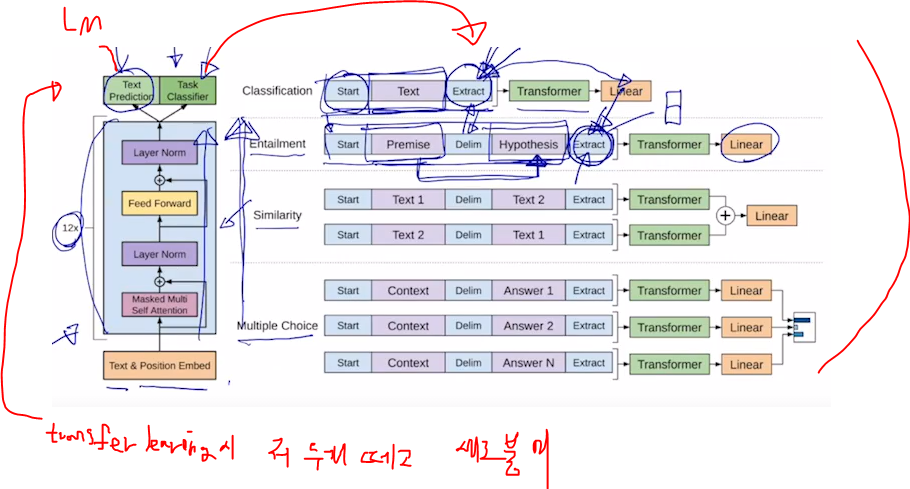

gpt-1은 이 LM task 뿐만 아니라 다수의 문장이 존재하는 경우에도

모델의 큰 변형없이 활용될 수 있도록 

학습의 framework를 제시했다.

start token, (extract token == end token), delim token(문장을 구분)

*gpt에서는 LM형태로 학습도 진행하고, label 달린 데이터도 넣고 task classification도 수행하는 듯.?*

### sentiment analysis

extract token을 최종 아웃풋 layer에 입력벡터로 줌으로써 문장이 긍정인지 부정인지 학습하게 된다

다음단어 예측 학습과 문장 분류 학습을 같이 진행할 수 있다

### entailment

어제 존이 결혼했다. 어제 최소한 한명은 결혼했다. 라는 문장이 있을 때 앞문장이 참이면 뒷문장이 참인 논리적 관계를  학습하는 문제

이때 두 문장을 하나의 sequence로 넣는다.

대신 delim token을 다른 문장을 나타내기 위해 넣어준다.

똑같이 extract 토큰을 아웃풋 layer에 넣어 분류 task를 수행한다.

입력에서 extract token은 끝을 나타내는 의미였지만 self attention block을 거쳐 인코딩된 벡터는 문장의 감정을 분석한, 입력문장의 논리 관계가 맞는지에 대한 정보를 포함한 벡터로 된다.

> 태스크에 맞게 되겠지

### Transfer learning

transfer learning 할 떄는 pretrained model에 output layer에 변환을 주고 조정해나간다.

> 학습하는 동안 긍부정 분류를 햇다면 내가 원하는 태스크인 뉴스기사의 카테고리를 분류하는 문제로 전이 학습

1. 학습할 때 썼던 LM을 위한 output layer와 긍부정 분류를 위한 outplayer를 떼어낸다.

2. 그 전단계 트랜스포머에서 나오는 워드별 인코딩 벡터를 사용해서 우리 task를 위한 추가적인 layer를 붙이고, 파라미터는 초기화 해준다.

   > 즉, 기존 인코더 부분에 우리 태스크를 위한 추가적인 레이어 하나를 덧붙인 것이다.

3. 학습데이터를 통해 전체 네트워크를 학습하게 된다.

   > 이때 특정 task에 해당하는 layer에는 lr 많이줘서 학습 많이 시키고, pretrained된 부분에는 lr 적게 줘서 많이 안바뀌게

4.  pretrained되면서 배웟던 지식들을 잘 써먹으면서 task에 쓸 수 있다.

main task인 LM은 별도의 라벨링이 필요 없기에 많은 양의 데이터를 사용하여 학습할 수 있다.

그러나 문서 분류의 태스크를 위한 데이터는 상대적으로 소량밖에 없을 것이다.

그래서 self-supervised learning으로 대규모 데이터로부터 얻을 수 있는 지식을 얻고, 이를 활용해서 문서 분류를 할 수 있도록 지식을 전이시키는 느낌

> self supervised learning은 과거 unsupervised learning의 용어 대체로 볼 수 있다.
>
> self supervised learning은 bert에서처럼 정답 데이터셋을 알아서 만듬. supervised learning인데 label을 사람이 달 필요 없지.

## BERT

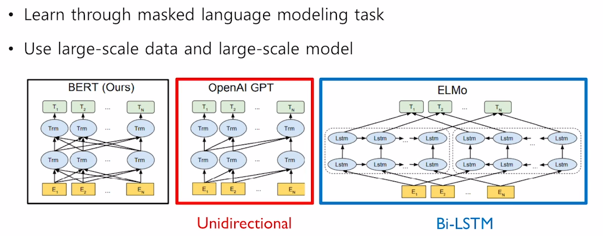

gpt와 마찬가지로 LM task로 pretrain을 수행한 모델

ELMO에서 Bi-lstm 이었던 부분을 transformer의 self attention으로 바꾼게 BERT, GPT

GPT 같은 경우 다음 단어를 예측하는 태스크를 수행하기에!! 다음에 나타내는 단어에 대한 접근을 허용하면 안된다

> 트랜스포머의  디코더 셀프어텐션이 마스크드로 됐던거 처럼!!

GPT에서 사용하는 SELF ATTENTION BLOCK은 트랜스포머의 디코더에서 사용된 **MASKED SELF ATTENTION BLOCK**을 사용한다

> 뒤를 못봐야하니까

BERT에서는 MASKED로 치환된 단어를 예측하기 때문에 모든 단어에 대해서 접근이 가능하게 된다. 

입력단어들이 앞뒤 모두를 볼 수 있다.

즉, 트랜스포머의 인코더에서 사용 **SELF ATTENTION BLOCK**으로 사용된다.

> 현실에선 앞 뒤 문맥을 보고 단어가 어떤 의미인지 유추를 많이 하기에 reasonable

### 학습

BERT는 학습에서 두가지 task를 수행한다.

* 마스킹된 단어의 원본 단어를 예측하는 word level task

* 입력으로 들어오는 두 문장이 연속된 문장인지를 예측하는 sentence level task

#### Word level task (LM)

입력으로 들어오는 문장에서 15% 확률로 각 단어들을 masking 한다.

이 15%를 모두 mask로만 하면 부작용이 생김

pretraining 당시에 평균적으로 15% 단어가 mask로 치환된 상태에 익숙해진 모델이 나오는데 이를 전이학습으로 주제분류 task에 사용한다면 mask라는 토큰은 나타나지 않아. main task의 입력 문장과는 상이할 수 있다. 이게 문제가 될 수 있음

그래서 15% 내에서도 확률적으로 서로 다른 형태로 됨.

> masking, random word, same word

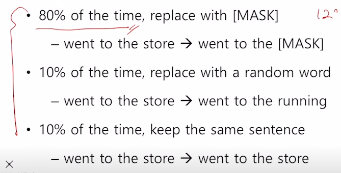

즉 이렇게 mask나 이상한 단어가 들어갔더라도 원래 있어야 할 단어를 예측해내도록 학습을 진행하게 된다.

#### Setenece Level Task (Next setnence prediction)

bert모델 학습시 입력으로 두 문장 사이와 끝에 [SEP] token을 넣어 하나의 sequence로 만들어 넣어준다.

그리고 이 문장들 앞에 문장 레벨에 태스크를 수행한다는 의미의 토큰으로써 [CLS] token을 넣어준다.

> [CLS] setence1 [SEP] setenece2 [SEP]
>
> 물론 masking 해서

### Next sentence prediction

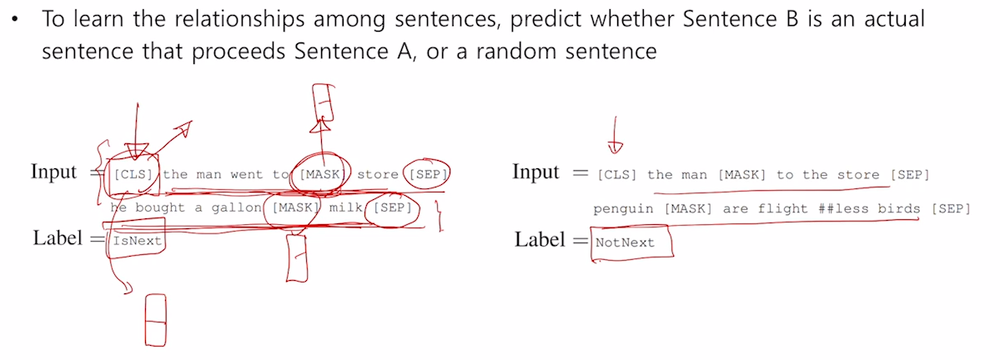

이 [CLS] token은 입력으로 들어온 두 문장이 이어지는 문장인지 아닌지를 판별하도록 학습된다. 

> binary classification 문제

그럼 [MASK] token에서 인코딩된 벡터은 실제 있어야 할 단어를 예측하게 되고 ,

[CLS] token에서 인코딩된 벡터는 두 문장이 이어지는 문장인지 여부를 예측하게 된다.

**[CLS]  token은 pre training에서 next sentence prediction을 수행하기에 [CLS] token의 인코딩 벡터는 입력 sequence의 context를 담는 token으로 학습돼간다. 그래서 문장 단위의 task를 수행하는 경우 output layer의 입력에 [CLS] 토큰의 인코딩 벡터를 사용하는 것.**

BERT에서도 transformer의 self attention block을 그대로 사용.

base model : 12개의 self attention block, 인코딩 벡터 차원 : 768, attention head 수는 12개

large model : 24개의 self attention block, 인코딩 벡터 차원 : 1024, attention head는 16개

### 입력 단어 인코딩? 임베딩?

다음과 같은 단계를 거쳐 단어의 인풋을 위한 임베딩 벡터를 만든다.

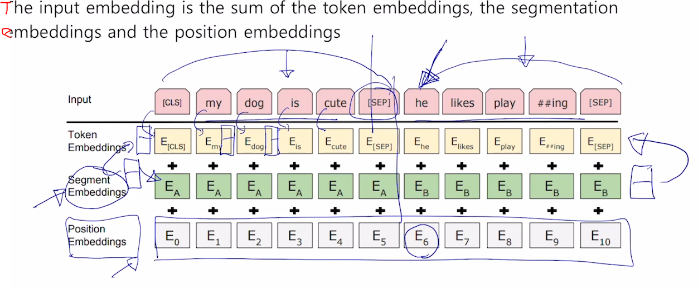

### 1. BPE

기계에 아무리 많은 단어를 학습시켜도 세상 모든 단어를 알려줄 수는 없다.

만약 기계가 들어온 단어를 모를 때 단어 집합에 없는 단어가 들어 왔다는 의미에서 OOV(Out of Vocabulary) 라는 문제가 생긴다.

이때 이러한 단어는 UNK 토큰으로 바뀌며 문제를 풀기 난해해 집니다.

#### - 기존

low : 5, lower : 2, newest : 6, widest : 3 라는 단어가 들어오면

vocab 은 {low, lower, newest, widest} 가 만들어진다.

#### - BPE 사용

low : 5, lower : 2, newest : 6, widest : 3 라는 단어가 들어오면

#### Vocab 만들기

1. 딕셔너리의 모든 단어를 글자 단위로 분리
   * {l, o, w, e, r, n, w, s, t, i, d} 라는 초기 단어 집합이 생김
2. n회 반복하면서 가장 빈도수가 높은 유니그램의 쌍을 하나의 유니그램으로 통합한다.
   1. 첫번째 iteration에서 (e,s)가 빈도수가 가장 많기에 하나로 통합해서 es라는 문자열이 만들어짐.
   2. 두번째 iteration에서 (es,t)가 빈도수가 가장 높고, est로 통합됨
   3. 이를 n번 반복한다.
   4. 10번 반복하면 {l, o, w, e, r, n, w, s, t, i, d, es, est, lo, low, ne, **new**, newest, wi, wid, widest} 와 vocab이 만들어짐.

#### Vocab 사용

1. lowest라는 단어가 들어오면 전부 글자 단위로 분발한다.
   * l o w e s t
2. 기계는 vocab을 참고하여 low와 est를 찾아내고, 이 두 단어를 인코딩하여 단어를 만들어낸다.

lowest라는 단어가 들어오면 기존의 경우에선 OOV 였지만 이제는 기존 vocab에서의 subword를 조합해 만들어낼 수 있다.

즉, 워드별로 embedding vector를 넣는게 아니라 sub word로 잘게 쪼개서 임베딩하고 입력으로 넣어준다.

> pretraining이라는 단어를 보고 pre와 training이라는 단어가 합성된거를 알고,
>
> 두 단어로 나눠서 의미를 생각하는게 더 좋을 수 있다.

### 2. positional embedding

positional embedding도 학습시킨다.

### 3. segement embedding 

입력 시퀀스에서 문장 별로 정보(순서?)를 주기 위해 더해주는 값.

position embdding이 각 단어어들의 위치 정보라면 문장 레벨에서의 위치 정보를 반영한 형태의 벡터가 된다.

두 문장을 [SEP] token으로 구분해서 넣는경우

각 워드에 해당하는 word embdding vector에 positional embedding이 들어가는데

문장을 하나의 독립된 정보를 나타내는 단위로 나타낸다면

he라는 단어는 6번째 시퀀스가 아닌, 두번째 문장에 속하는 첫번재 단어로 알려줘야 한다.

그래서 position embdding 하고 segment embedding 해준다.

>  mask 예측하는 task와 두 문장이 인접문장이지 아닌지를 예측한다.고 함
>
> 그럼 mask안된 단어 예측하는 task는 안하는건가? 학습에 반영안되나?
>
> 만약 둘다 한다면 가중치를 좀더 줘야하지 않을가??

## TRANSFER LEARNING 

FINE TUNING

GPT와 마찬가지로 기존 LM학습시 썻던 OUTPUTLAYER를 떼어내고 새로운 layer를 추가한다.

BERT에서도 각 MAKSED 토큰의 임베딩 벡터를 특정 단어로 예측하는 OUTPUT LAYER가 있었을텐데 이를 버리고 새로운 LAYER추가 한뒤 모델을 구성한다.

> DOWNSTERAM STASK = FINE TUNING 하는 TASK

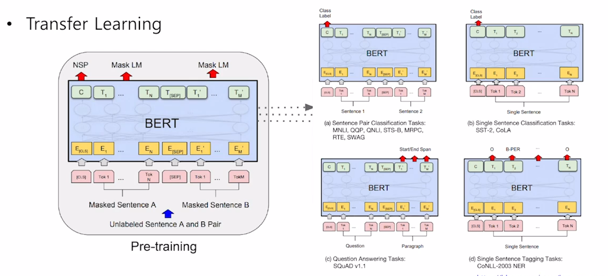

### 1. SENTENCE PAIR CLASSIFICATION (다수 문장을 입력으로 하는 예측)

논리적 모순 관계, 내포 관계 예측 

> "철수가 결혼햇다."  "한명은 결혼햇다." 라는 문장이 있을 때 앞의 문장이 참이라면 뒤의 문장은 참이 된다.

두개의 문장을 [SEP] token으로 분리하여 하나의 시퀀스로 넣은 후, [CLS] token의 인코딩 벡터를 아웃풋 레이어에 입력으로 주어서 예측 테스크를 수행한다.

### 2. SINGLE SENTENCE CLASSIFICATION (단일 문장 예측)

하나의 문장을 입력으로 주고, [CLS] token에서 나온 인코딩 벡터를 아웃풋 레이어에 넣어 예측

### 3. SINGLE SENTENCE TAGGING (POS TAGGING, NER)

각각 단어에 대한 인코딩 벡터들이 얻어지는데, 이 벡터들을 동일한 공통의 아웃풋 레이어에 통과시켜 각 워드별 예측을 수행한다.

----------------------

BERT가 한번에 더 많은 워드를 가져와서 학습을 수행

**일반적으로 더 큰 사이즈의 배치를 사용하면 학습도 안정화되고, 모델 성능이 좋아진다.?????**

이는 GD 수행할 때 일부 데이터 만으로 도출된 gradient로 매번 업데이트 할지

아니면 보다 더 많은 데이터를 바탕으로 종합적으로 나온 gradient를 바탕으로 업데이트 할지에 따라 더 많은 숫자를 사용할 때 더 안정적이고 학습에 좋다.

---------------------

### 4. MACHINE READING COMPREHENSION (QUESTION ANSWERING)

독해에 기반한, 즉 지문이 주어졌을 때 지문을 잘 이해하고, 질문이 주어졌을 때 이에 해당하는 정보를 지문에서 찾아내는 것.

BERT에 입력으로 주어진 지문과 원하는 질문을 [SEP] token을 통해 하나의 SEQUNCE로 넣어준다.

그러면 지문에 있는 각 단어별 인코딩 벡터가 만들어지고 정답의 위치를 찾아내도록 학습이 진행된다.

각 단어들이 인코딩 벡터로 나오면 공통된 아웃풋 레이어를 통해 스칼라 값을 뽑아낸다.

> 각 단어별 인코딩된 N차원 벡터 ===[Linear layer]===> 1차원 벡터

단어가 124개가 있다면 스칼라 값은 124개가 생길 것이다. 거기에 SOFTMAX를 취한 뒤 값 하나를 뽑아낸다.

이떄 GROUND TRUTH로는 첫번째 단어에 해당하는 값이 주어진다.

> 원핫 벡터로 몇번째 단어인지 표시했겠지.

위와 같은 형태로 하나의 또 다른 OUTPUT LAYER를 또 만든다. 이건 끝나는 위치를 알려주는 것.

똑같이 SOFTMAX 취해서 값 하나 뽑아내는데 이건 끝나는 단어를 예측.

>  즉 두개의 서로 다른 OUTPUT LAYER가 생기는거지, 첫 문자 찾는용, 두번째 문자 찾는용

### SQUAD 2.0

기존 SQUAD1.0 + 주어진 지문에 대해서 질문에 대한 답이 없는 경우도 넣은 것.

그래서 먼저 질문에 대한 정답이 있는지 없는지 먼저 판단해야함.

그래서 [CLS] token에서 나온 인코딩 벡터를 통해 BINARY CLASSIFICATION 하는 OUTPUT LAYER로 만들어낸다.

만약 답이 있다면 위에서 말한거 똑같이 해서 정답 위치 찾아내고.

### ON SWAG

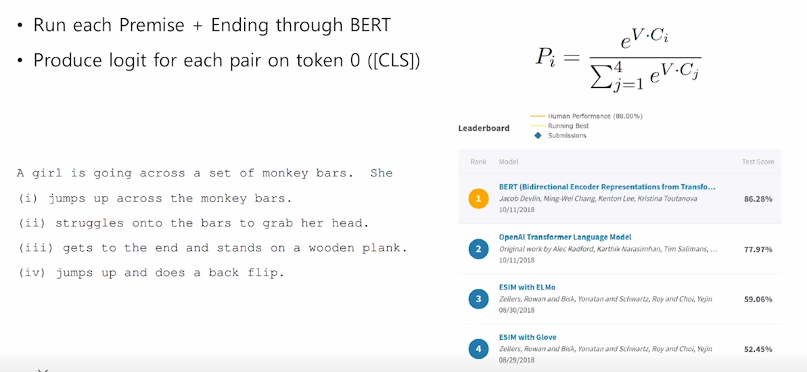

첫 문장과 각 후보 문장들을 하나의 SEQUENCE로 이어 붙여서 BERT에 넣는다.

그리고 CLS의 인코딩 벡터로 하나의 SCALAR 값을 뽑아낸다.

이 4개의 값을 SOFTMAX 취해서 정답을 찾아냄.

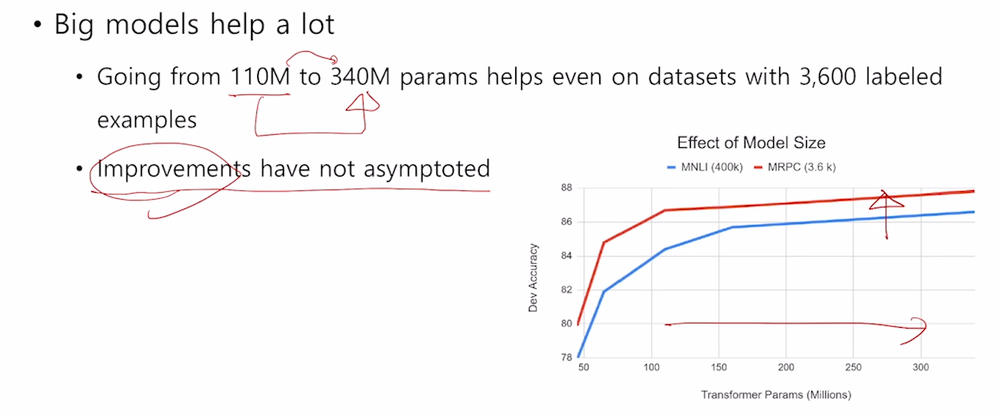

BERT에서 제안한 모델을 점점 더 레이어 깊게 쌓고, 파라미터 늘리는 방식으로 

학습을 진행하면 여러 DOWNSTREAM TASK에 대한 성능이 끈임없이 증가하더라.

더 커질수록 그냥 계속 좋아진다.

## GPT-2

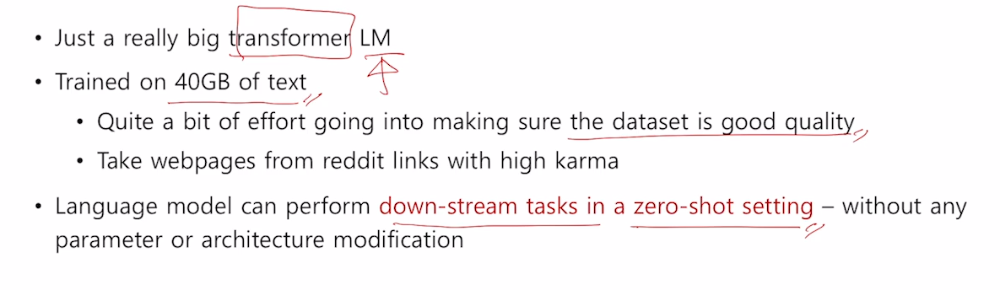

LM 모델을 더 크게 하고 데이터셋을 더 좋게 만들었다. BPE도 했다

LAYER NORMALIZATION이 위치가 한층 위, 아래로 옮겨졌다.

각 Layer에 초기값을 줄 때,  LAYER의 높이?에  반비례해서 INITIALIZATION 값을 바꿧다.

> layer가 더 위에 있을 수록 더 작은 값.

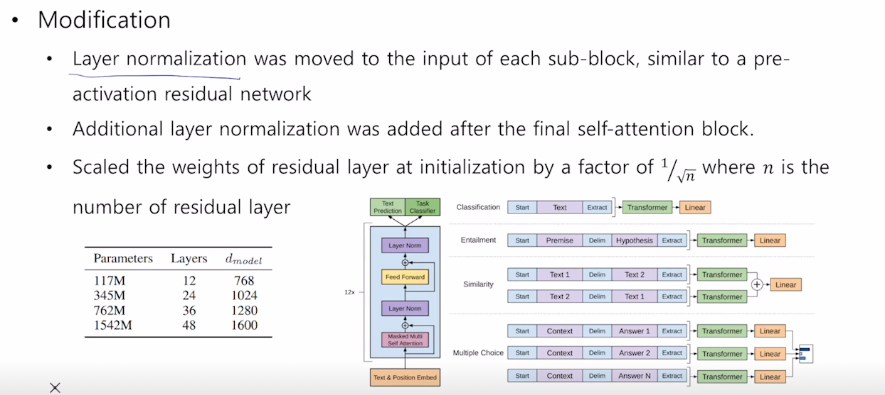

gpt-2에서는 layer가 점점 깊어질 수록 (output layer에 가까워질 수록) initialize할 때, 점점 작은 값으로 initialize하게 했다.

교수님은 이는 위쪽의 레이어에서 선형변환에 쓰이는 값이 0에 가까워지도록해서 위의 layer의 역할이 줄어들도록 하기 위해서라고 설명함.

(조교)

그 이유는 딥러닝 모델 내의 모든 계산은matrix multiplication을 기반으로 이루어져있다.

이에 따라 곱셈과 덧셈이 몇백차원에 걸쳐 반복적으로 이루어진다. 이 때문에 계속해서 각 element들의 분산 값이 점점 달라지게 되고 이 때문에 값이 지나치게 explode 해버리거나 vanishing될 수 있다.

즉, 점점 layer을 지날수록 이러한 현상이 누적되게 된다.

그래서 실제로 깊어질수록 weight들의 영향력을 줄여 값을 어느정도 안정화해주기 위함이다.

## GPT-3

기존 GPT-2 모델에 비교할 수 없을 정도로 많은 파라미터를 쓴것. 또한 더 많은 데이터

큰 배치사이즈를 통해 학습 진행했더니 점점 더 좋아지더라.

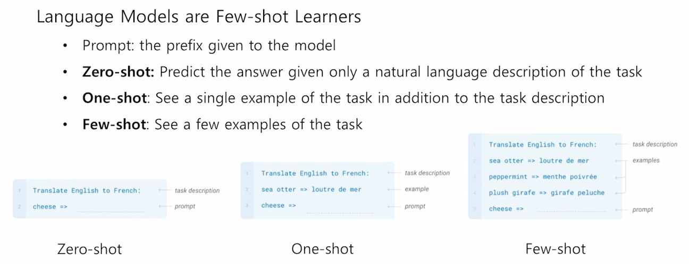

* ZERO SHOT SETTING을 놀라운 수준으로 끌어 모음

* ONE SHOT에서는 예시를 하나 준다. ==> 이거 해주면 ZERO SHOT SETTING 보다 훨씬 잘된다.

* FEW SHOT에서는 여러 예시를 준다. ==> 더 좋아진다 ㅋㅋ

별도의 **FINE TUNING 과정 없이** 예시 보여주고, 그 주어진 시점에서 예시 내에서 패턴을 학습하고 TASK를 수행한다..

기존의 버트와는 다르게 fine tuning도 필요 없고, 추가적인 labeling 된 데이터도 필요가 없어진 것이 핵심

**이렇게 몇개의 예시를 주는데 좋은 결과를 보이는 이유에 대한 조교님의 생각**

gpt-3가 아주 많은 양의 text를 학습하면서 prompt로 제공된 text의 상징적/사전적 의미를 아주 잘 파악할 수 있는 모델이 되었기 때문이라고 생각합니다.

입력한 prompt의 형태는 이미 사전 학습된 text에 많이 존재하는 pattern일 것이고 이런 식으로 입력해주는 것만으로 성능을 올리는 것.

> Translate English to French
>
> 안녕 => hi
>
> Translate English to French라는 의미를 알고 있고, => 가 변환된다는 의미로 많이 쓰였을 것이다.
>
> 안녕 &^%$& hi 같이 했으면 못알아 듣지 않을가..??

## ALBERT

기존에 학습하는데 리소스나 시간이 너무 만이 걸림

성능을 좋아지게 하면서 모델 사이즈 줄이고, 학습시간을 빠르게 만들었다.

그리고 성능을 좋아지게 하는 PRETRAINING할 때 **새로운 TASK**를 제안

### 1. FACTORIZED EMBDDING PARAMETERIZATION

SELF ATTENTION BLOCK을 계속적으로 쌓아가면서 만들어지는 버트, GPT의 모델을 볼 때

항상 RESIDUAL CONNECTION이 있기 때문에

입력으로 주어지는 벡터 차원이랑 출력 벡터의 차원랑 같아야 했다.

이 벡터 차원이 너무 작으면 정보를 담을 수 있는 공간 자체가 작아지는 거고, 너무 크면 모델 사이즈도 커지고, 연산량도 증가한다.

**LAYER를 쌓아나가면서 점점 HIGH LEVEL의 유의미한 정보를 추출해 나가는 과정이 딥러닝에서의 LAYER를 쌓는 과정이다**

가장 밑에 있는 EMBEDDING LAYER에서 갖는 벡터의 정보는 위에서 갖는 벡터에 비해서는 더 적은 정보를 저장하고 있다.

그렇기에 더 적은 벡터로도 충분하다? ==> 그래서 임베딩 레이어의 디멘젼을 줄이는 기법을 제시했다.!!!

그것은!! 임베딩 레이어를 한개를, 두개의 매트릭스로 쪼개서 만들어라

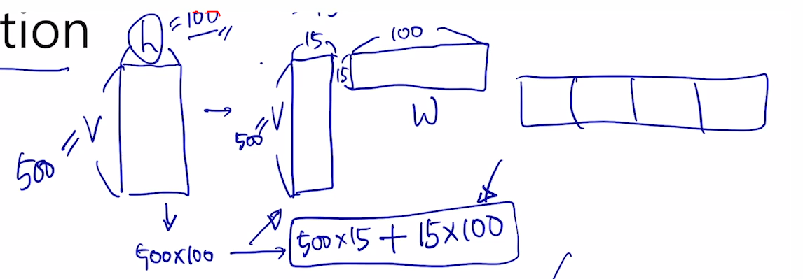

워드 임베딩 레이어 사이즈를 줄여서 모델 크기와 연산 시간을 줄이자!

### 2. Shared Parameter

ATTENTION에서의 학습 파라미터는 W_Q, W_K, W_V와 CONCAT뒤 특정 크기로 바꿔주는 W_O가 있지.

BERT에서는 self attention block 마다 각각의 독립적인 파라미터들이 있었다.

ALBERT에서는 이 선형변환 MATRIX를 SHARED된 형태로 구현했다.

ATTENTION BLOCK이 12개면 원래는 12개의 W_Q, W_K, W_V, W_O가 있었는데 이 행렬들을 공유해서 하나로 사용하자!		

SHARED하면 파라미터 개수 떨어지지만 성능은 조금바께 안떨어져. 

이렇게 SHARING 한게 CROSS LAYER PARAMETER SHARING 기법

​	

> 어떻게 정보가 쌓이는지???

### 3. SENTENCE ORDER PREDICTION

두 문장 가져 올때 항상 같이 붙어 있는 문장만 가져온다 (BERT에서는 안맞게도 가져왔지)

그리고 TASK를 순서가 맞는지 , 앞뒤가 역전된 순서인지를 찾는 TASK를 수행한다.

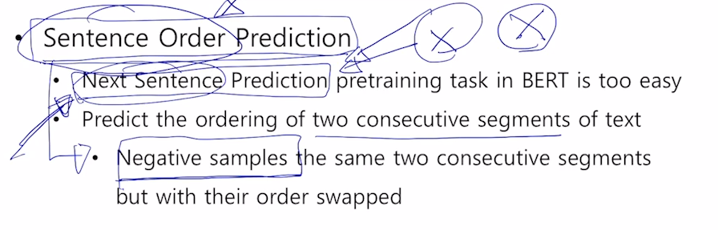

BERT에서 두개의 TASK가 있었다.

MASEKD TOKEN 맞추는 TASK 와 두 문장이 연결되는 문장인지 맞춘는 TASK(NEXT SENTENCE PREDICTION).

후속 연구들에서 NEXT SENTENCE PREDICTION은 TASK 난이도가 너무 쉽다. 또한 실효성이 없더라.

이거 떼고 MASKED TASK만 해도 성능이 별로 떨어지지 않는걸 발견함.

그 이유는 BERT에서는 서로다른 두 문서에서 추출된 두 문장을 CONCAT해서 만들어냈다.

그럼 두 문장에 있는 단어나 내용들이 많이 안겹칠 확률이 높아.  그래서 문제를 풀기가 쉬웠을 것이다.

> 하나는 정치, 하나는 연예 뉴스 기사 라면 내용이 엄청 상이할 것이다.

만약 정말 연결된 문장이라면 두 문장에서 **유사한 단어**들이 존재할 확률이 높다.

그렇다면 BERT에서는 두 문장의 논리적 흐름(고차원적인 추론, setence level)이 아니라, 저차원적인 단어의 겹침(word level)으로 이 TASK가 풀리게 된다.

그렇게 학습되면 의도했던 sentence level의 정보를 얻지 못한다.

> SEQ? 토큰에는 두 문장에 단어들이 비슷했는지? 와 같은 정보가 담기게 됨

그래서 정말 논리적 관계를 파악해야 풀 수 있도록 문제를 재정의했다. 이게 **SENTENCE ORDER PREDICTION**	

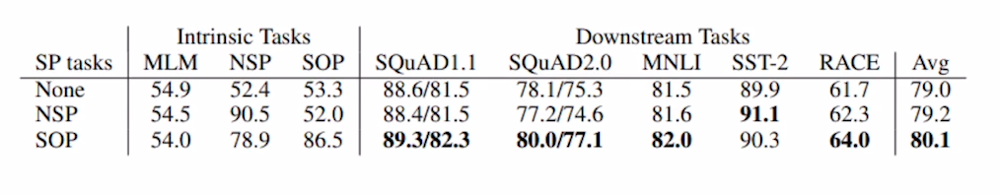

그래서 NEXT SENTENCE ORDER PEDICTION을 썼을 때 안썼을 때 거의 비슷하다. 심지어 오르는 경우도 있어.

그리고 SENTENCE ORDER PREDICTION을 사용하면 전체적으로 성능이 좋아짐

## ELECTRA

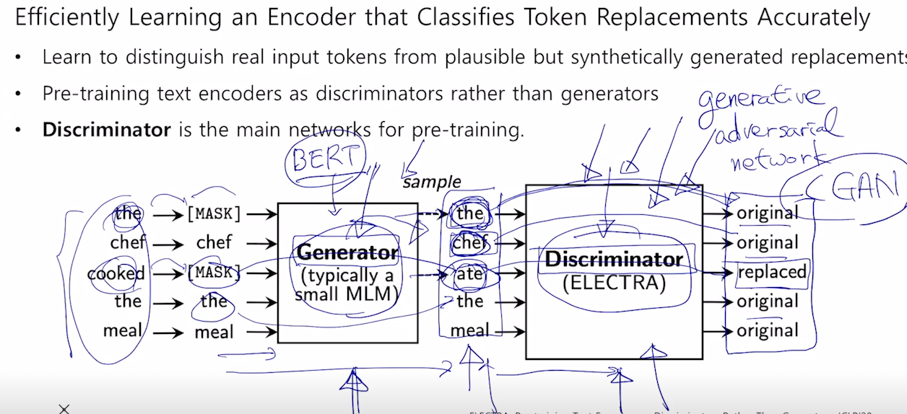

GENERATOR 를 BERT로 생각하면 된다. DISCRIMINATOR 를 ELECTRA

ELECTRA도 SELF ATTENTION BLOCK이 쌓인 구조이고 마지막 LAYER는 이진 분류 레이어

GENERATOR는 더 잘만들도록 학습, DISCRIMINATOR는 더 잘 분류하도록 학습됨.

그럼 이 DISCRIMINATOR를 FINETUNING하여 사용한다.

## LIGHT WEIGHT MODEL

모델을 더 크게 만들면서 성능은 좋아지지만, 많은 학습 시간, gpu 리소스가 필요해진다.

이런 모델들을 실제 application을 만드는데 걸림돌이 되었다.

이 비대해진 모델을 더 적은 파라미터를 가지는 경량화된 모델로 발전시키는 형태의 연구.

목표는 기존 모델 성능을 유지하면서 모델을 경량화하기

### DISTILATION 기법

#### 1. DistilBERT

TEACHER MODEL, STUDENT MODEL이 잇다

STUDENT MODEL은  TEACHER MODEL에 비해 레이어 수나, 파라미터가 더 적게 경량화 함

STUDENT MODEL은 TEACHER MODEL이 내는 아웃풋을 잘 모사할 수 있도록 학습함

TEACHER MODEL이 아웃풋으로 내놓은 확률분포 (SOFTMAX값을) 를 GROUND TRUTH로 사용하여 학습한다.

> [1,0,0,0,0] 같은 실제 정답 LABEL을 쓰는게 아니라! [0.2, 0.1, 0.1, 0.6] 같은 softmax output을 정답으로!

#### 2. TinyBERT

DistilBERT에서 student network가 teacher model의 softmax 값만을 모사하도록 훈련했지만

TinyBERT에서는 embedding layer와 각 self attention block이 가지는 W_Q, W_K, W_V 같은 matrix와 결과로 나오는 hidden state vector까지도 유사해지도록 student network를 학습하게 한다.

즉, 최종 결과물 뿐만 아니라 중간 결과들도 모사하도록

### Knowledge graph

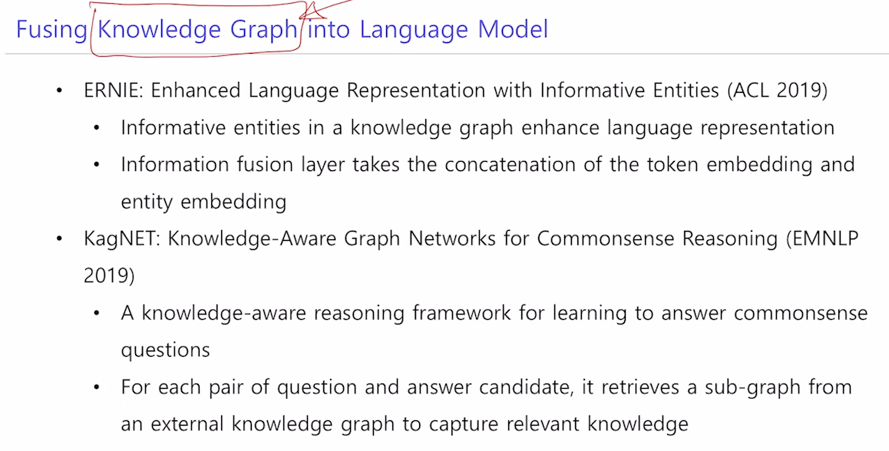

Knowledge Graph라 불리는 외부적인 정보를 결합하는 방법이 필요하다.

BERT는 주어진 문장이 있을 때, 문맥을 잘 파악하고 각 단어들 간의 유사도라든지 관계들을 잘 파악한다.

그러나 주어져 있는 문장에 포함되지 않은 추가적인 정보가 필요한 경우에는 그 정보를 효과적으로 활용하지는 못한다.

가령 주어진 문장에서 "꽃을 심기 위해서 땅을 팠다",   "집을 짓기 위해서 땅을 팠다" 라는 문장이 있는데 QA에서 무엇으로 땅을 팟는가 라는 질문이 들어온다면 BERT의 기본 문장에는 뭐로 팠는지에 대한 정보가 들어있지 않다.

하지만 사람이라면 꽃을 심기 위해선 모삽으로, 집을 짓기 위해서는 기계로 팠다고 생각할 수 있다.

우리가 이런 질문에 대해 답을 할 수 있는 것은 주어진 문장에서 담고 있는 정보 뿐만 아니라 기본적으로 갖고 있는 외부 지식 혹은 상식을 덧붙여서 문제를 해결해나가는 것이다.

> 이러한 외부 지식을 Knowledge graph라고 표현된다.

BERT의 취약적인 부분을 Knowledge graph를 통해 문제를 더 잘 해결할 수 있을까 하는 연구 방향.

-----------------------

배치사이즈와 일반화

https://hongdoki.github.io/2017/10/07/optimization-difficulty-and-generlization-performance-as-batch-size-increases.html

버트나 gpt는 batch size가 커져서 성능이 좋아지는 것이 아닌 larger model이 되어 성능이 좋아진 것

batch size를 키우면 학습 속도를 키울 수 있다는게 최대 장점.

