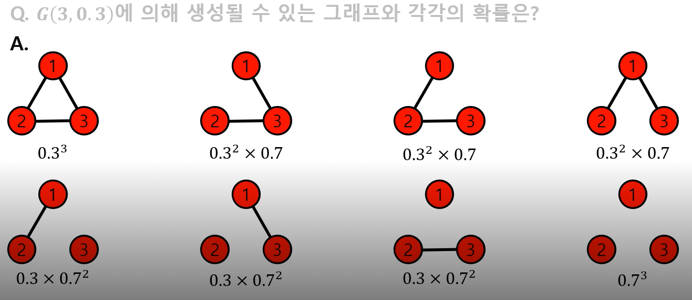
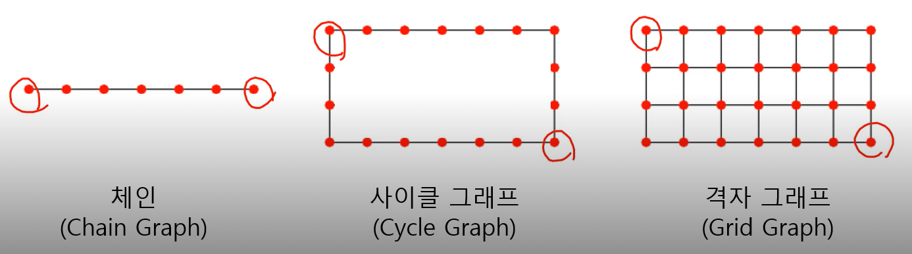
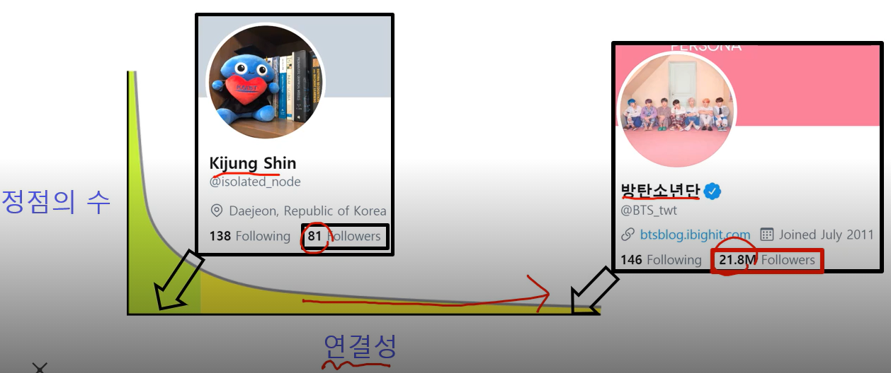
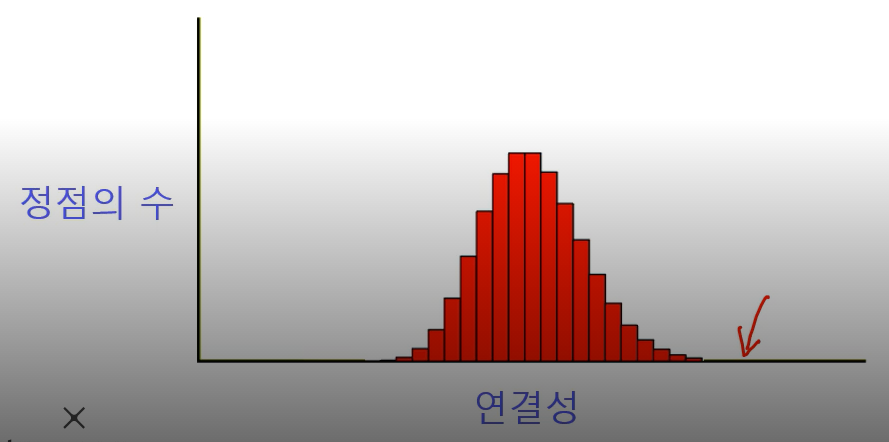

그래프 관련 인공지능 문제

## 정점 분류 문제

##### 1. 해당 정점이 어떤 글을 리트윗 했는지를 통해 그 정점의 정치적 성향을 알 수 있다.

> 같은 정치적 성향이 있는 글을 많이 리트윗한다. 는 사실에 기반

##### 2. 단백질의 상호작용을 분석하여 단백질의 역할을 분류해낼 수 있다.

## 연결 예측 문제

주어진 그래프가 어떻게 성장할지를 예측하는 것

추천문제와도 연결됨

미시적 관점에서는 각 정점이 어떤 정점과 연결될지도 예측.

> 각 사용자가 어떤 물건을 구매할지를 예측.

## 군집 분석 문제

연결 관계로부터 사회적 무리를 찾아낼 수 있을까

## 랭킹 및 정보 검색 문제

수많은 웹페이지에서 내가 원하는 정보를 어떻게 찾아낼 수 있을까.

## 정보 전파 및 바이럴 마케팅

SNS를 통해 많은 정보가 전파된다.

정보는 어떻게 네트워크를 통해 전달될까.

어떻게 정보 전달을 최대화할 수 있을까.

# 그래프 기초

## 이종 그래프

두가지 종류의 정점을 가진다.

중요한 특성은 **서로 다른 종류의 정점 사이에만 간선이 존재**한다는 것.

*  전자 상거래 구매내역 그래프 : 사용자 정점, 상품 정점
* 영화 출연 그래프 : 배우, 영화 정점

동종 그래프는 단일 종류의 정점을 가진다.

이웃을 보통 N(v) 또는 N_v로 표현한다.

N(1) = 2,5의 의미는 정점 1에 이웃노드 2와 5가 있다.

> N_out, N_in

## NetworkX

그래프를 생성, 변경, 시각화, 분석할 수 있는 툴.

> NetworkX는 조금 느리지만 사용성이 편의하고, snappy는 사용성이 좋지 않지만 빠르다. 둘다 아는게 좋다.

인접 리스트 :

간선 리스트 : 

> 그냥 간선을 모두 list로 저장

인접 행렬 :

* 일반행렬 : 정점 수의 제곱이 행렬의 크기
* 희소행렬 : 간선 수에 비례한 크기 (그러나 속도 좀 느림)

랜덤 그래프 

확률적 과정을 통해 생성한 그래프

> 다양한 방법으로 만들어지는 랜덤 그래프 들이 있다.

에르되스-레니 랜덤 그래프

임의의 두 정점 사이에 간선이 존재하는지 여부를 동일학 확률분포에 의해 결정

G(n,p)는

* n개의 정점을 갖는다
* 임의의 두 정점 사이에 간선이 존재할 확률은 p
* 정점 간의 간선은 독립적이다.

정점 u와 v 사이의 경로는 다음 조건을 만족하는 정점들의 순열

* u에서 시작해서 v에서 끝나야 한다.
* 순열에서 연속된 정점은 간선으로 연결되어 있어야 한다.

정점 u와 v사이의 거리는 u와 v사이의 최단 경로

작은 세상 효과

임의의 두 사람을 골랐을 때, 몇 단계의 지인을 거쳐 연결될까

여섯 단계 분리 실험

1960년대 오마하와 위치타에서 500명을 뽑아 보스턴에 있는 한 사람에게 편지를 전달하게 끔 하였다. 단 지인을 통해서만 전달해야한다.

이때 평균적으로 6단계만 거치면 도착했다고 한다.

> MSN에서도 두 정점 간에 7번만에??

그래프 상에서 임의의 두 정점의 거리가 작다는 사실을 작은 세상 효과(Small word effect)

작은 세상 효과는 높은 확률로 랜덤 그래프에도 존재한다.

이렇게 되는 이유는 모든 사람이 100명의 지인이 있다고 가정한다면 다섯 단계를 거치면 최대 100억 (10^5)명의 사람과 연결될 수 있다..!

실제로는 중복이 있긴 하지만 그래도 몇번만에 엄청 퍼질 수 있다.

그러나 체인, 사이클 그래프, 격자 그래프에는 작은 세상 효과가 없다.

이 그래프에서는 서로 거리가 먼 정점들이 존재하고, 이 거리는 그래프가 커질 수록 커진다.

연결성(Degree) : 정점과

연결성의 두터운 꼬리 분포

연결성이 매우 높은 허브 정점이 존재함을 의미한다.

즉, 몇몇의 정점엔 연결된 정점이 매우 많다.

> 방탄소년단의 팔로워 수

랜덤 그래프의 연결성 분포는 높은 확률로 정규 분포와 유사한다.

연결성이 매우 높은 허브 정점이 존재할 가능성이 0에 가깝다.

실제 그래프는 두터운 꼬리 분포가 존재할 확률이 높다.

연결 요소는 다음 조건을 만족하는 정점 집합

* 연결 요소에 속하는 정점들은 경로로 될 수 있다.
* 위 조건을 만족하면서 정점을 추가할 수 없다.

실제 그래프에는 거대 연결 요소가 존재한다.

거대 연결 요소는 대다수의 정점을 포함한다.

군집

* 집합에 속하는 정점 사이에는 많은 간선이 존재
* 집합에 속하는 정점과 그렇지 않은 정점 사이에는 적은 수의 간선이 존재

지역적 군집 계수

한 정점에서 군집의 형성 정도를 측정.

특정 정점의 이웃 쌍 중 간선으로 직접 연결된 것의 비율

예시에서 6이 나오는 건 4C2이다.

즉 이웃 노드들이 2개씩 연결될 수 있는 모든 경우의 수가 분모로 간다.

그중 (2,3), (2,4), (3,5) 만 연결 되어 있기 때문에 3이 분자로 간다.

정점 i의 지역적 군집 계수가 높다는 것은 정점 i의 이웃들도 높은 확률로 서로 간선으로 직접 연결되어 있다는 의미이다.

정점 i와 그 이웃들은 높은 확률로 군집을 형성한다.

전역 군집 계수는 각 정점에서의 지역적 군집 계수의 평균

실제 그래프에서는 군집계수가 높다. 즉 많은 군집이 존재한다.

그 이유는

동질성 : 서로 유사한 정점들끼리 간선으로 연결될 가능성이 높다.

> 같은 동네에 사는 같은 나이의 아이들이 친구가 된다.

전이성 : 공통 이웃이 있는 경우, 공통 이웃이 매개 역할을 해줄 수 있따.

> 친구를 서로에게 소개해주는 경우가 그 예시

랜덤 그래프에서는 지역적 혹은 군집 계수가 높지 않다.

G(n,p)에서 군집 계수는 p에 해당함

랜덤 그래프에서 군집계수가 낮은 이유는 간선 연결에 독립성과 관련 있따.

공통 이웃의 존재 유무가 간선 연결확률에 영향 안끼쳐서 전이성이 없고, 또한 동질성이 없기에

배치가 32~512까지는 상간이 없다.

fine tuning을 너무 큰 lr로 하면 

pretrained model의 weight를 바꾸지 않도록 주의해야한다.

weight_decay

warmup_proportion

