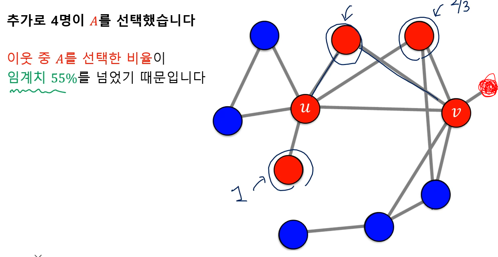

웹은 웹페이지와 하이퍼링크로 구성된 거대한 방향성 있는 그래프

웹은 정점, 하이퍼링크는 나가는 간선.

구글 이전의 검색 엔진

##### 1. 웹을 거대한 디렉토리로 정리

웹페이지 수가 증가함에 따라 카테고리의 수와 깊이가 무한정 커짐. 또한 카테고리를 분류하는 것도 모호하여 힘듬

##### 2. 웹페이지에 포함된 키워드에 의존한 검색 엔진

사용자가 입력한 키워드에 대해 해당 키워드를 (여러 번) 포함한 웹페이지를 반환

하지만 악의적으로 성인 사이트에 "축구" 라는 키워드를 보이지 않게 넣어두면 검색이 된다.

## 페이지 랭크

### 투표.

투표를 통해 사용자 키워드와 관련성이 높고 신뢰할 수 있는 페이지를 찾는다.

투표의 주체는 웹페이지. 웹페이지가 하이퍼링크를 통해 투표한다.

> 즉 나가는 간선이 투표

이 또한 악의적으로 웹페이지를 여러개 만들어 들어오는 간선의 수를 부풀릴 수 있다.

그래서 가중 투표를 사용한다.

관련성이 높고 신뢰할 수 있는 웹사이트의 투표를 더 중요하게 간주한다.

측정하려는 웹페이지의 관련성 및 신뢰도를 페이지 랭크 점수.

각각 웹페이지의 투표의 가중치를 (자신의 페이지랭크 점수 / 나가는 간선의 수)로 정의

각 웹페이지의 페이지랭크 점수는 투표의 가중치 합으로 정의

$$
r_j = \sum_i\frac{r_i}{d_{out}{i}}
$$

예시

## 임의 보행

임의 보행을 통해 웹을 서핑하는 웹서퍼 가정.

웹서퍼는 현재 웹페이지에 있는 하이퍼링크 중 하나를 균일한 확률로 클릭하는 방식으로 웹 서핑

웹서퍼가 t번째 방문한 웹페이지가 웹페이지 i일 확률을 p_i(t)

그러면 p(t)는 길이가 웹페이지 수와 같은 확률분포 벡터

그러면 아래식이 성립
$$
p_j(t+1) = \sum_{i}\frac{p_i(t)}{d_{out}(i)}
$$

이를 무한히 반복하여 t가 커지면 확률 분포는 p(t)로 수렴

즉, p(t) = p(t+1) = p이 성립되는 정상 분포가 된다.

그럼 다음과 같이 수식이 변할 수 있다.
$$
p_j(t+1) = \sum_{i}\frac{p_i(t)}{d_{out}(i)} => p_j = \sum_{i}\frac{p_i}{d_{out}(i)}
$$
이는 투표관점에서 정의한 페이지랭크 점수 r과 임의 보행 관점에서 정의한 정상분포 p가 동일하다.

페이지랭크 계산 : 반복곱

1. 각 페이지 i의 페이지랭크 점수 r_i^(0) 를 동일하게 1/웹페이지의 수로 초기화

2. 아래 식을 이용하여 웹페이지의 페이지랭크 점수 갱신
   $$
   r_j = \sum_i\frac{r_i^{(t)}}{d_{out}(i)}
   $$

3. 페이지 랭크 점수가 수렴하였으면 종료하고, 아니면 (2) 반복

4. 

예시

6/15, 6/15, 3/15가 되면 갱신을 해도 값이 같다 == 수렴

위 페이지 랭크의 문제

2,4,6 ...번째 벡터와 1,3,5... 번째 벡터끼리는 동일하다.

이러한 이유는 스파이더 트랩으로 인한 문제

스파이더 트랩은 들어오는 간선은 있지만 나가는 간선은 없는 정점 집합.

이 예시에서는 페이지랭크 점수는 0으로 수렴한다.

들어오는 간선은 있지만 나가는 간선은 없는 막다른 정점 문제

이 문제를 해결하기 위해 순간이동을 도입.

기존 웹서퍼에 행동을 추가한다.

순간이동 도입으로 페이지랭크 점수 계산이 바뀐다.

$$
r_j = \sum_i(\alpha\frac{r_i^{(t)}}{d_{out}(i)}) + (1-\alpha)\frac{1}{|V|}
$$
왼쪽 부분은 하이퍼링크를 따라서 웹페이지 j에 도착할 확률, 오른쪽 부분은 순간이동을 톻애서 웹페이지 j에 도착할 확률을 의미.

## 바이럴 마케팅

선형 임계치 모형

가장 간단한 형태의 의사결정 기반의 전파 모형

카카오톡과 라인중 뭐를 쓸까?

친구가 많이 쓰는걸 쓴다. 이렇게 주변 사람들의 의사결정을 고려하여 각자 의사결정을 내리는 경우에 의사결정 기반의 전파 모형을 사용한다.

예시

각 정점은 이웃 중 A를 선택한 비율이 임계치 q를 넘을 때만 A를 선택한다.

이 모형은 전부 B를 사용한다고 가정하고, 처음 A를 사용하는 얼리 어답터들을 가정한다.

이 얼리 어답터들을 시드 집합이라고 불리고 항상 A를 고수한다고 가정한다.

 기존 파랑들에다 얼리어답터 2개가 들어간다.

얼리어답터의 등장으로 4개의 노드가 빨강으로 변했다.

4명이 빨강으로 추가되어 1개의 노드가 빨강으로 변했따.

이러한 과정이 반복하여 마지막으로 다음과 같은 결과가 나옴

즉, u와 v에서 시작하는 얼리어답터의 기술이 2개의 정점을 제외한 모든 정점들이 a라는 기술을 사용하게 됐다.

확률적 전파 모형

코로나의 전파 과저은 의사결정 기반 모형으로 적합하지 않다.

누구도 코로나에 걸리기로 의사결정을 내리지 않기에.

코로나 전파는 확률적 과정이기에 확률적 전파 모형을 사용해야함.

## 바이럴 마케팅과 전파 최대화

​	

바이럴 마케팅은 상품에 대한 긍정적인 입소문을 내게하는 기법

소문의 시작점이 중요하다. 전파 범위가 중요하기에

> 소셜 인플루언서

