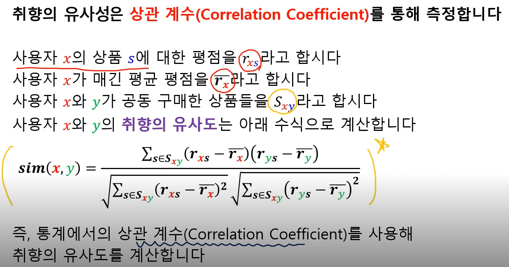
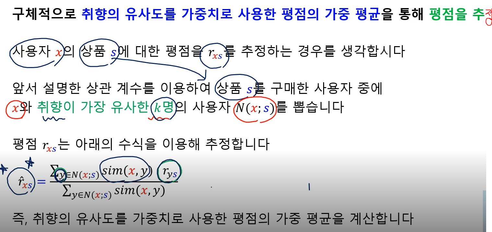

Girvan-Newman 알고리즘

탑다운 방식이다.

전체 그래프에서 간선 없애면서 군집형성

1. 전체 그래프에서 시작
2. 매개 중심성이 높은 순서로 간선을 제거하며 군집성 변화를 기록
3. 군집성이 가장 커지는 상황을 복원
4. 이때 서로 연결된 정점들, 즉 연결 요소를 하나의 군집으로 간주한다.

Louvain 알고리즘

바텀업 방식.

개별 정점에시 시작해서 병합하면서 군집형성

1. 개별 정점으로 구성된 크기 1의 군집들에서 시작
2. 각 정점을 기존 혹은 새로운 군집으로 이동시킴. 이때 군집성이 최대화되도록.
3. 더 이상 군집성이 증가하지 않을 떄 까지 2)반복
4. 각 군집을 하나의 정점으로 하는 군집 레벨의 그래프를 얻은 뒤 3) 반복
5. 정점이 한개 남을때까지 4) 반복

## 중첩이 있는 군집 구조

위의 두 알고리즘은 한개의 정점은 오직 한개의 군집에만 포함될 수 있다고 가정한다.

각 정점이 각 군집에 속하는 정도를 실수값으로 표현함

> 사람도 여러 모임에 가입돼있지만 중요한 정도가 다르다.

최적화 관점에서 모형의 매개변수들이 실수값을 갖고 있기 때문에 경사하강법으로 모형을 탐색할 수 있다는 장점이 있다.

## 추천 시스템

사용자와 아이템을 이종 그래프를 통해 표현할 수 있따.

추천하는 것을 "미래의 간선을 예측하는 문제", "누락된 간선의 가중치를 추정하는 문제"로 해석할 수 있다.

컨텐츠 기반 추천

1. 각 상품에 대한 상품 프로필을 만든다.

상품 프로필은 상품의 특성을 나열한 벡터

> 영화의 경우 장르, 감독, 출연진 등등

2. 사용자 프로필을 만든다.

사용자 프로필은 선호한 상품의 상품 프로필을 선호도로 사용하여 가중 평균으로 계산한다.

> 상품 프로필 \* 유저의 평점

3. 사용자 프로필과 상품 프로필 벡터 간 코사인 유사도를 계산한다.

4. 유사도가 가장 높은 상품을 추천해준다.

장점

1. 다른 사용자의 구매 기록이 필요하지 않다
2. 독특한 취향의 사용자에게도 추천이 가능하다
3. 새 상품에 대해서도 추천이 가능
4. 추천의 이유를 제공 가능

단점 

1. 상품에 대한 부가 정보가 없는 경우에는 사용할 수 없다.
2. 구매 기록이 없는 사용자에게는 사용할 수 없다
3. 과적합으로 지나치게 협소한 추천만을 할 위험이 있다.

협업 필터링

사용자-사용자 협업필터링

1. 추천 대상자 x와 유사한 취향의 사용자 찾는다.

2. 유사한 사용자들이 선호했던 상품을 찾는다

3. 이 상품들을 x에 추천한다.

동일한 영화 s에 대해서 x라는 사람이 자신이 평균적으로 매기는 점수보다 높은 평점을 주고, y도 더 높은 평점을 줬다면 양의 상관관계가 존재하여 양수 값을 가진다.

만약 한명은 높게 줫는데 한명은 작게 주면 음수 값이 발생.

분모는 정규화하는 목적으로 사용.

취향의 유사도를 가중치로 사용한 평점의 가중 평균을 통해 평점을 추정한다.

마지막으로 추정한 평점이 가장 높은 상품을 추천한다.

장점

1. 상품에 대한 부가 정보가 필요 없다.

닺넘

1. 충분한 수의 평점 데이터가 누적되어야 효과적

2. 새 상품, 새로운 사용자에게 추천이 불가능

   > 충분한 평점 데이터가 누적돼야기에

3. 독특한 취향의 사용자에게 추천이 어렴

   > 유사한 독특한 취향을 가진 사람 찾아내기 어려움

## 평가지표

MSE

