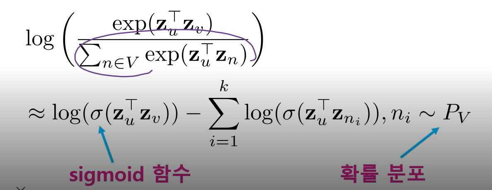
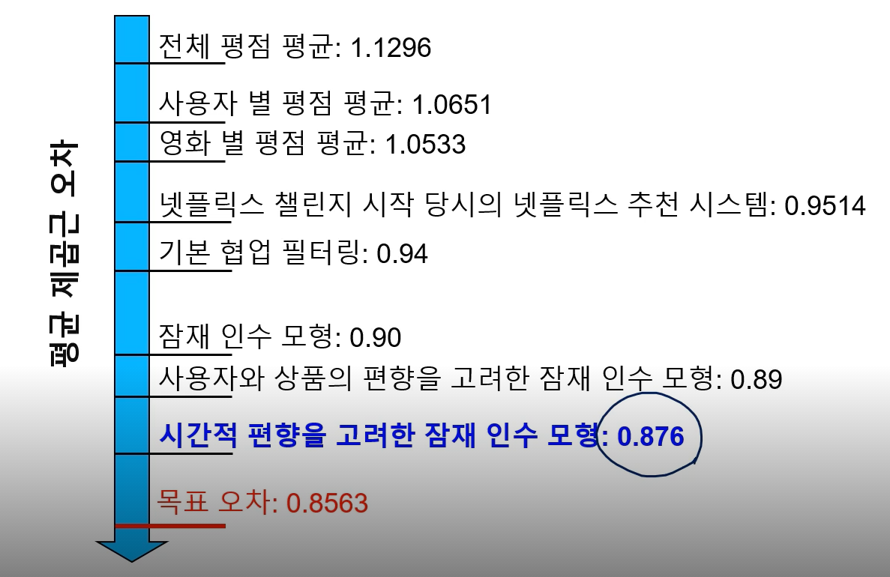

정점을 벡터로 표현하면 기계학습 방법을 정점 분류, 군집 분석 등 쓸 수 있따.

> 로지스틱 회귀, MLP, K-means, DBSCAN 등등

지금까지 수업들에선 이전까지 그래프 형태의 데이터를 위하여 그에 맞는 알고리즘을 만들어야 했다.

하지만 그래프를 벡터로 잘 표현할 수 있다면 최신 기술을 활용할 수 있다는 장점이 있지.

정점을 벡터로 변환할 때 유사도의 목표를 정해야 한다.

1. 그래프에서의 정점간 유사도를 임베딩 공간에서도 "보존"하는 것을 목표로 한다.

임베딩 공간에서는 내적을 통해 유사도를 표현

> 유사도는 두 벡터의 방향이 같을 수록, 값이 클 수록 커진다.

즉, 정점 인베딩의 두 단계는

1. 그래프에서의 정점 유사도를 정의하는 단계
2. 정의한 유사도를 보존하도록 정점 임베딩을 학습하는 단계

## 인접성 기반 접근법

두 정점이 인접할 때 유사하다고 간주한다.

> 인접하다는 것은 둘을 직접 연결하는 간선이 있음을 의미

Loss function

한계

인접성 만으로 유사도를 판단하기엔 한계가 있다.

두 정점 사이에 몇칸이 떨어져 있더라도 유사도는 0이 된다.

많이, 적게 떨어져있음을 분간하지 못해

## 거리/경로/중첩 기반 접근법

거리 기반 접근법 : 두 정점 사이의 거리가 충분히 가까운 경우 유사하다고 간주

> 예를 들면 2번 안에 갈 수 있는 거리에 있는 점들만 가까움 => 얘네만 유사도 1, 더 멀면 유사도 0

경로 기반 접근법 : 두 정점 사이의 경로 거리가 k 이라힌 경로가 많을 수록 유사하다고 간주

loss function

인접매트릭스 A가 있을 때 간선이 있다면 1로 없으면 0으로 한다

그럼 이 A는 각 정점에서 한번만에 갈 수 있는 정점들에 1이 있는것

A^2 는 각 정점에서 2번만에 갈 수 있는 정점들에 1

A^k는 각 정점에서 k번 이동했을 때 갈 수 있는 정점들에 1이 있다.

중첩 기반 접근법 : 두 정점이 많은 이웃을 공유할 수록 유사

빨강과 파랑은 두명의 이웃을 공유하기에 유사도가 2

loss function

자카드 유사도 : 공통 이웃의 수 대신 비율을 계산하는 방식
$$
\frac{|N(u) ∩ N(v)|}{|N(u)∪N(v)|}
$$

Adamic Adar 점수 : 공통 이웃 각각에  가중치를 부여하여 가중합을 계산
$$
\sum_{w=N(u)∩N(v)}\frac{1}{d_w}
$$
여기서 1/d_w가 1이면 공통 이웃의 수를 나타내는 것을 알 수 있다.

u와 v의 공통 이웃 w에 대해서 w의 연결성이 크면 클수록 가중치가 작아진다.

트와이스를 팔로우하는 사람은 수백만명인데, 그 트와이스를 팔로우한 두명이 관계가 있다고 판단하기엔 무리다.

김철수를 팔로우하는 사람이 두명이라면, 그 두 명은 관계가 있다고 판단할 수 있다.

그래서 연결성이 낮을 수록 가중치는 커지지.

## 임의보행 기반 접근법

한 정점에서 시작하여 임의보행을 할 때 다른 정점에 도달할 확률을 유사도로 간주

> pagerank에서 임의보행하는 웹서퍼

임의 보행 : 현재 정점의 이웃 중 하나를 균일한 확률로 이동하는 과정을 반복하는 것.

임의보행을 사용할 경우 시작 정점 주변의 **지역적 정보**와 그래프 전역 정보를 모두 고려한다는 장점이 있다.

> 아무래도 정점 주변을 많이 탐색할 것이므로 지역적 정보는 자명
>
> 기존의 거리기반, 경로기반에서는 거리를 k로 제한했지만 여기선 거리를 제한하지 않기에 전역 정보를 고려한다고 할 수 있다.

각 시작점 u에서 임의보행을 해서 도달한 v를 고려한다.

출력에 해당하는 임베딩으로부터 추정한 u에서 부터 시작하여 v에 도달할 확률갑을 고려

이 확률값이 크면 클수록 추정을 잘한 것이다.

출력에 해당하는 임베딩부터 확률값을 어떻게 추정할까

출력에 해당하는 임베딩으로부터 

이런 수식이라면 도달할 확률이 0.8 이면 그 노드가 N_R에서 많이 나와야지 loss가 작아짐.

도달할 확률이 0.01이라면 N_R에서 조금 나와도 별 상관을 안씀

그럼 가까이 있는 노드들만 맞추는 형태로 학습이 진행되나???

임의보행 방법에 따라 DeepWalk와 Node2Vec

DeepWalk는 위에서 살펴본 방식이다 

> 이웃을 균일한 확률로 선택하여 임의보행

Node2Vec은 2차 치우친 임의보행(Second-order Biased Random Walk)를 한다.

현재 정점과 직전에 머물렀던 정점을 모두 고려하여 다음 정점을 선택한다.

u에서 임의보행 시작해 v 도달했다.

그럼 v에서 이웃 중 하나를 선택해야 하는데, u,x,y 든 어디로든 갈 수 있다.

(a) : 직전 정점 u와 가까워지는 방향

(b) : u와 y사이의 거리가 u와 v사이의 거리보다 멀어지는 방향

(c) : u와 v 사이의 거리와 u와 x사이의 거리가 같아지는 방향

이러한 경우들에 대해 차등적으로 확률을 부여한다.

확률을 부여하는 것은 사용자가 정의할 수 있고, 기준에 따라 다른 임베딩이 만들어짐

다음 그림은 임베딩한 뒤 k-means로 군집화한 시각화 자료

멀어지는 방향에 높은 확률을 부여한 경우 : 점점의 역할에 따라 비슷한 임베딩 값을 갖게 된다.

같은 군집에 속한 정점들을 보면

파랑 : 인접하진 않지만 서로 다른 군집들을 연결해주는 다리역할을 하는 정점

노랑 : 연결성이 높지 않은, 그래프의 주변부에 속하는 정점

빨강 : 군집에 속해있는 정점

가까워지는 방향에 높은 확률을 부여한 경우 : 같은 군집에 속한 경우 임베딩 값이 유사해진다.

손실 함수

식을 보면 정점의 수의 제곱에 비례하는 시간이 걸린다.

너무 오래걸려!

따라서 근사식을 사용한다.

모든 정점에 대해서 정규화하는 대신 몇개의 정점을 뽑아서 비교하는 것

이때 뽑힌 정점들을 네거티브 샘플이라고 부른다.

> word2vec에서도 사용하지

이때 연결성에 비례하는 확률로 네거티브 샘플을 뽑으며 샘플이 많을수록 더욱 안정적.

위 수식에서 모든 정점에 대해 합산하기에 문제가 생기는 것.

모든 정점에 대해 합산하는 대신 k개의 정점을 임의로 선발하여 그 정점에 대해서만 분모를 계산할 수 있다. 

또한 exp 말고 시그모이드로??

## 변환식 정점 표현 학습의 한계점

변환식 방법 : 학습의 결과로 정점의 임베딩 자체(임베딩 벡터)를 얻는다는 특징

귀납식 방법 : 각 정점을 벡터로 표현하는데 사용하는 함수. 즉, 인코더 자체를 얻는다.

한계점

1. 학습이 진행된 이후에 추가된 정점에 대해서는 임베딩을 얻을 수 없다.
2. 모든 정점에 대한 임베딩을 미리 계산하여 저장해두어야 한다.
3. 정점이 속성 정보를 가진 경우에 이를 활용할 수 없다.

대표적인 귀납식 임베딩 방법이 GNN이다.

node2vec이 word2vec과 같은형식으로 되면 인코더가 나오는게 아닌가??

node2vec.fit 해서 model을 얻어내잔아

## 그래프를 이용한 추천시스템

### 잠재 인수 모형

사용자와 상품을 벡터로 표현하는 것.

UV decompsition

사용자와 상품을 임베딩한다면 공간에서 사용자와 가깝에 위치한 영화를 추천해줄 수 있따.

하지만 영화를 얼마나 액션적인지 로맨스적인지, 가벼운지 등을 수치로 표현하는 것은 어려운 일이고, 표현할 수 있다고 하더라도 꼭 영화를 진지<-> 가벼움, 액션<-> 로맨스로 구분할 필요는 없다.

그래서 잠재 인수 모형에서는 고정된 인수 대싱 효과적인 인수를 학습하는 것을 목표로 한다.

이때 학습한 인수를 잠재 인수라고 한다.

손실 함수

그래프에서는 그래프의 유사도를 보존하게 임베딩을 한다.

여기서는 사용자와 상품의 임베딩 내적이 평점과 최대한 유사하도록 만든다

$$
\sum(r_{xi} - p^{t}_xq_i)^2
$$
다음 수식을 최소화 하는 방향으로 사용자행렬 P와 아이템행렬 Q를 학습시킨다.

하지만 위 손실 함수를 사용하면 과적합 가능성이 있다.

훈련 데이터의 노이즈까지 학습하여 평가 성능은 오히려 감소하는 현상

과적합을 방지하기 위하여 정규화 항을 손실함수에 더해준다.

> 여기선 L2 norm

모형 복잡도가 작다는 것은 P와 Q가 너무 큰 값을 갖지 않는 것을 의미.

임베딩 값이 너무 크면 잡음까지 배우게 되는 것을 의미.

하지만 잡음은 평가셋에서 중요하지 않다.

확률적 경사하강법을 사용!

경사하강법이 더 적은 epoch로 수렴할 수도 있지만 이 한 epoch에 많은 시간과 컴퓨팅 자원이 필요

그래서 확률적 경사하강법으로 많이 사용함.

## 고급 잠재 인수 모형

### 1. 사용자와 상품의 편향을 고려한 잠재 인수 모형

A는 평균적으로 후하게 점수 주고, B는 깐깐하게 준다.

에전엔 p^T_x\*q_i를 통해 바로 평점 자체를 예측하려 했지만

 지금은 상품 편향, 사용자 편향을 제외하고 그 차이 만을 p^T_x\*q_i을 통해 근사하려 한다.

앞의 손실함수에서는 p_x와 q_i만을 학습했다면 이제 사용자 편향과 상품 편향을 함께 학습한다

> 평균을 통해 그냥 상품, 사용자 편향을 구하는게 정확하지 않다. 그래서 다 학습시켜간다

전체 평균은 학습하지 않고 그냥 구한거 갖다 쓴다.

그리고 마지막에는 정규화 텀까지 더해주고

### 2. 시간적 편향을 고려한 잠재 인수 모형

넷플릭스 시스템의 변화로 평균 평점이 크게 상승한 사건이 있었다.

>  넷플릭스 시스템의 인터페이스가 변화한다던지 점수를 매기는 시스템에 변화가 있다던지

영화의 평점은 출시일 이후 시간이 지남에 따라 상승하는 경향을 갖는다.

맨 처음 보는 사람들은 이 영화를 간절히 기다렸을 가능성이 크다. 그러니 점수가 높게 나오고

다른 사람들도 나왔다더라 하고 보니까 기대했던 사람들 보다는 점수를 적게 줘서 평균적으로 점수가 조금 내려가는 거지

시간이 엄청 흐른 뒤에 보는 사람들은 추천시스템에 의해 추천 받거나 (비슷한 류의 영화를 좋아하기에), 어떠한 이유로 관심히 생겨서 직접 찾아서 보는 경우일 것이다. 그러니 이 영화를 좋아할 만한 가능성이 높은 사람이 보기에 평점도 올라가는 경향이 있는 거지.

위와 같은 시간적 편향을 고려하기 위해 사용자 편향, 상품 편향이 시간에 따라 변할 수 있도록 추가했다.

위에서 배운 기술들로 인해 챌린지의 오차가 줄어들었고

마지막엔 다양한 모델을 앙상블해서 목표 오차를 넘겼다.

