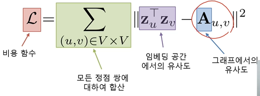

목적 정점의 임베딩을 엇기 위해 이웃들의 정보를 집계함.

이웃 정점들의 정보를 집계하는 과정을 반복하여 임베딩

각 집계 단계를 층이라 하며 각 층마다 임베딩을 얻는다.

각 층에서는 이웃들의 이전 층 임베딩을 집계하여 새로운 임베딩을 얻는다. 0번 층, 즉 입력층의 임베딩으로는 정점의 속성 벡터를 사용

0번층의 임베딩을 집계하여 1번층에서의 임베딩 얻고, 1번층에서의 임베딩을 집계해서 2번층의 A의 임베딩을 얻어낸다.

정점 마다 상대적으로 많이 집계되는게 있고, 적게 되는게 있고!!

층별로 집계 함수는 공유한다.

입력의 크기가 가변적이어도 처리할 수 있어야 한다.

집계함수를 뭘 써야할까?!

집계함수는 (1) 이웃 정보의 평균을 계산하고, (2) 신경망에 적용하는 단계를 거친다.

입력 갯수가 얼마든지 평균을 구하면 동일한 차원의 정보를 얻을 수 있다.

> 집계함수에 무엇을 쓰느냐에 따라 달라진다. 그래프 신경망, 그래프 합성곱 신경망, graphSAGE

학습변수는 W_k와 B_k가 된다.

> 층 별 신경망의 가중치

### 손실함수 정의

정점간 거리를 보존하는 것을 목표로 해야한다.

> 거리를 어떻게 정의하느냐에 따라 여러 손실함수가 있을 수 있다.

#### 1. 인접성을 기반으로 거리를!

### 2. Downstream task의 손실함수를 통해 학습.

종단종 학습이라고 한다. (End to End)

임베딩을 얻는게 목적이 아닌 정점 분류하는 task가 최종 목표라고 해보자

임베딩이 정점간 거리를 보존하는게 직접적인 목표가 아니고, 분류기 성능을 높히는 것이 목표이다!!

크로스엔트로피를 통해 학습을 할 수 있다.

임베딩을 학습한 후 분류기를 학습하는 것보다

한번에 즉, 종단종 학습을 통해 분류하는게 성능이 더 잘나오더라

1번은 비지도 학습, 2번은 지도 학습으로 학습이 진행되는거지!!

## GCN

GCN의 집계함수

##### 1. 기존과의 차이점은 현재 집계가 되고 있는 정점의 임베딩 값을 별도의 신경망을 이용하여 합계해줬지만 v를 별도의 신경망을 사용하지 않고 W_k로 한꺼번에 평균내고 사용한다.

##### 2. v의 연결성만이 아닌 u와 v의 연결성의 기하평균을 사용해준다.

## GraphSAGE

##### 1. 이전에는 이웃 임베딩을 평균내어 W_k로 넣고, 자신의 이전 스텝 임베딩을 B_k에 넣은 뒤 두 값을 더해줬찌만, 여기선 concat한다!

##### 2. AGG로 다양한 함수를 사용한다.

mean, pool, lstm 등등...

## 합성곱 신경망과의 비교

합성곱 신경망과 그래프 신경망 모두 이웃의 정보를 집계하는 과정을 반복한다.

합성곱 신경망은 이웃 픽셀의 정보를 집계하는 과정을 반복

차이점은 합성곱 신경망에서는 이웃의 수가 균일하지만, 그래프 신경망은 아니다.

> 정점 별로 집계하는 이웃 숫자가 다르기에 이 처리를 위한 함수가 필요했지

그래프의 인접 행렬에 CNN을 적용하면 안된다!

**합성곱 신경망이 주로 쓰이는 이미지에서는 인접 픽셀이 유요한 정보를 담고 있을 가능성이 높다.**

하지만 그래프의 인접 행렬에서의 인접 원소는 제한된 정보를 가지고, 행과 열의 순서가 임의로 결정되는 경우가 많기에 행이 가깝다고 뭔가 유사성이 있는게 아니야

## 그래프 신경망에서의 어텐션

기존의 문제

기본 그래프 신경망의 단점은 이웃들에 동일한 가중치를 준다.

GCN에서도 단순한 연결성을 고려.

> facebook 친구 중에서도 더 친하고, 많이 소통하는 친구들이 있을 것

GAT

이웃별로 미치는 영향이 다를 수 있기 때문에 이웃과의 가중치 자체도 학습을 한다.

이를 위해 셀프 어텐션!!

 

셀프 어텐션

W와 a 벡터는 학습해가는 파라미터이다.

## 그래프 표현 학습

이전에는 각 정점을 벡터로 표현하는 정점 표현 학습에 대해 배웠다.

그래프 표현 학습은 그래프 전체를 하나의 벡터로 표현하는 것을 의미한다.

그래프 분류에 활용된다.

## 그래프 풀링

정점 임베딩으로부터 그래프 임베딩을 얻는 과정

평균과 같은 단순한 방법 말고 다른 방식으로 정점을 합산한다.

미분 가능한 풀링

군집구조를 활용하여 임베딩을 계층적으로 집계한다.

군집단위로 계속해서 합산하면서 하나의 벡터를 얻어낸 뒤 뉴럴넷에 넣어 그래프가 어느 클래스에 속하는지 판단,

### 지나친 획일화 문제(over smoothing)

그래프 신경망의 층 수가 증가하면서 정점의 임베딩이 서로 유사해지는 현상

레이어를 통과하면 통과할 수록 정점들이 가까워지고 유사해진다.

작은 세상 효과와 관련이 있다.

즉, 정점간의 거리가 너무 가까운데서 발생하는 문제.

5 레이어를 나온다는 것은 5만큼 거리가 떨어진 정점들의 정보를 집계한다는 것이다.

정점들의 거리가 가깝다보니까 거리 5 정도면 그래프 내 대다수의 정점을 보게 되는 것이다.

그래서 특정 정점의 지역적 정보를 취합하는게 아닌 그래프 전체인 글로벌한 정보를 취합하게 되는 것이다.

residual를 해줘도 여전히 좋은 성능이 나오지 않았다.

그래서

두 방법 모두 효과가 어느정도 있었다.

특히 APPNP를 사용하면 층이 늘어나면서 정확도가 떨어지지 않는 것을 확인했다.

> 유지되거나 조금 더 좋아지거나

## 그래프 데이터의 증강 (augmentation)

이미지에선 사진을 돌리거나 crop 하거나 여러개 붙히거나 등등으로 데이터를 증강했다

1. 기존 그래프를 통해 유사도를 구한다
2. 유사도를 기반으로 간선을 만들어낸다
3. 만들어낸 간선과 기존 그래프를 합쳐서 그래프를 만들어냄.

데이터 증강을 했더니 정점 분류의 정확도가 개선되는 것을 확인!

